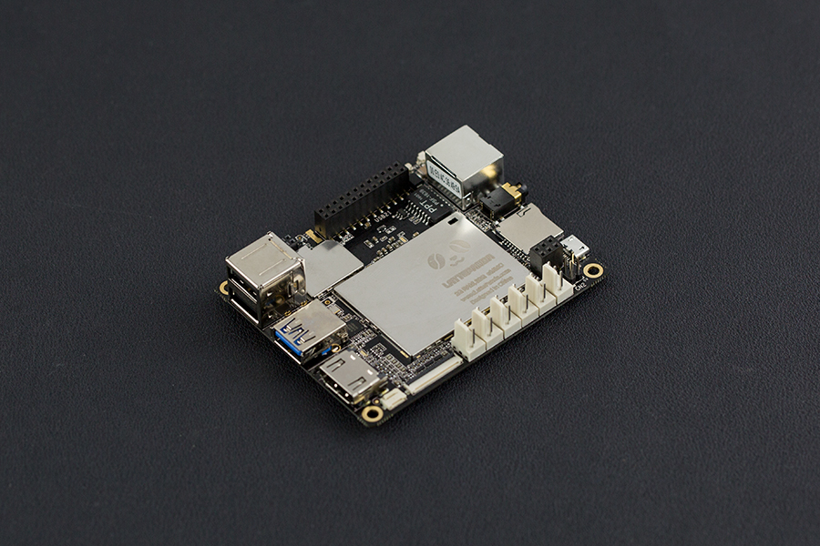
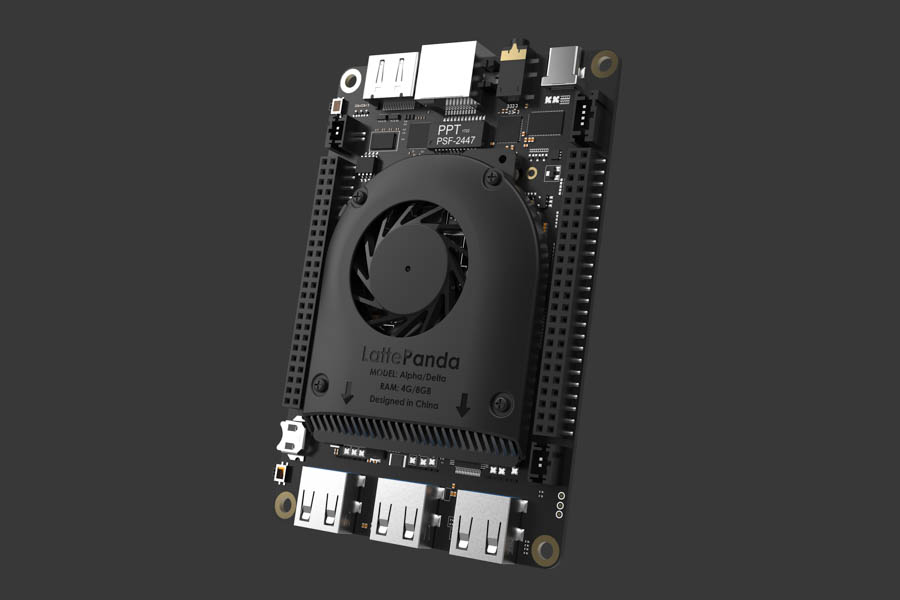

# Documentation

## Overview

| [LattePanda][1]                               | [LattePanda Alpha][2]                         | LattePanda Delta    |
| :--------------------------------------- | :--------------------------------------- | :--------------------------------------- |
|  |  |  |
| Models                                   | Models                                   | Models                                   |
| 2G 32GB 4G 64GB 2G 32GB /w Windows 10 Home 4G 64GB /w Windows 10 Enterprise  | 800 - 8G (No eMMC) 864 - 8G 64GB 864 - 8G 64GB /w Windows 10 Pro  | 432 - 4G 32GB 432 - 4G 32GB /w Windows 10 Pro  |

  [1]: content/1st_edition/power_on/
  [2]: content/alpha_edition/get_started/

This guide will show you how to use LattePanda products to start up your little drive first. And kick-off your adventure of software plus hardware development.

!!! note

    If you have any problem or idea when reading our docs, feel free to **commit your suggestions** directly on the **[Github Docs Repo][4]** or discuss through the **[FORUM][3]**. We, together with our community members, are always ready to help you and listen your suggestions!

  [3]: https://www.lattepanda.com/forum
  [4]: https://github.com/LattePandaTeam/Docs

## Content Structure
The docs is broken down into several parts, covering **LattePanda 1st gen boards** and **LattePanda Alpha**:

1. **Getting started** goes over how to power on your device with the pre-installed Windows system. Experience the power of the hardware.
    * Power on Device
    * Building Connectivity
    * Optional Peripherals Introduction
2. **Multiple OS Support** shows different operation system supported on LattePanda boards
    * OS Installation and setup
    * Tools recommended
3. **Hardware Introduction** details the different parts of the LattePanda platform that come in handy as you build a cool project or commercial product. 
    * Hardware Interface
    * Progromming guidance
4. **Projects** introduces small projects you can build with entry level hardware tinkering background. Start your hardware innovation experience.
5. **Troubleshooting** links tutorials and guides contributed by our community members to fix the problems you met with when tinkering the device.

The best way to use the guide is:

* Go through **Getting started**
* Review **Hardware reference**
* Check out **Applications and OS recommendation** for getting familiar with the software resources
* Search the **Forums**, reply posts or **create** topics for discussing your idea and problems when tinkering
* If you're going to production with LattePanda, **contact** with **LattePanda biz team** via [Email](lattepanda@outlook.com)

## How to Contribute

This documentation is managed by LattePanda, **BUT** supported by the all community members, which is pretty important as a team growing up from open maker community. We welcome contributions such as:

- Edits to improve grammar or fix typos
- Edits to improve clarity
- Additional annotated examples for others to follow
- Additional content that would help provide a complete understanding of the LattePanda platform
- Translations to other languages
- Open - anything u think is good for the growth of this community

Making a contribution is as simple as forking this repository, making edits to your fork, and contributing those edits as a pull request. For more information on how to make a pull request, see [Github's documentation](https://help.github.com/articles/using-pull-requests/).

## Ready?  [Go!][5]
  [5]: /content/1st_edition/power_on/
