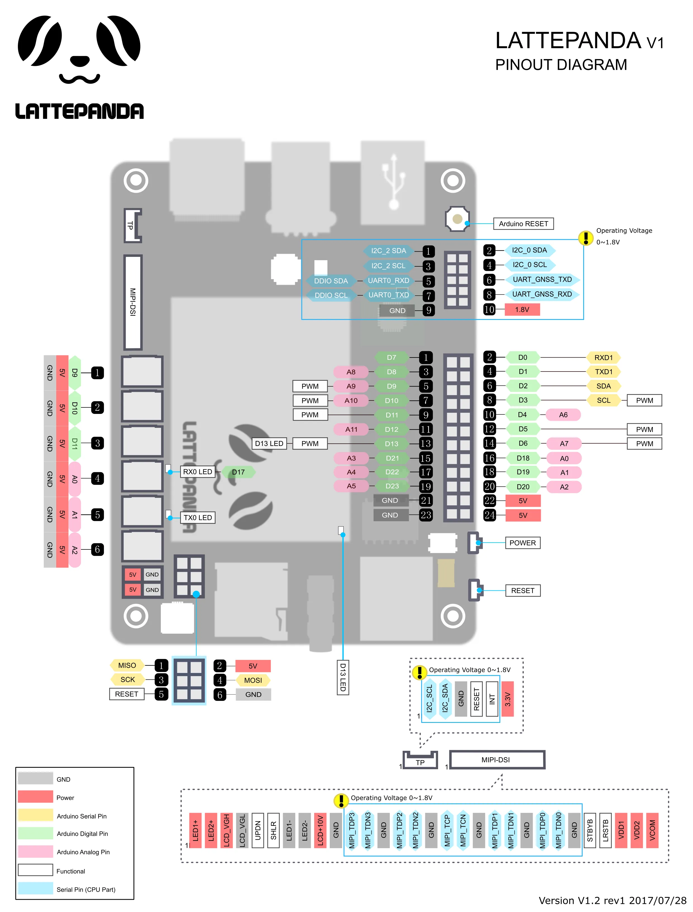

In this article we will discuss the different features shown in these images of the LattePanda. Below is a basic diagram that displays all of the pins located on the board:

Pinouts in area U1 are assigned to the X-Z8350 core.

Pinouts in area U2 are assigned to the ATmega32u4 core. Each of the 20 digital pins (A0 - A5, D0 - D13) in area U2 can be used as an input or output, each operating at 5 volts. Each pin can output or receive 40 mA and each has an internal pull-up resistor (disconnected by default) of 20-50k ohm.
**Caution:** Exceeding 40mA on any I/O pin may cause permanent damage to the ATmega32u4. 

**Some pins have specialized functions:**

- **Analog Inputs:** A0 - A5, A6 - A11 (on D4, D6, D8, D9, D10, and D12). The LattePanda has 12 analog inputs, labeled A0 through A11, all of which can also be used as digital I/O (inputs/ouptus). Each pin has a 10 bit resolution (i.e. 1024 different values). By default, their voltages measure from ground to 5 volts.
- **Serial:** D0 (RX) and D1 (TX). Used to receive (RX) and transmit (TX) TTL serial data.
- **External Interruptions:** D3 (interrupt 0), D2 (interrupt 1), D0 (interrupt 2), D1 (interrupt 3) and D7 (interrupt 4). These pins can be configured to trigger an interruption when measuring low values, a rising or falling edge, or a change in value.
- **PWM:** D3, D5, D6, D9, D10, and D13 provide 8-bit PWM output.
- **SPI:** D16 (MOSI), D14 (MISO), D15 (SCK).
- **LED:** D13 There is a built-in LED driven by digital pin 13.
- **TWI:** D2(SDA), D3(SCL). **Other pins on the board:**
- **Reset:** Causes LOW line to reset the microcontroller. Typically used to add a reset button to shields which can block functions on the SBC.
