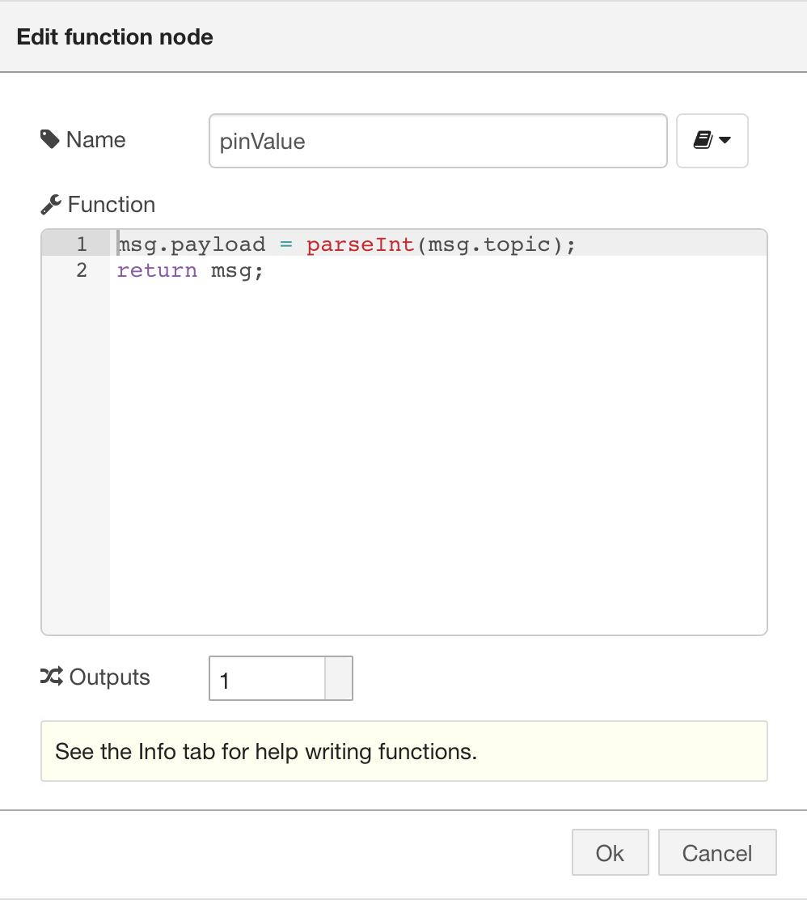

## Introduction

[Node-RED](http://nodered.org/) is a visual programming tool for the Internet of Things. IBM is actively implementing its newest functions, including Watson and IOT service, into Node-RED's toolbox ever since its creation.
Here, we are taking advantage of the Node-RED tool and the email service to build a simple but awesome IOT control unit. You can remotely control your Arduino board by sending an email to your own account. The process roughly takes half an hour, with minimum coding required.

### Hardware List

- LattePanda x 1

### Software Setup

1.[Download Flash Firmata onto Your Board](https://github.com/LattePandaTeam/LattePanda-Development-Support/tree/master/LattePandaFirmata)

2.[Install Node-RED](http://nodered.org/docs/getting-started/installation).

3.Please follow the [official Arduino documentation from Node-RED](http://nodered.org/docs/hardware/arduino).

As soon as you get past the first blinking example, you can start preparing the IoT portion.

4.Build Control Flow.

Here is the simple flow setup.

5.Configure Email Node

Now we can configure the email node. I am using the Microsoft office email server. If you are using another email service provider, please check your server settings for setting up an `imap` client.

Also, if you are using *Gmail*, you need to create an application specific password for third-party application authentication.

6.Configure Function Node

We need a tiny bit of code to interpret the email messages before their messages are relayed onto your Arduino board. Specifically, we are using the email's **subject line** to control our Arduino board. Since some servers may automatically attach to or transform the email's **body** content or format it in a certain way in order to produce a "better user experience", it will be easier to write working code for our example using only the **email subject** rather than the email's **body**.
Here is the code :

`javascript`

`msg.payload = parseInt(msg.topic);`

`return msg;`

7.Configure the Arduino LED Node.

You should have configured the LED node onto pin 13 already if you have gone through the previous examples. Here is a screenshot displaying the required setup.

### Test

Now you can send an email to your account, using a single digit in the subject line: 1( or 0 if your pin 13 LED is already turned on). You should see the LED on the board change after about 10 to 20 seconds after you have sent the email.

You can leave the email body empty, as we did not utilize this portion for this example. However, you can choose to develop more functionality in this project by using the email body's content once you feel confident enough with your skills in manipulating and using the subject line.

# How It Works

According to Node-RED documentation, the email node will try to get your latest email from the given mail folder during a given time interval. It will notice any new email, and pass on email information to our logical function. Then our function tries to interpret the subject as an integer and fill in the data that our Arduino output pin needs. Finally, the Arduino pin node controls the board using firmata protocol and changes the LED status.

I hope you were successful in using Node-RED and Arduino together. Firmata is a great way to communicate with the single board computer, and Node-RED is a truly quick way to build IoT control layers. Additionally, you do not have to pay for email services, so you will not need to buy a public domain IP address to remotely control your board across different network domains. All you need is something that runs nodejs with a serial port. Given this, we recommend using either the [Raspberry Pi](https://www.dfrobot.com/search-%20raspberry%20pi%20.html) (which runs Linux based operating systems) or the [LattePanda](https://www.dfrobot.com/topic-278-184.html) (which runs standard windows 10).
