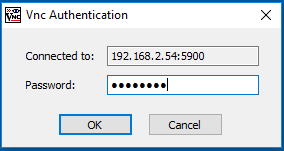

# Remote Desktop

# Introduction

Using a VNC server will enable you to access the GUI of Windows running on your LattePanda from a different PC on your local network. TightVNC is a free and easy way to set up this service.

VNC stands for “Virtual Network Computing”. It is a way of transmitting the keyboard and mouse events of one computer to another - in other words, it uses the information from one computer to remotely control aspects of other computers which are connected along the same network. This is useful, because you might not have extra monitors, keyboards, or mice for available use – using a VNC service enables you to access several computers on your local network using just one computer, monitor, keyboard and mouse. You might also have headless servers set up which might benefit more from a remote connection to the master server rather than a vast amount of peripherals attached to each server. Thus, setting up a VNC server on your headless server is an effective way to interface with its GUI whenever you should need to connect to it. 

Let’s get started:

### Step 1 - Installation

1.Download and install TightVNC for Windows on your LattePanda. Choose 32-bit or 64-bit depending on your system architecture. (LattePanda Standard is 32-bit, LattePanda Enhanced is 64-bit)

   [Download](http://www.tightvnc.com/download.php)

   

2.End-User Licence Agreement

Accept the licence agreement and click next
   

3.Choose Setup Type

   Typical installation will install both TightVNC server and TightVNC viewer on your LattePanda

   Custom installation allows you to select which elements to install. In this situation, all we need is the server itself (unless you would like to be able to view other PCs on your network through the LattePanda, in which case you will need to install the viewer, as well).

   For this tutorial, we will perform the typical installation method.

   

4.Select Additional Tasks

   Make sure all of the boxes are checked

   

5.Install TightVNC

Click Install to begin!

   

6.TightVNC Server: Set Passwords

​    Password Access

   
   
At this point it is advised to set a password for remote access. To do this, click on the radio button, “Require password-based authentication,” and then choose a password. Then, retype your password into the next textbox directly underneath.

In this example, the password has been set to “lattepan” (since the password cannot be longer than 8 characters)

7.Administrative Password

This is not strictly necessary. In this tutorial I will not set an administrative password, but you may if you wish. If you set a password for this portion, you will have to enter it each time before changing any configuration settings.

When you are happy with your settings, click “OK”. Click “Finish” to exit the setup wizard.

### Step 2 - Configuration

   You should now see a new icon in your system tray. (If you don’t, try logging out and logging back in to your PC).

   

Here you can see the IP address of your PC. (If you cannot hover your mouse over the icon and see the IP address, you can also view the IP address that your computer is using via the command prompt.)

Double click this icon to bring up the service configuration window. These default settings should be fine for our purposes of initially setting up the servers.

   

Next, you will need to go on to the computer that you would like to use to control the LattePanda with, and using the same installation package install TightVNC viewer. When you have successfully installed TightVNC viewer, check that you are on the same network as your LattePanda, otherwise it will not work!

When you are certain that your computer and the LattePanda are on the same local network, proceed to step 3

### Step 3 - Testing

   

Open TightVNC Viewer. A window will appear for a new TightVNC Connection. At this point, you need to input the IP address of your LattePanda.

   

Tip: A quick way to find this IP address is to hover over the system tray TightVNC icon on your LattePanda. A hint will pop up with “TightVNC Service - 

” You can also go into your router control interface and look for attached devices. The next step is to input this IP address into the New TightVNC Connection Window, followed by the port number you set in the service settings. The default port is 5900.

 `<ip address of LattePanda>:<port number>`
   `e.g. 192.168.2.60:5900` Click connect. If all goes well you will be prompted to input a password. Please input the password that you created earlier. In this example, this password was “lattepan”. Then, press enter.

You will now see a window containing your LattePanda’s GUI! You can now control it remotely!

This concludes the LattePanda VNC tutorial. If you have any questions or comments, please let us know in the forums. We hope this has has helped.
