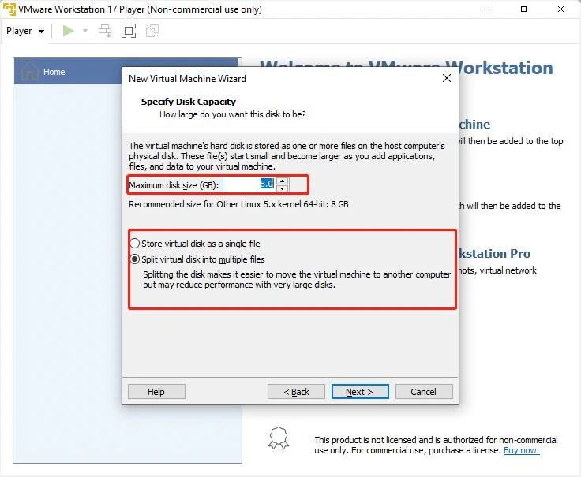
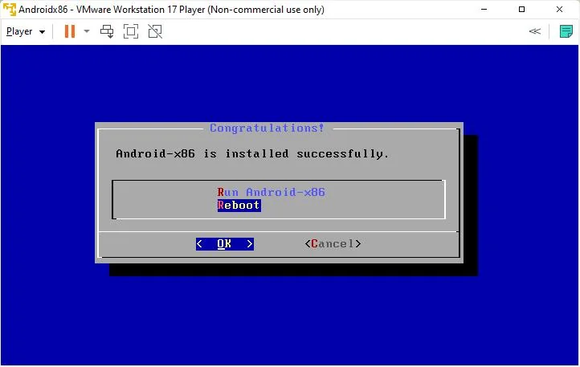

# Operating System

## Android
{width="600" }

In this chapter, we will show the steps to install Android x86 OS on LattePanda 3 Delta using a virtual machine.

### Preperations

* 💿 [Android x86 OS Disc Image File](https://sourceforge.net/projects/android-x86/files/Release 9.0/)
* Virtualization Software, such as [VMware](https://customerconnect.vmware.com/en/downloads/info/slug/desktop_end_user_computing/vmware_workstation_player/17_0), VirtualBox

### Installation Steps

- **Download the ISO mirror image file for Android x86.**

  > You may download the latest version of the mirror image file from the official website of Android x86.Download [android-x86_64-9.0-r2](https://sourceforge.net/projects/android-x86/files/Release%209.0/).

- **Install virtualization software.**

  > You may utilize VMware, VirtualBox, or other virtualization software. For this instance, we will be utilizing VMware Player as the virtualization software. Download [VMware Player](https://customerconnect.vmware.com/en/downloads/info/slug/desktop_end_user_computing/vmware_workstation_player/17_0).

- **Establish a virtual machine.**
  
  > 1. Commence VMware Player and select **`Create a new virtual machine`**.
  { width="400" }

  > 2. After clicking on **`Browse`** for the installation program disc image file, select the above-mentioned downloaded mirror image file, and then click on **`Next`**.
  { width="400" }

  > 3. Select **`Linux`** for the operating system, and then choose **`Other Linux 5.X Kernel 64-bit`** as the version, and finally, click on **`Next`**. 
  { width="400" }

  > 4. Name the virtual machine and select the physical location for storing the virtual machine, then click on **`Next`**. 
  { width="400" }

  > 5. Choose a disk size of 8GB, and then split the virtual disk into multiple files before clicking on **`Next`**. 
  { width="400" }

  > 6. Confirm the virtual machine information and click on **`Finish`**. 
  { width="400" }

  > 7. Click on **`Play`** to start the virtual machine. 
  { width="400" }

  > 8. Installing Android onto a virtual machine. 
  { width="400" }

  > 9. Press **++c++** on the keyboard, select **`Create/Modify partitions`** using the arrow keys, and then click **`OK`**. 
  { width="400" }

  > 10. Choose not to use GPT. 
  { width="400" }

  > 11. Select **`NEW`**, then **`Primary`**. Confirm the amount of available disk space, and press **++enter++**. 
  { width="400" }
  { width="400" }
  { width="400" }

  > 12. Click on **`Bootable`** and press **++enter++**, ensuring that the **`Bootable`** option is present in the Flags. 
  { width="400" }

  > 13. Click on **`Write`** to write the image. 
  { width="400" }

  > 14. Manually type **`Yes`** and press **++enter++**. 
  { width="400" }

  > 15. After waiting for the image to be written, select **`Quit`** and press **++enter++**. 
  { width="400" }

  > 16. Select the hard disk that was just written to, and click **`OK`** to confirm. 
  { width="400" }

  > 17. Select the EXT4 file system, and press **++enter++** to confirm. 
  { width="400" }

  > 18. Select **`Yes`** to format the hard disk in EXT4 format. 
  { width="400" }

  > 19. Select **`Yes`** to install the GRUB bootloader. 
  { width="400" }

  > 20. Press **++c++** on the keyboard, select **`Create/Modify partitions`** using the arrow keys, and then click **`OK`**. 
  { width="400" }

  > 21. Select **`REBOOT`** and then **`OK`**, to complete the installation of Android onto the virtual machine. 
  { width="400" }

* **Modify the disabled graphics card driver.**

  > 1. Select the second "debug" mode to enter the system. 
  { width="400" }

  > 2. Enter "mount -o remount,rw /mnt" to modify the corresponding file's read and write permissions. 
  { width="400" }

  > 3. Enter `vi /mnt/grub/menu.lst` to edit the corresponding file using the vi editor. 
  { width="400" }

  > 4. Press **++i++** to enter the edit mode in the vi editor. Add **`nomodeset`** after **`quiet`** to disable the graphics card driver. Then, type **`:wq`** to save and exit the vi editor. 
  { width="400" }

  > 5. Click on "Restart" to select and initiate a reboot. 
  { width="400" }

After completing the above steps, restart the virtual machine and select "Android x86". You can now begin using the Android x86 system. 
  { width="400" }

In summary, the Android x86 virtual machine is a convenient way for users to experience the Android operating system on a Lattepanda. Users only need to follow the above steps to install and use it. 

!!! note
    - Android x86 is designed for PC, not for mobile phones or tablets, so its user interface and operation may be slightly different from the Android system you use on mobile devices. 

[**:simple-discord: Join our Discord**](https://discord.gg/k6YPYQgmHt){ .md-button .md-button--primary }