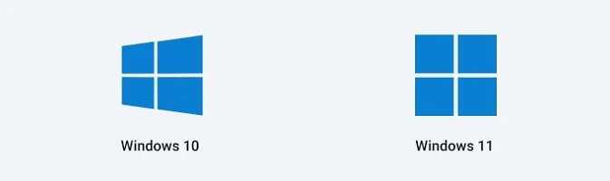
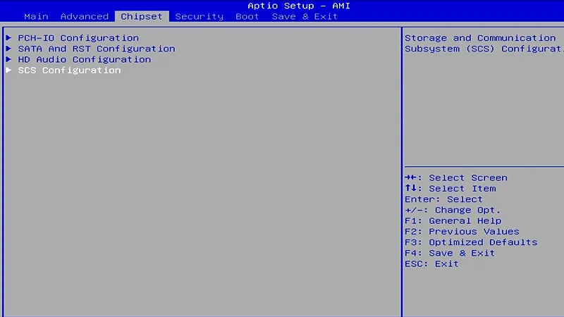
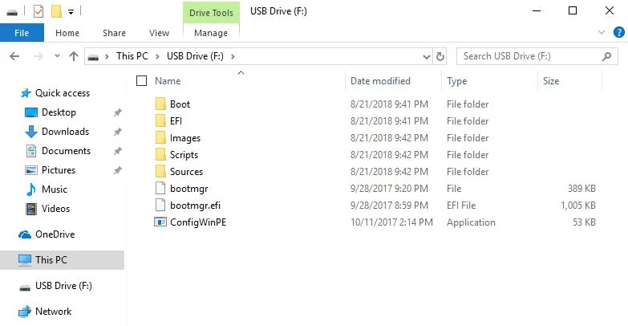
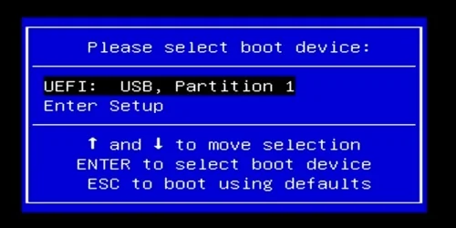
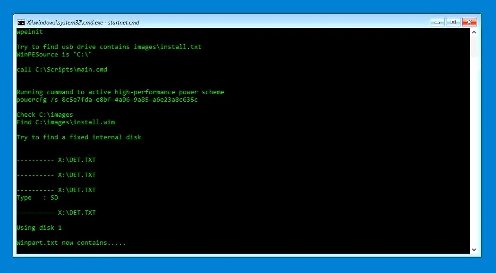
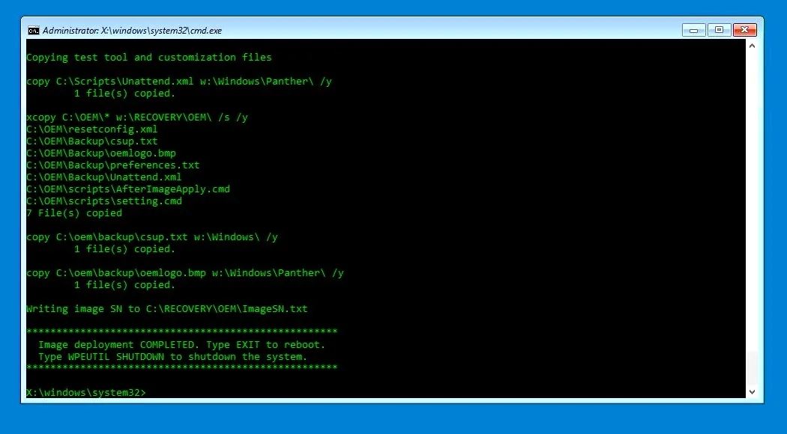

# Operating Systems

## Windows

The following contents will take the Windows OS installation as an example to demonstrate. And the Operating system will be installed on the eMMC by default.

??? tip "How to install the official system image to the SSD?"
    - Insert your SSD into the LattePanda, then remove all other storage.
        - Enter into the BIOS setup to disable the onboard eMMC. Then save the change.
        
        - Restart the LattePanda. Use the following installation steps to install the system image.

### Preperations

* :material-usb-flash-drive-outline: Empty USB flash drive (8 GB or larger)
* 💿 OS Disc Image File for the LattePanda 3 Delta: Download from [:material-dropbox:Dropbox](https://www.dropbox.com/sh/8xxjl13xf4ocsvi/AAAOu-RaR_1SulZGJpq1InwVa?dl=0) or [:material-google-drive:Google Drive](https://drive.google.com/drive/folders/1-m6dQCReMQ_iV0Kqk87u9775eWJYzAgd?usp=sharing)

!!! Note

    - The installation steps for both Windows 10 and Windows 11 are the same. 
    - We will use the official system image file(provided by LattePanda team) with all hardware drivers pre-installed and ready to use, bringing you a fast and ultimate experience.

### Installation Steps

* Download the Windows 10/11 disc image file of LattePanda 3 Delta.

* Format your USB drive into NTFS format.

* Unzip the  Windows 10/11 disc image file. Then copy and paste them to the USB drive. 

      The files location on the USB flash drive should be as shown below.

  

* Insert your USB drive into LattePanda, and turn on the LattePanda. (If you created the USB installation media on LattePanda, please restart the LattePanda before OS installation.) 

* Press **++f7++** key continuously to enter into **Bootable Device Selection Menu**. 

* Use the **++arrow-up++** or **++arrow-down++** key to choose the USB bootable device, then press **++enter++** key.
  

* It will enter into the OS installation terminal. It should look like the picture below. As it's a fully automatic process, you don't need to do anything. Please wait patiently for 5-8 minutes.
  

* After 5~8 minutes, the installation will be completed. You will get the notice in the terminal like the picture below. 
  Then shut down the LattePanda. Unplug the USB flash drive.
  

* Press the power button to turn on the LattePanda. Then it will start the system initialization. After about 3 minutes, it will enter into Windows System desktop.  Now enjoy it!

### Windows Activation
If you are using LattePanda 3 Delta activated model, there should be a License Key in the box as shown below.

**There are 6 steps to activate your LattePanda:**

- Scrape the coating off the sticker to obtain the full **Product Key**
- Make sure your LattePanda has an active internet connection via WiFi or Ethernet
- Right click on the Windows button and select **System**
- Click **Activate Windows**
- Click **Change Product Key**
- Enter the product key number
- Click **Next**

[**:simple-discord: Join our Discord**](https://discord.gg/k6YPYQgmHt){ .md-button .md-button--primary }