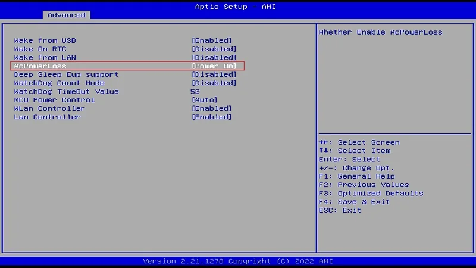

# BIOS Setup

## Auto Power-on
The Auto Power-On feature allows the LattePanda to start up automatically without pressing the physical power button. The setup process varies slightly between the old and new versions of the LattePanda 3 Delta. You can identify your product version by checking the silk screen on the board pins.

### Identifying Your Version
- **New Version:** There are the AUTO and SW pins as shown below.
- **Old Version:** There are the NC and NC pins as shown below.
{width="600"}

=== "For the New Version"

    !!! note ""
        #### Step 1: Short-Circuiting the Pins
        Short-circuit the AUTO and SW pins on the board.
        {width="600"}
        
        #### Step 2: BIOS Configuration
        1. Power on the LattePanda and enter the BIOS.
        2. Navigate through the following path:
            **Path: BIOS Setup → Advanced → Power Management → AcPowerLoss**
        3. Set the AcPowerLoss option to **`Power On`**.
        {width="600" }

        The new version of LattePanda 3 Delta natively supports the Auto Power-On feature, which is not affected by the RTC battery charge level, ensuring stable support for Auto Power-On.

=== "For the Old Version"

    !!! note ""
        #### BIOS Configuration
        1. Power on the LattePanda and enter the BIOS.
        2. Navigate through the following path:
            **Path: BIOS Setup → Advanced → Power Management → AcPowerLoss**
        3. Set the AcPowerLoss option to **`Power On`**.
        {width="600" }
        
        !!! Warning
        - When the **RTC battery's charge** is depleted, the Auto Power-On function will not work. Hence, it is crucial to ensure that the RTC battery is adequately charged to maintain its functionality. 
        - The LattePanda 3 Delta comes equipped with an onboard CR927 RTC battery, with a voltage of 3.0V, capable of maintaining power for  **around 9~12 months**.You could refer to [**External RTC Power Pin Chapter**](io_playability_Internal.md#external-rtc-power-pin) to connect an external large-capacity RTC battery.
        - Please disable the **Deep Sleep EUP Support** feature to ensure smooth operation of the Auto Power-On function.

[**:simple-discord: Join our Discord**](https://discord.gg/k6YPYQgmHt){ .md-button .md-button--primary }