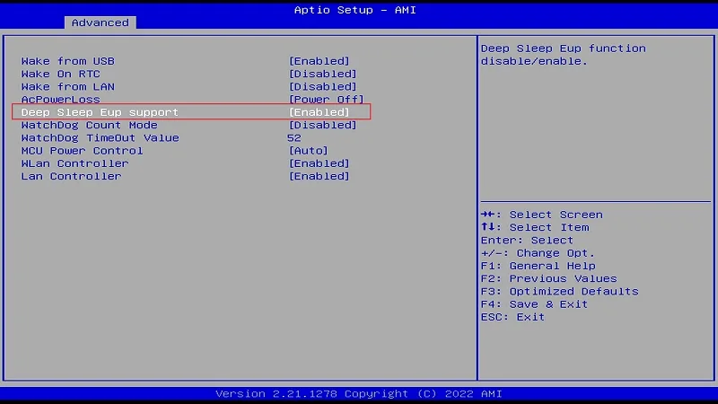

# BIOS Setup

## Deep Sleep EUP Support
For handheld or portable devices/projects, it is crucial for the device to maintain extremely low power consumption while turned off. In this particular application scenario, you can activate the **Deep Sleep EUP Support** feature in the BIOS. This will effectively diminish the power consumption of the LattePanda to a mere **18mA@12V** after the device has been shut down.

**Path: BIOS Setup --> Advanced --> Power Management --> Deep Sleep Eup Support**

  {width="600" }

The default setting is **Disabled**.

!!! info "**Attention** "

    - Only when **Turning on Fast Startup** in windows OS is disabled, **Deep Sleep Eup** function can work probably. 
    - When deep sleep Eup support is enabled, **Wake On Lan** will not work.  The 5V, 3.3V,1.8V, USB2.0 pins in the female headers, three USB Type-A ports and ATmega32U4 chip will be forced to power off in the hibernate and shutdown state. 
    - When deep sleep Eup support is enabled,, the **Wake On RTC** function will not work. 

[**:simple-discord: Join our Discord**](https://discord.gg/k6YPYQgmHt){ .md-button .md-button--primary }