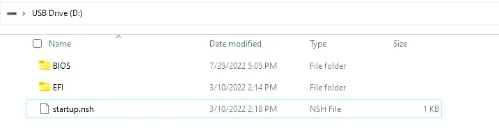
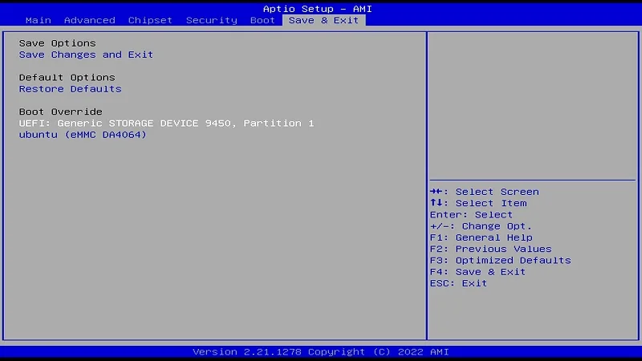
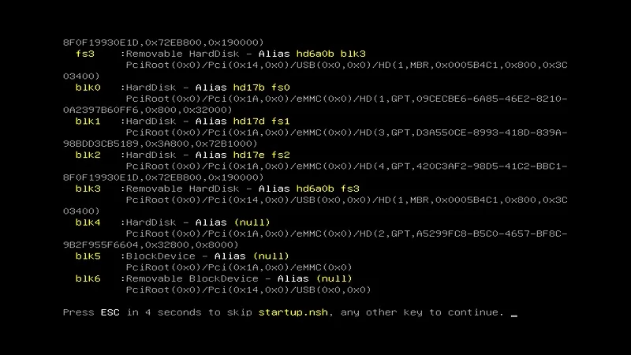
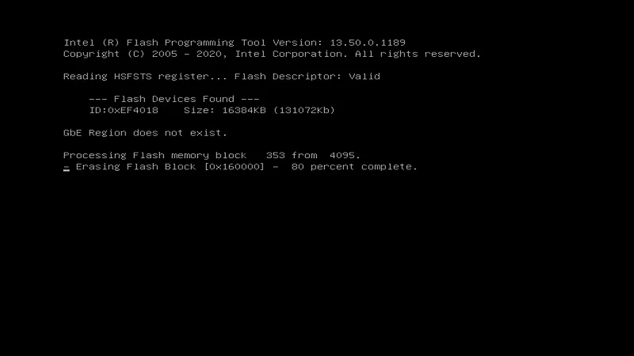
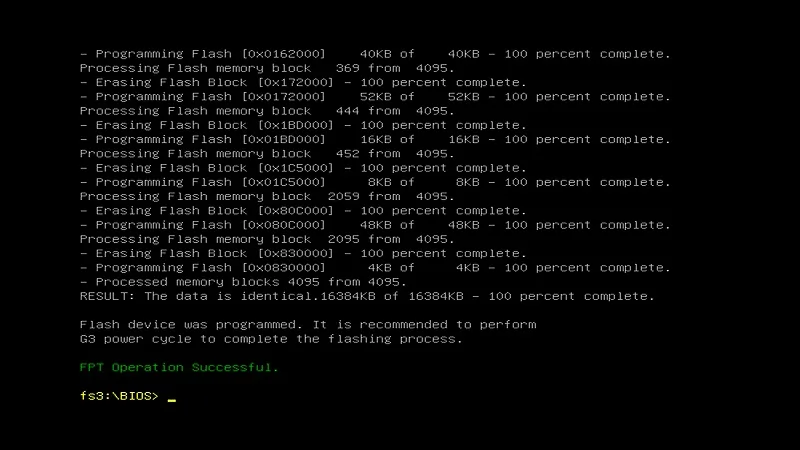

# BIOS Setup

## Update BIOS Firmware
In the event that a new BIOS firmware is necessary or if the BIOS doesn't work properly, updating the BIOS firmware is advised.

Before the operation, it is recommended to disconnect any storage devices such as the SSD, TF card, or any other external storage mediums, in order to allow the BIOS to accurately identify the specific drive that contains the required BIOS firmware during the updating process.

### Preperations
* Download [**the BIOS file of LattePanda 3 Delta**](https://github.com/LattePandaTeam/LattePanda-Win10-Software/tree/master/BIOS%20for%20LattePanda%203%20Delta).

* Format your USB drive to **FAT32** format.

* Extract the BIOS files and proceed to copy them to the root directory of the USB flash drive.

   **The files located on the USB flash drive should be as shown below.**

  {width="600" }

### Steps
* Insert the USB drive into LattePanda, and turn on LattePanda. (If you created the USB installation media on LattePanda, please restart the LattePanda.) 
* Press **++del++** key continuously to enter into BIOS Setup Menu. 
* **Path: BIOS Setup --> Save & Exit --> Boot Override**. In the boot override menu, choose the UEFI device. 
  {width="600" }

* Then press **++enter++** key, to enter into the EFI shell.  Then **do not press any key** to let the countdown end. 
  {width="600" }

* After the countdown, BIOS firmware refresh will start automatically. 
  {width="600" }

*  After about 2 minutes, the green font message **`FPT Operation Successful`** will be on the screen, which indicates that BIOS firmware refresh is completed. 

* Gently press the power button to turn off the LattePanda and unplug the USB drive. Then short press the power button to turn on the LattePanda. The BIOS update has been successfully accomplished. 
  {width="600" }

!!! info "**Attention**"

    - Kindly ensure that you download the **correct version of the BIOS**. Flashing an incorrect BIOS file can result in the LattePanda board being unable to boot.
    - If you are unable to access the EFI shell page, please double-check the formatting settings of your USB drive and ensure that the BIOS file is placed in the root directory.
    
    If you encounter any further issues, feel free to reach out to the [**LattePanda tech support team**](mailto:techsupport@lattepanda.com) for assistance.

[**:simple-discord: Join our Discord**](https://discord.gg/k6YPYQgmHt){ .md-button .md-button--primary }