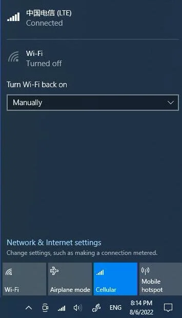

# Internet Connection 

## :material-wifi: WIFI

Before connecting to a Wi-Fi source, you should install two Wi-Fi antennas to your LattePanda board by plugging the round-shaped end of the antenna into the complementary socket.

  {width="500" }

Then, surf the internet!

## :material-lan-connect: Ethernet 

There is an Ethernet port on the LattePanda board. Plug the ethernet cable, then surf the internet!

## :material-signal-cellular-3: Cellular (4G/5G)

!!! info "NOTE"
    **Before using the cellular network, please assemble the 4G/5G module on the M.2 B key socket first!**

* Assemble the 4G/5G module on the M.2 B key socket and attach the 4G/5G antennas onto the module. Afterward, insert a micro-SIM card into the SIM card slot.
    {width="500" }
    {width="500" }

* Upon logging into the operating system, proceed with the installation of the module driver. Ensure that there are no unknown devices listed in the device manager.
  {width="500" }

* Now surf the internet! 
  

We have conducted thorough testing on the following modules, all of which have demonstrated excellent functionality within the Windows 10 operating system.

* [SIMCom SIM7600G-H-M2](https://www.dfrobot.com/product-2643.html)

* [SIMCom SIM8262](https://www.dfrobot.com/product-2636.html)

* [Quectel EM05-E](https://www.quectel.com/product/lte-em05-series)

* [Quectel RM500Q-GL](https://www.quectel.com/product/5g-rm50xq-series)

[**:simple-discord: Join our Discord**](https://discord.gg/k6YPYQgmHt){ .md-button .md-button--primary }