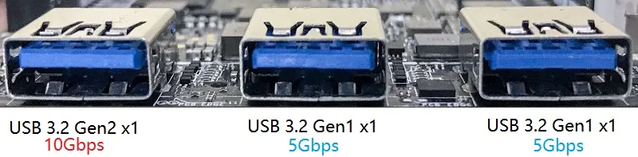
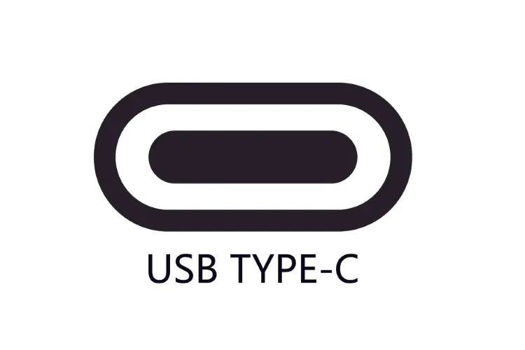
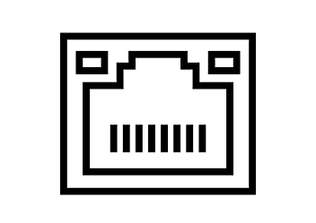

# External Interface

## :material-usb-port: USB Type-A Port

The LattePanda 3 Delta features a total of three USB Type-A ports. 

- 1x USB 3.2 gen2 port, offering an impressive throughput of up to 10Gb/s, and twice as fast as that of the USB 3.2 gen1(formerly known as USB 3.0). 

- 2x USB 3.2 gen1 ports, providing reliable and efficient connectivity options.

!!! tip
    - Please refer to [**BIOS Setup**](bios_USB_Port_Power_Control.md) for additional information on power control configuration of the three USB Type-A port.

## :material-usb: USB Type-C Port
{width="200"}

The LattePanda 3 Delta is equipped with a USB Type-C port, which can be connected to a PD power adapter or a USB-C hub to expand to a wider array of ports, including DP, DVI, USB, SD/MicroSD, and more. 

The USB Type-C port supports simultaneous use of following three functions.

- :material-power-plug: Power Delivery
- :fontawesome-solid-display: DP 1.4, refer to [**Display Connections**](touch_and_display.md#usb-type-c) for additional information on obtaining video output using USB Type-C port.
- :material-usb-port: USB 2.0 (without USB 3.0)

## :material-lan-connect: RJ-45 LAN Connector(up to 2.5Gbps)
{width="200"}

The LattePanda 3 Delta features one 2.5 Gigabit Ethernet port, which uses the Intel I225-V Ethernet Controller. And with support for **Wake-On-LAN (WOL)**, LattePanda can be easily managed remotely, making it a perfect choice for network administrators or anyone who needs to remotely manage their device. 

!!! Note "Ethernet Chip Type"
    The batches of LattePanda 3 Delta produced before June 2023 are equipped with the **Intel I211-AT 1.0 GbE** Ethernet Controller.

[**:simple-discord: Join our Discord**](https://discord.gg/k6YPYQgmHt){ .md-button .md-button--primary }
