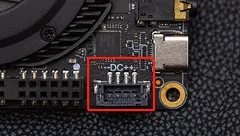

# Internal Interface

## M.2 Socket

There are two M.2 sockets on LattePanda 3 Delta: M key and B key.

=== "M.2 M Key"

    !!! note ""
        The M.2 M key socket only allows **PCIe 3.0 x2**. 
        
        #### :material-check-circle: **Compatible Device**
          - **Storage:** Compatible with M.2 NVMe SSD
          - **Other Devices:** eGPU (If you have a high-quality cable adapter such as the ADT Link, you can also connect an eGPU to the M.2 M key slot. Here is a [**video link** :link:](https://youtu.be/LMmm2V33cvs) for your reference)

=== "M.2 B Key"

    !!! note ""
        The M.2 B key socket allows **SATA III, USB 2.0, USB3.0, and SIM**. 
        
        #### :material-check-circle: **Compatible Device**
          - **Storage:** Compatible with M.2 SATA SSD
          - **Wireless Devices**
            * M.2 4G Module (USB 2.0 lane)
            * M.2 5G Module (USB 3.0 lane)
        
          Before using the 4G or 5G module, please insert a micro-SIM card into the SIM card slot. More information to get Cecullar network on LattePanda, pls refer to [**Multiple Network**](connectivity.md#cellular-4g5g).
          
          If you want to use a PCIe device with the M.2 B key, please refer to [**Optional BIOS Firmware**](BIOS_Firmware_3_delta.md#optional-bios).

## Female Header Pins

### :bulb: Status Indication Pin

The S0, S3, S4 pins can indicate the current state of operating system through different output voltages. So the Opersting System status can be obtained by reading these voltages or connecting LED indicators. The pins have already been connected in series with 2K~3K current-limiting resistors, so most LEDs can be directly attached without burning out.

{width="300"}

The voltage of these pins in different states are shown as follows:

|        | Run  | Sleep | Hibernate | Shut Down |
| ------ | ---- | ----- | --------- | --------- |
| S0 Pin | High | Low   | Low       | Low       |
| S3 Pin | Low  | High  | Low       | Low       |
| S4 Pin | Low  | Low   | High      | Low       |

!!! Note "Mark Pattern"

    - High: 5V
    - Low: 0V

### :material-power: Power Switch Pin

In addition to the pins that display the system operating status (S0/S3/S4), there are also pins that can control the power on and off and restart.

{width="300"}

- SW Pin: Power SW - By pulling this pin to a low level once, it has the same effect as pressing the power button once.

- RST Pin: Reset SW - By pulling this pin to a low level once, it has the same effect as pressing the reset button once.

    It is recommended that the pull-down time last for more than 50 milliseconds.

### :zap: Auto 5V Output Pin

There are two auto 5V output pins in the female headers. They are automatically controlled according to different states. 

{width="400"}

The power output of these two 5V output pins is as follows:

|                                      | Run     | Sleep   | Hibernate | Shut Down |
| ------------------------------------ | ------- | ------- | --------- | --------- |
| power output of these 5V output pins | Enabled | Enabled | Disabled  | Disabled  |

Other 5V & 3.3V output pins are always turned on unless you enable Deep Sleep EUP function in BIOS.

### :sound: Audio Output Pin

LattePanda 3 Delta has two-channel audio output pins with audio power amplifier and the output power of each channel can be **up to 2Watt (rms)/4Ω**. You can directly connect two speakers to play sound.

When the headphone is inserted, the audio output automatically switches to the headphone jack.

{width="400" }

### :material-battery-clock: External RTC Power Pin

The LattePanda 3 Delta comes equipped with an onboard CR927 RTC battery, with a voltage of 3.0V, capable of maintaining power for **around 9~12 months**.

If you require a longer battery life for the RTC (Real-Time Clock), you can connect a battery with a larger capacity to the external RTC power pin in the pin header. Since the external RTC power pin in the pin header is directly connected to the onboard RTC battery, **remove the onboard CR927 battery** when using an externally battery.

Larger capacity batteries include the CR2032, among others. The power voltage should not exceed 3.3V.

{width="300"}

!!! note ""
    #### Note for Old Version Users
    If you are using the old version of the LattePanda 3 Delta, be aware that the status of the RTC battery will affect the Auto Power-On function. For more details, refer to the section on the [**Auto Power-On Function**](../3rd_delta_edition/bios_Auto_power_on.md) in the BIOS Setup.

### GPIO Pin
#### :simple-arduino: Arduino Leonardo Pins
Lattepanda 3 Delta has an ATmega32u4 chip on board, and the built-in firmware is compatible with LattePanda Leonardo. It is connected to the processor through the USB 2.0 lane, and is mapped to a COM port device in the operating system, named LattePanda Leonardo. 

{width="300"}

Its usage is consistent with Arduino Leonardo. We developed the pinpong library, you can easily use python to control GPIO. For specific usage, please refer to [**IO Playability chapter**](../IO_Playability/InstallPinpongLibrary.md).

- **MCU Power Configuration**

By default, the Arduino Leonardo pins on the LattePanda 3 Delta are powered only when the device is either turned on or in sleep mode. However, **enabling the MCU Power Control** in the BIOS settings will keep them powered even when the device is off.

**Path: BIOS menu --> Advanced --> Power Management --> MCU Power Control**

!!! note
    **This setup only functions with a constant power supply.** If the power is interrupted, the Arduino pins will not receive power until the device is rebooted. To ensure the pins remain powered whenever the device is connected to a power source, you can connect the 5V pins as shown below, allowing the DC 5V to continuously power the Arduino.
    

## JST PH2.0-4Pin Power Input

- 11-15V (No higher than 15V)

- 24 watts or above is recommended 

- Recommended power source: 12V, at least 2A

- Recommended Cable: [LattePanda DC 5.5x2.1mm Power Cable](https://www.dfrobot.com/product-2624.html)

!!! Tip

    This connector can only be used as a power input, so it cannot output power and can not charge the battery.

## eDP Touch Display

LattePanda 3 Delta is equipped with a 30-pin eDP connector and I2C touch connector. Please refer to [**eDP(Embedded DisplayPort**)](touch_and_display.md#edpembedded-displayport) chapter to learn how to use the eDP touch display.

[**:simple-discord: Join our Discord**](https://discord.gg/k6YPYQgmHt){ .md-button .md-button--primary }

