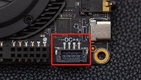
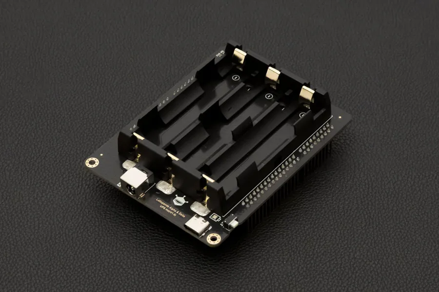

# Power Options

LattePanda is a powerful and versatile single board computer that can be used for a wide range of application scenario.

In this chapter, we will embark on an exploration of diverse ways for powering LattePanda 3 Delta, to meet different project requirements and apply more application scenarios.

## 3 Ways to Power LattePanda

!!! Warning "Voltage and Power"

    - The acceptable power input range is **11V to 15V**. Please ensure the voltage doesn't exceed 15V.
    - Please use the power adapter with at least **24W** or more, otherwise the LattePanda 3 Delta may work abnormally.

1. USB Type C PD adapter via USB Type C Port (**Recommended**)

2. 12-volt power adapter  via  JST PH2.0-4Pin connector

3. [UPS Hat for LattePanda 3 Delta](https://www.dfrobot.com/product-2735.html)

## Power Supply Priority

LattePanda has a preference for using the power supply from the port with a higher voltage. The power supply selection process is as follows:

!!! Example
    === "Senario 1"
        If the USB Type-C port is powered by 15V, and the JST PH2.0 4Pin port is powered by 12V, **LattePanda will prioritize the power supply from the USB Type-C port.** 
        > 1. In case the power supply from the USB Type-C port is accidentally cut off, LattePanda will automatically switch to the power supply from the JST PH2.0 4Pin port. 
        > 2. When the power supply from the USB Type-C port is restored, LattePanda will automatically switch back to using the power supply from the USB Type-C port. 
        > 3. During the power switching process, LattePanda will continue to operate normally without any unexpected power outages.

    === "Senario 2"
        If both the USB Type-C port and the JST PH2.0 4Pin port are powered by 15V, **LattePanda will utilize the power supply from both ports simultaneously.**

## Powered by USB Type-C PD Adapter(🔌) or Power Bank(🔋)

### Input Specifications

* Supports PD protocol
* Accepts Power Delivery compliant devices at 15V 3A or 12V 3A

### Recommended Power Banks

* [ZMI 20000mAh PD battery](https://www.amazon.com/ZMI-Pixelbook-Nintendo-External-Powerbank/dp/B072BD98CM/ref=sr_1_1?dchild=1&keywords=ZMI&qid=1600766468&sr=8-1)
* [More options recommended and tested](https://www.lattepanda.com/topic-f23t17787.html) by ccs_hello (community member).
* Or any other brand of power bank that supports PD protocol and outputs 12V or 15V at least 24W.

## Powered by JST PH2.0-4Pin Input Connector

!!! Warning "Ensure Correct Polarity Connection"

    Please make sure the positive and negative pins are properly connected and double-check your connections before turning on your LattePanda.

### Input Specifications

- 11-15V (No higher than 15V)

- 24 watts or above is recommended 

- Recommended power source: 12V, at least 2A

### Note

 

The pin mapping is marked on the board: -- DC ++, which means two negative pins and two positive pins.

The input voltage range of the JST PH2.0-4Pin connector is **11~15V**.
The LattePanda requires a peak power of approximately **12V 1.5A** during boot-up when no additional devices are connected. However, to ensure system stability and compatibility, it is recommended to use a power supply capable of delivering **at least 12V 2A** output.

**This connector is exclusively for power input and does NOT support power output or battery charging.**

### Recommended Cable

[LattePanda DC 5.5x2.1mm Power Cable](https://www.dfrobot.com/product-2624.html)

## Powered by UPS Hat

The [LattePanda UPS Hat](https://www.dfrobot.com/product-2735.html) is compatible with the LattePanda 3 Delta pins and can be installed directly. It uses three 18650 lithium-ion batteries as UPS storage batteries and supports power supply through both TypeC PD and 5.5mm DC interfaces. When the external power supply is interrupted, the UPS Hat will automatically switch to battery power, ensuring that your LattePanda is not damaged by a sudden power outage.

{ width="500" } 

It supports the HID-UPS protocol, which can be recognized as a battery device in the operating system. You can use system power management to implement power-saving modes and automatic shutdown functions, just like using an internal laptop battery.

Please see the [**UPS Hat Tutorial**](https://wiki.dfrobot.com/SKU_DFR0682_LattePanda_Alpha_Delta_UPS_Hat) for instructions on using it with your LattePanda.

[**:simple-discord: Join our Discord**](https://discord.gg/k6YPYQgmHt){ .md-button .md-button--primary }