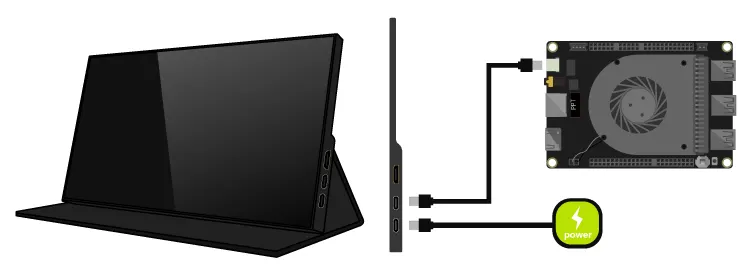
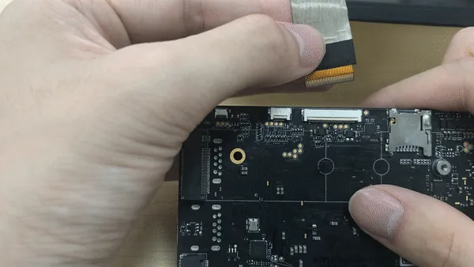

# Display Connections

This chapter will demonstrate multiple ways to connect display devices to your LattePanda, and provide information on the necessary components and installation steps.

!!! Warning "Electrostatic Warning"
    Be sure to remove the static electricity from your body before touching the LattePanda! Otherwise, it may cause potential static discharge and damage your LattePanda! 

## 3 Ways to Extend Your Display on LattePanda 3 Delta

=== "HDMI Monitor"

    * via HDMI port
    * HDMI 2.0b: Up to 4096x2160 @ 60Hz HDR
    * for standard desktop usage

=== "USB Type C monitor or USB Type C to HDMI/DP Dock"

    * via USB Type C port
    * DP 1.4: Up to 4096x2160 @ 60Hz HDR
    * for standard desktop or mobile usage

=== "eDP Screen"

    * via eDP slot
    * 2 Lanes, Up to 1920*1080
    * for embedded application scenarios


## HDMI

!!! Note "4K HDR"
    The LattePanda 3 Delta provides support for HDMI 2.0b, thus, if you intend to connect it to a display capable of 4K 60Hz or 4K HDR, it is advisable to employ an HDMI 2.0b cable.

### Preparations

- :material-cable-data:     HDMI Cable
- :material-monitor:        TV or Monitor with HDMI Port

### Installation Steps

1. Connect one end of the HDMI cable to the HDMI port on the LattePanda.
2. Connect the other end of the HDMI cable to the TV or monitor.

## USB Type C

### Preparations

* USB Type C Display, or USB Type C Dock
* USB Type C Cable

!!! Note

    The USB Type C dock must support external PD power input and transfer data with the LattePanda by USB Type C port.


### Installation Steps

- If your display device does not have a USB Type C port, you will need a **USB Type C Dock**. Please follow these steps:

    ```markdown
    a. Connect the USB Type C Dock to the USB Type C port of your LattePanda.
    b. Connect the USB Type C Dock to your TV or monitor by HDMI or DP cable.
    c. Connect the USB Type C PD power adapter to the USB Type C Dock.
    ```
    
- If your display has a full fuction USB Type C port that supports DP, PD and USB, a single USB Type C cable is sufficient. Please follow these steps:

 

    a. Connect the USB Type C cable to the USB Type C port of your LattePanda.
    b. Connect the other end of the USB Type C cable to the display device.	
    c. Connect the USB Type C PD power adapter to the display device.

## eDP(Embedded DisplayPort)

###  Compatibility

In most cases, any display devices which have a 30Pin eDP connector and is powered by 3.3V is compatible with LattePanda 3 Delta and don't require additional drivers. The eDP connector of LattePanda 3 Delta has 2 lanes.

### Preparations

* [eDP touch display for LattePanda 3 Delta](https://www.dfrobot.com/product-1853.html)

### Installation Steps

!!! Warning "Ensure Correct eDP Cable Installation"

    To avoid any potential damage to your LattePanda or display device, it's important to ensure that the eDP cable is correctly installed and the display is connected before turning on your LattePanda. Please double-check these connections carefully, as failure to do so may cause a short circuit.

- Ensure the LattePanda is powered off and disconnected from power supply cable.
- Open the eDP latch on the bottom of LattePanda.
- Align the eDP cable with the eDP cable connector on LattePanda. Make sure the gold finger of the eDP cable faces away from the bottom of LattePanda.
- Insert the eDP cable, then press down the latch to secure the eDP cable.



### Additional eDP Displays from LattePanda Community

Although LattePanda officially offers the [7 inch eDP touch display](https://www.dfrobot.com/product-1853.html), our community members have successfully made use of a variety of alternative displays.

* [17.3" Display](https://www.lattepanda.com/topic-f23t17107.html?start=11)
* [14.0'' BOE Display](https://www.lattepanda.com/forum/topic/322393)
* [Fixing Screen Flickering Issues on LattePanda 3 Delta when connecting other eDP displays](https://www.lattepanda.com/forum/topic/320736)

## Touch Panel

Touchscreen connections can be made using <span style="color: rgba(225, 103, 13);">**USB, I2C, or Type-C**</span>. 

- USB and Type-C connections are simple and convenient, suitable for most PCs and tablets. 
- I2C connection is commonly used in embedded applications, especially for eDP touchscreen screens. 

When choosing a touchscreen, it is important to consider the requirements of the device and the intended application scenario in order to choose the appropriate connection method.

!!! note ""
    === "USB Connection"

        **The USB connection** is a common method for connecting a touchscreen, known for its simplicity, convenience, and wide compatibility. **Most personal computers and tablets** support USB interfaces, making it suitable for these devices. USB connection typically utilizes the USB HID (Human Interface Device) protocol for communication, enabling basic touchscreen functionality.
    
    === "I2C Connection"
    
        **The I2C connection** is a serial communication protocol commonly used for embedded devices. In the context of touchscreens, the I2C connection is often employed for connecting eDP (Embedded DisplayPort) touchscreen screens. Compared to USB connection, I2C has a lower transmission rate but is more prevalent in embedded applications. Selecting an I2C connection usually requires considering factors such as **device power consumption and space limitations**.
    
    === "TYPE C Connection"
    
        **The Type-C connection** is a versatile and comprehensive standard that supports various protocols and functions, including USB, DisplayPort, and Power Delivery. Opting for a Type-C connection is typically suitable for scenarios that demand both data transfer and power charging capabilities simultaneously, such as **high-performance tablets and mobile devices**.


* [7 inch eDP display with touch panel](https://www.dfrobot.com/product-1853.html)


[**:simple-discord: Join our Discord**](https://discord.gg/k6YPYQgmHt){ .md-button .md-button--primary }