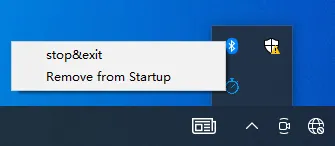

# Watchdog Timer

## Overview

Lattepanda 3 Delta utilizes IT8613E Super I/O chipset which bulid in the watchdog timer. It can improve the system reliability by automatically restarting the system if it becomes unresponsive. This feature is crucial for maintaining uninterrupted operation, particularly in remote or critical applications.

This tutorial will show the principles of watchdog timer initialization, setting related registers, and how to program the watchdog timer in Windows and Ubuntu OS.

Our community member Youyou provided a detailed explanation of the principles, as well as the watchdog prototype software and engineering code in the Windows 10 OS, as well as the application code in the Ubuntu OS. This tutorial is based on these contents.

If you have any thoughts or questions about the use of watchdog timer, please feel free to enter our [**discord discussion**](https://discord.gg/k6YPYQgmHt). You can also join the discussion in the [**Watchdog Timer Application Post**](https://www.lattepanda.com/forum/topic/328966).

## Principle Introduction

### Operate Registers

The IT8613E has two special ports, namely: Address Port and Data Port.

The Address Port is 2EH, which is used to specify the address of the selected register.

The Data Port is 2FH, which is used to write or read the value of the selected register.

For example: 

To write the value 3CH into the register on address 73H, the steps are as follows:

- Write value 73H into the Address Port 2EH
- Write value 3CH into the Data Port 2FH

### MB PnP Mode

After the hardware reset or power-on reset, the IT8613E enters the normal mode with all logical devices disabled except KBC.

To operate the registers of IT8613E, first, enter the MB PnP mode, then read and write the relevant registers. After completion, exit the MB PnP mode. 

So there are three steps to complete the configuration setup: 

- Enter the MB PnP Mode; 
- Modify the data of configuration registers; 
- Exit the MB PnP Mode. 

!!! Note

     If not exited in a timely manner and remaining in MB PnP mode for an extended period, unintended results may occur.

### Enter into the MB PnP Mode

To enter into the MB PnP Mode, four special I/O write operations are required to be performed during Wait for Key state.

To ensure the initial state of the key-check logic, four consecutive write operations to the Special Address port (2EH) are required: specifically, writing 87H, 01H, 55H, 55H in sequence.

### Configure LDN Registers

All configuration registers can be accessed after entering the MB PnP Mode.

Before accessing a selected register, the content of Index 07h must be changed to the LDN to which the register belongs, except some Global registers.

Since the relevant registers to be operated next are not Global registers, this step needs to be completed before operating the relevant registers.

The steps are as follows:

- Write value 07H into the Address Port 2EH
- Write value 07H into the Data Port 2FH

### Watchdog Timer Register

The watchdog timer of LattePanda 3 Delta output the reset command through the PWRGD pin to let the OS restart. That is, set Bit 4 as 1. 

In this tutorial, 60 seconds are used as an example. That is, set Bit 7 as 1.

10010000 BIN = 90 HEX. 

Write value 90H to this register. The steps are as follows:

- Write value 72H into the Address Port 2EH
- Write value 90H into the Data Port 2FH

!!! Note

     To disable the watchdog timer leading restarting OS, just set Bit 4 as 0.

In this tutorial , the reset time is 60 seconds as an example.

60 DEC = 3C HEX.

Write 0x3C to the LSB register. There is no need to operate the MSB register, just keep the default value. The steps are as follows:

- Write value 73H into the Address Port 2EH

- Write value 3CH into the Data Port 2FH

!!! Note

     Before the watchdog timer overflows, rewriting values to the LSB and MSB registers can feed the dog. The watchdog timer will begin counting based on the newly written values.

### Exit the MB PnP Mode

 

Set Bit 1 of the configure control register to 1 to exit the MB PnP Mode. The steps are as follows:

- Write value 02H into the Address Port 2EH
- Write value 02H into the Data Port 2FH

## Flow Chart

## Windows OS

### Demo App

The function of this app demo is to set the watchdog timer overflow time to 60 seconds, and the app feeds the watchdog timer every 30 seconds. If the watchdog timer is not fed within 60 seconds, the system will be restarted.

Download the [**WinDog demo**](../../assets/drivers/3rd_delta_edition/WinDogAppDemo.zip) installation file, then double-click to run it, and keep clicking **Next** until the installation is completed.

After the installation, double-click the WinDog icon to run the application.

You will see the WinDog icon in the lower right corner of the desktop. Right-click the icon to see two functions:

- Stop and Exit 
    * Stop the watchdog timer and close the WinDog app.

- Remove from Startup / Add to Startup
    * Add the WinDog app to the startup items, or remove it from the startup items. Depending on the status, the text of this function will automatically change.
    * You can also check whether WinDog app is included in the startup items in the **Task Scheduler** of Windows OS.

!!! Note

     - WinDog app can detect whether the OS is logging off or shutting down. In these two states, it will automatically stop the watchdog timer, so the OS will not suddenly restart when logging off or shutting down.
     - To prevent OS sudden restart, it is recommended to stop the watchdog timer before executing windows update.

### App Source Code

This demo app is written with C# in Visual Studio. [**Click to download**](../../assets/drivers/3rd_delta_edition/WinDogSourceCode.zip) the project source code. 

The .dll files used in the demo app project have been digitally signed. Executable files that you generate yourself may require digital signatures to function properly.

This project code can be embedded into your application to regularly feed the watchdog timer. If the application becomes stuck or unresponsive, the watchdog timer will restart the OS to eliminate this stuck or unresponsive application. 

## Ubuntu OS

Please see the [**Watchdog Timer Application Post**](https://www.lattepanda.com/forum/topic/328966).

[**:simple-discord: Join our Discord**](https://discord.gg/k6YPYQgmHt){ .md-button .md-button--primary }