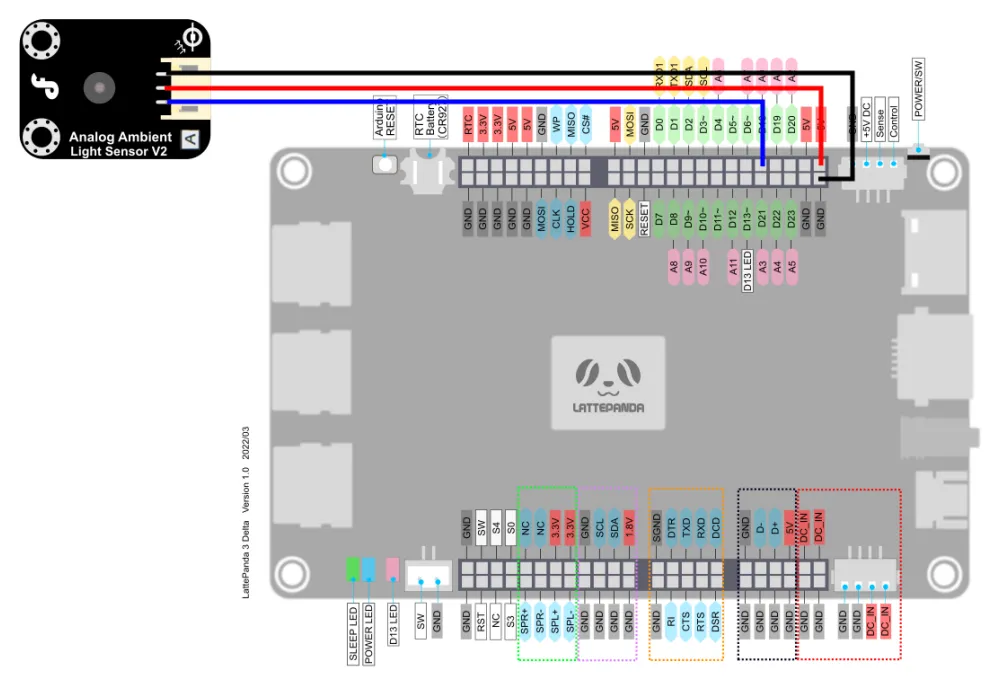
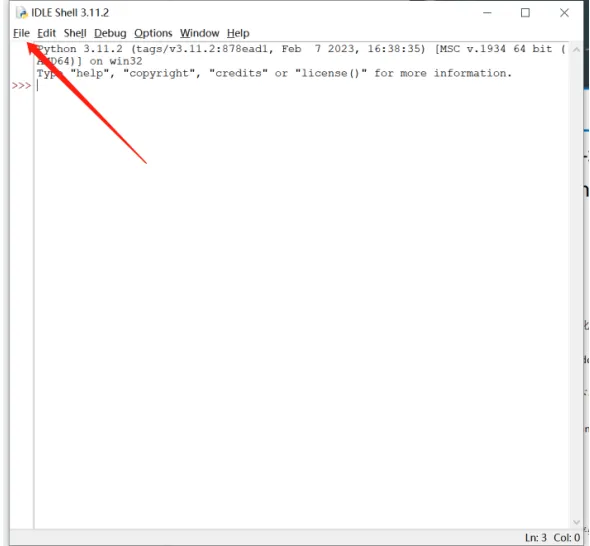
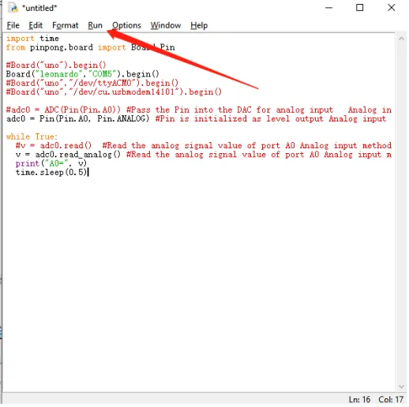
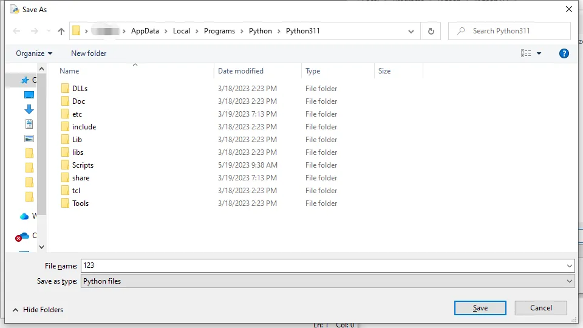
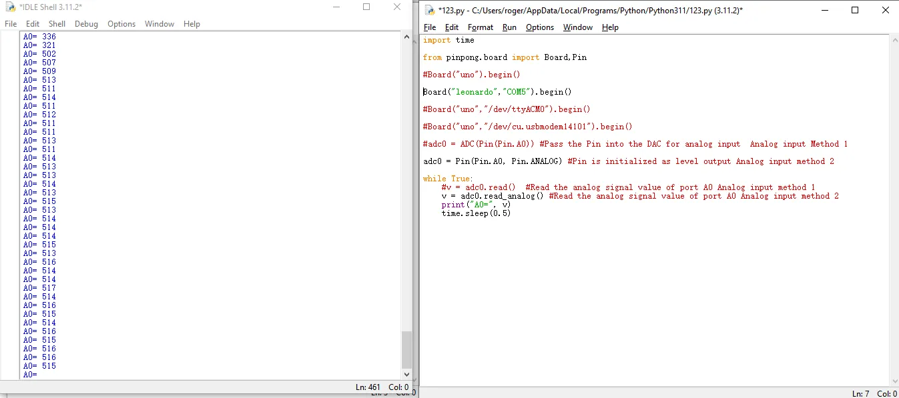

## Purpose of sample code

In the previous tutorial, we learned about the use of digital IO. However, digital IO is often limited in scope and can only represent two states of 0 and 1 using high and low levels. 

In actual development, we sometimes need more precise and subdivided values. This is where we often use the MCU’s analog input interface. The analog input interface inputs the corresponding analog voltage to the MCU, which is converted into an analog value by the MCU’s ADC (analog-to-digital converter unit) and input to the MCU. 

For the Arduino Leonardo onboard LattePanda 3 delta board, its MCU accuracy is 10 bits, which means that its maximum representation range is 2^10. In simpler terms, if the working voltage of the MCU is 5V, the MCU will subdivide the voltage of 0-5V received by the analog input port into 0-1024 units. When the analog value reading is 0, the actual voltage is also 0. When the analog value reading is 1024, the actual voltage is 5V.

## Hardware preparation

LattePanda 3 delta 					*1

Gravity:Analog Ambient Light sensor		*1

Jumper Cables(M/M)					*3

## Hardware connection

By looking at the [wiki page](https://www.dfrobot.com/wiki/index.php/DFRobot_Ambient_Light_Sensor_SKU:DFR0026) for simulating a light sensor

We can know that the sensor can be connected to a voltage of 3.3-5V, and will change its output voltage according to the detected light.

The Arduino Leonardo on the LattePanda 3 delta supports 12 analog inputs, corresponding to the pins: A0~A11 (analog input pins and digital IO pins are multiplexed, please refer to the pin diagram of LattePanda 3 Delta for details)

This tutorial takes the A0 pin as an example to connect the photosensitive sensor to 5V voltage for driving

 

 

 

## Programming

In this example, we use the text editor IDLE that comes with python to edit the code.

If you are familiar with the editing and compiling process of python code, you can also use your customary code editor.

 

- Search for IDLE in the search box and open it

- Click File -> New File to create a new Python file.

- Enter the following python code

		import time
		
		from pinpong.board import Board,Pin
		
		#Board("uno").begin()        
		
		Board("leonardo","COM5").begin() 
		
		#Board("uno","/dev/ttyACM0").begin() 
		
		#Board("uno","/dev/cu.usbmodem14101").begin()  
		
		#adc0 = ADC(Pin(Pin.A0)) #Pass the Pin into the DAC for analog input  Analog input Method 1
		
		adc0 = Pin(Pin.A0, Pin.ANALOG) #Pin is initialized as level output Analog input method 2
		
		while True:
		
			#v = adc0.read()  #Read the analog signal value of port A0 Analog input method 1
		
			v = adc0.read_analog() #Read the analog signal value of port A0 Analog input method 2
		
			print("A0=", v)
		
			time.sleep(0.5)

 

 

 

 

-  Click Run->Run Module to execute python code

 

-  Prompt to save the python file, you can choose your custom folder to store. Here we save by default

- After the save is complete, the python code is automatically executed. The command line prints out the ADC analog value

 

 

 
