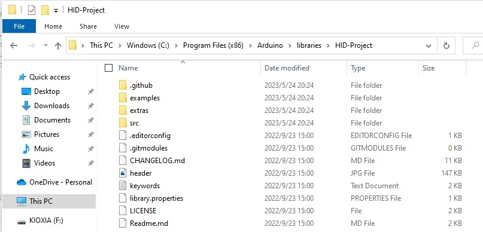
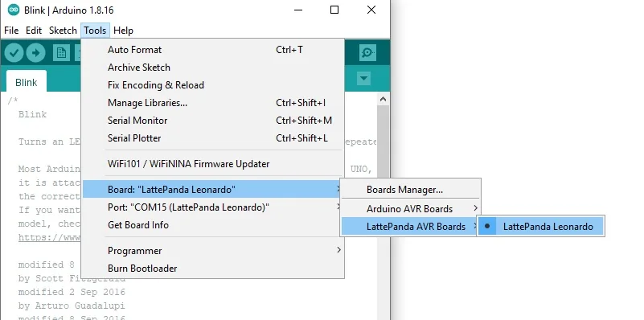

## Principle Overview

The Arduino Leonardo, integrated into the Lattepanda board, employs the ATmega32u4 microcontroller and enables direct USB communication without requiring an additional processor. It possesses the ability to simulate Human Interface Devices (HID), allowing the transmission of keystrokes, mouse movements, and click events to a connected computer, thereby effectively managing functionalities of the Windows operating system such as volume control, sleep mode, and wake functions.

In this chapter, we utilize the HID library (developed by NicoHood) as an example to demonstrate the process of utilizing the Arduino Leonardo for controlling the volume of a Windows 10 system.


## Requirements

### Software

   [HID Library](https://github.com/NicoHood/HID/releases)<br>
	
   [Arduino IDE 1.8.x](https://www.arduino.cc/en/software)<br>

### Hardware<br>

   LattePanda Board with Windows 10 System<br>


## Tutorial

- Download and install the Arduino IDE. However, if you are using the LattePanda official image, the Arduino IDE is already incorporated into the Windows system, and this step can be bypassed.

- Download the HID library file.  Once downloaded, extract its contents. Rename the extracted folder to 'HID-Project'. Then copy this folder to the 'library' folder located in the Arduino IDE installation directory. The result should looks like the following:



- Launch the Arduino IDE. Navigate through the following selections: Tools -> Board -> Arduino Leonardo (or LattePanda Leonardo). Afterwards, choose the COM port that corresponds to this board.



#### Control Volume via Push Button
- Connect two buttons to **pins A0 and A1** respectively.
- Click on the 'Upload' button to upload the sample code provided below.

```C
/*
  Consumer example
  Use two buttons to turn up or down the windows system volume.

  See HID Project documentation for more Consumer keys.
  https://github.com/NicoHood/HID/wiki/Consumer-API
*/

#include "HID-Project.h"

const int pinButtonUp = A0;
const int pinButtonDown = A1;

void setup() 
{
  pinMode(LED_BUILTIN, OUTPUT);
  pinMode(pinButtonUp, INPUT_PULLUP);
  pinMode(pinButtonDown, INPUT_PULLUP);
  Consumer.begin();   // Sends a clean report to the host. This is important on any Arduino type.
}

void loop() 
{
  if (!digitalRead(pinButtonUp)) 
  {
      digitalWrite(LED_BUILTIN, HIGH);
      Consumer.write(MEDIA_VOLUME_UP);  //see HID Project documentation for more Consumer keys
      delay(100); //simple debounce
      digitalWrite(LED_BUILTIN, LOW);
  }
  if (!digitalRead(pinButtonDown)) 
  {
      digitalWrite(LED_BUILTIN, HIGH);
      Consumer.write(MEDIA_VOLUME_DOWN);
      delay(100);
      digitalWrite(LED_BUILTIN, LOW);
  }
}
```

- Once done, you'll be able to use two buttons that are connected to **the A0 and A1 pins** of the Arduino Leonardo to manipulate the volume of the Windows system.

    * Press the button connected A0 pin: turn up the volume
    * Press the button connected A1 pin: turn down the volume

#### Control Volume via Rotary Knob 
- Connect the rotary Knob to **pin A2**.
- Click on the 'Upload' button to upload the sample code provided below.

```C
#include "HID-Project.h"

const int pinPotentiometer = A2;
int lastRead = 0;  // stores the previous ADC reading

void setup() 
{
  pinMode(pinPotentiometer, INPUT);
  Consumer.begin();
  lastRead = analogRead(pinPotentiometer);  // initialize lastRead with the current reading
}

void loop() 
{
  int currentRead = analogRead(pinPotentiometer);  // read the current ADC value

  if (currentRead - lastRead > 5) 
  {
      Consumer.write(MEDIA_VOLUME_UP);  // send media volume up command
  }
  else if (lastRead - currentRead > 5) 
  {
      Consumer.write(MEDIA_VOLUME_DOWN);  // send media volume down command
  }

  lastRead = currentRead;  // update lastRead with the current reading

  delay(50);  // read ADC value every 50ms
}
```
- Upon uploading the code, you will be able to utilize the rotary Knob connected to **the A2 pin** to control the volume of the Windows system.
  

Enjoy it!<br>

- Please see the [Consumer-API](https://github.com/NicoHood/HID/wiki/Consumer-API) to explore more functions.


[**:simple-discord: Join our Discord**](https://discord.com/invite/UHgtJbf978){ .md-button .md-button--primary }