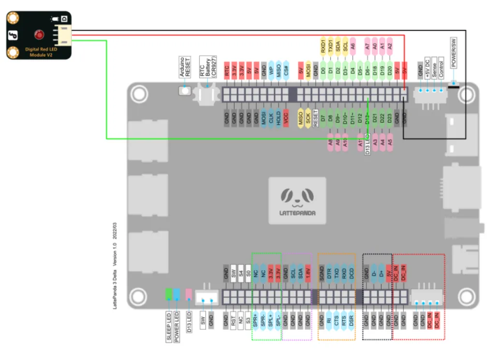
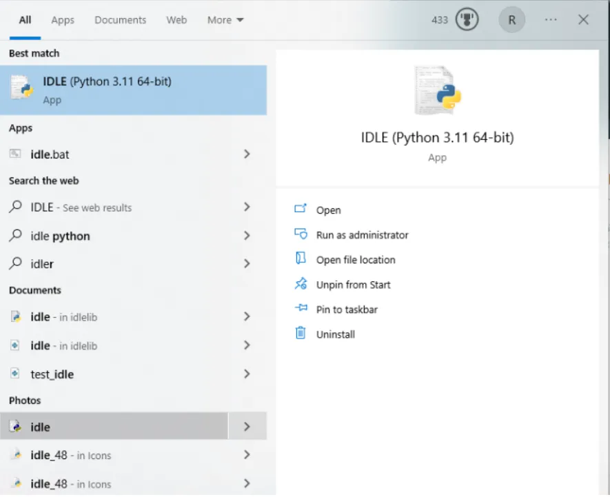
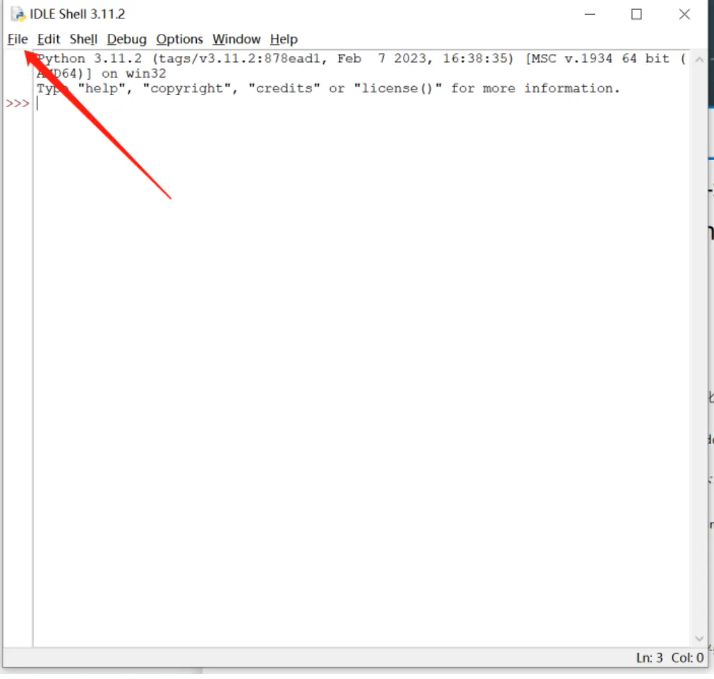
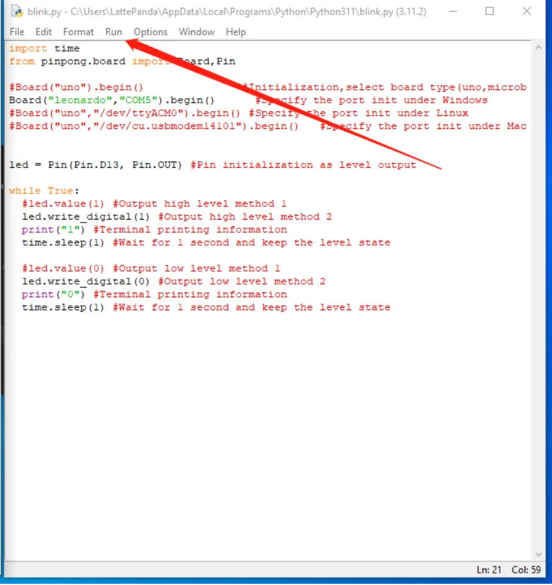
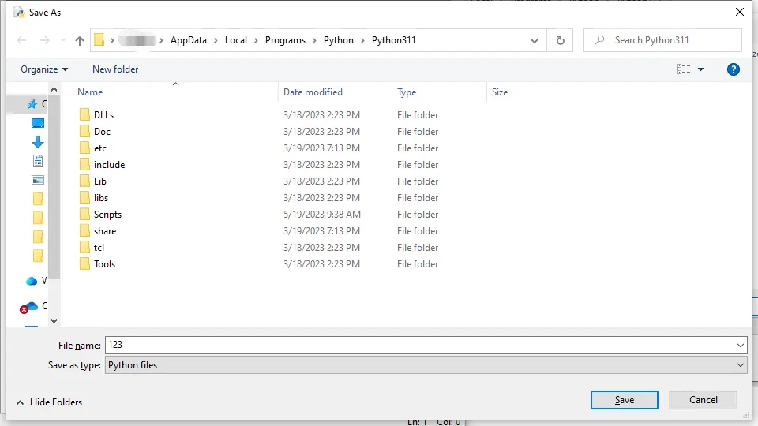
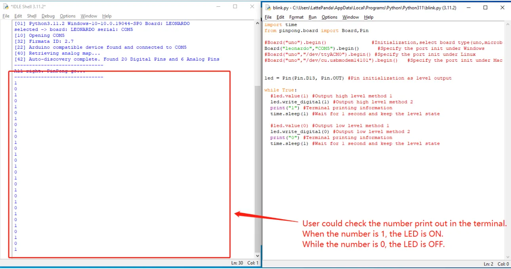
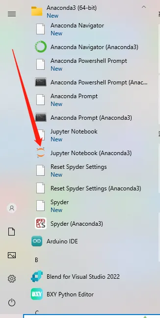
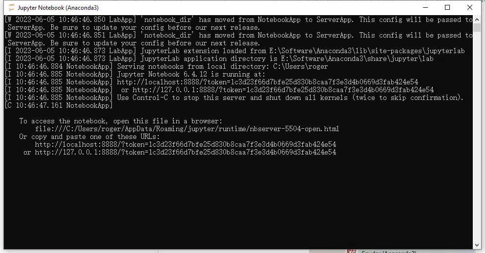
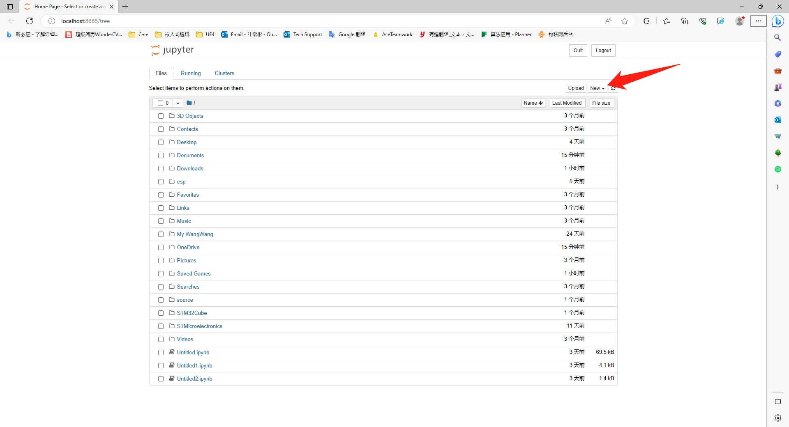
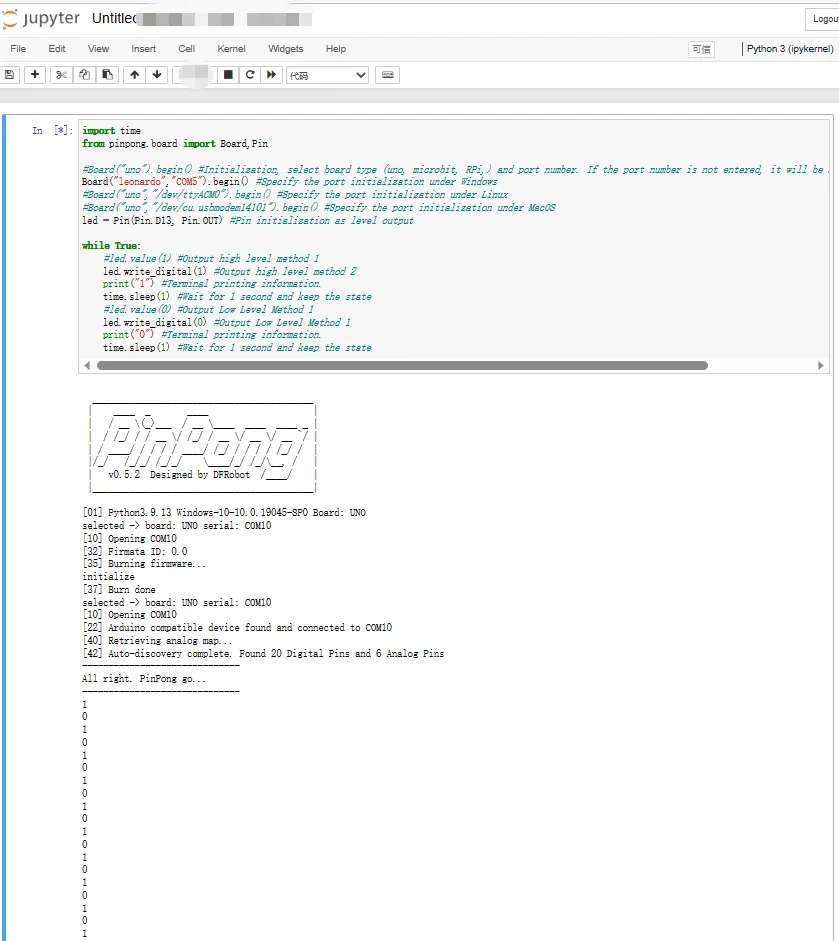

## Purpose of sample code

If you possess knowledge of programming, you are likely acquainted with the classic first test code, which is printing "Hello world!" onto the command line. This customary practice commenced with "The C Programming Language" where it was utilized as the initial demonstration program. Subsequently, fellow programmers sustained the tradition when studying programming or debugging novel device environments.

Similarly, within the embedded and hardware fields, a comparable "Hello world!" example exists -- illuminating a small LED for debugging. In the progression of single-chip microcomputers or embedded devices, illuminating an LED serves as a fundamental debugging technique.

This article will delineate how to manipulate the pinpong library on LattePanda 3 Delta to operate an LED light. With the support of pinpong library, you can facilely regulate a range of common open source hardware, accomplish seamless linkage between software and hardware, and significantly abbreviate the development process.


## Hardware prepare

- 1 x LattePanda 3 delta (or other LattePanda board)

- 1 x Gravity:Digital Piranha LED Module-red

- 1 x Jumper Cables(M/M) 


## Hardware connection

By viewing the product page of LED small lights:

[https://www.dfrobot.com/product-490.html](https://www.dfrobot.com/product-490.html)

We can see that the LED can be connected to a driving voltage of 3.3-5V and controlled by high and low levels. So we can connect it to the Arduino digital output pin on the onboard of LattePanda for control. The Arduino Leonardo onboard of LattePanda 3 delta supports 24 digital outputs, corresponding to pins D0~D23.

This tutorial takes D13 pin as an example and connects the LED small light to 5V voltage for driving:




## Programming

In this example, we use the IDLE text editor that comes with Python to edit code. If you are familiar with the editing and compiling process of Python code, you can also use your own preferred code editor

-  In Lesson 1, you have already installed the Python 3 environment, so IDLE will also be automatically installed on your LattePanda. Search for IDLE in the search box and open it.




-  Click File -\> New File to create a new Python file.




- Enter the following Python code
```Python
import time
      	
from pinpong.board import Board,Pin
      	
#Board("uno").begin() #Initialization, select board type (uno, microbit, RPi,) and port number. If the port number is not entered, it will be automatically recognized
      	
Board("leonardo","COM5").begin() #Specify the port initialization under Windows
      	
#Board("uno","/dev/ttyACM0").begin() #Specify the port initialization under Linux
      	
#Board("uno","/dev/cu.usbmodem14101").begin() #Specify the port initialization under MacOS
      	
led = Pin(Pin.D13, Pin.OUT) #Pin initialization as level output
      	
while True:
      	
	#led.value(1) #Output high level method 1
      	
     led.write\_digital(1) #Output high level method 2
      	
      print("1") #Terminal printing information.
      	
      time.sleep(1) #Wait for 1 second and keep the state
      	
      #led.value(0) #Output Low Level Method 1
      	
      led.write\_digital(0) #Output Low Level Method 1
      	
      print("0") #Terminal printing information.
      	
      time.sleep(1) #Wait for 1 second and keep the state

```

-  Click Run -\> Run Module to execute Python code




-  Click the prompt to save the Python file. You can choose to save it in a folder of your choice. Here we will save it by default




-  After saving, the Python code will execute automatically. You can see that the LED light is flashing at an interval of one second



- Similarly, you can also use the Jupyter Notebook installed in the previous course to call the pinpong library to write Blink code
- Click Jupyter Notebook in the Anaconda installation folder
  
  

- Jupyter Notebook will open a Command Prompt.
- When using Jupyter Notebook, be sure not to close this Command Prompt. Otherwise the connection to the Jupyter Notebook server will be lost
  
  

- At the same time, Jupyter Notebook opens a browser web page.
- You can click New to create a new Jupyter Notebook project file，this will create a .ipynb file in the current folder.
  
  

- Copy and paste the Blink python code above.
- Then press the "shift+Enter" to run the Blink code.

- Then you could see the blnk code is working now.
  
  
