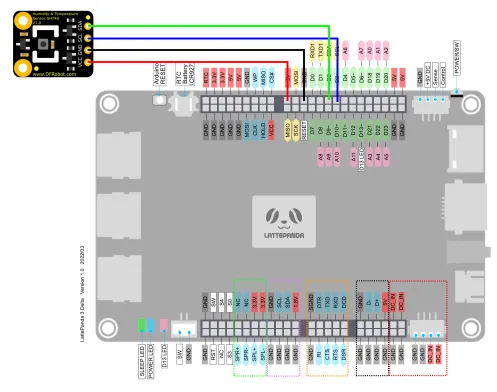
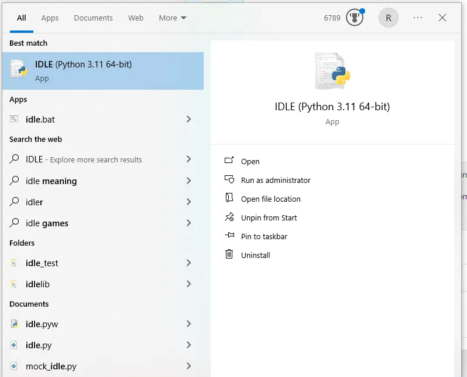
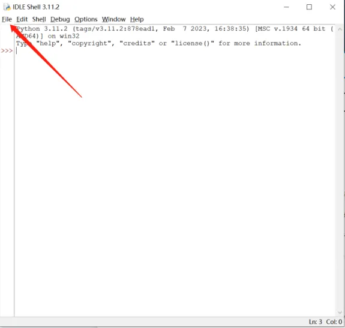
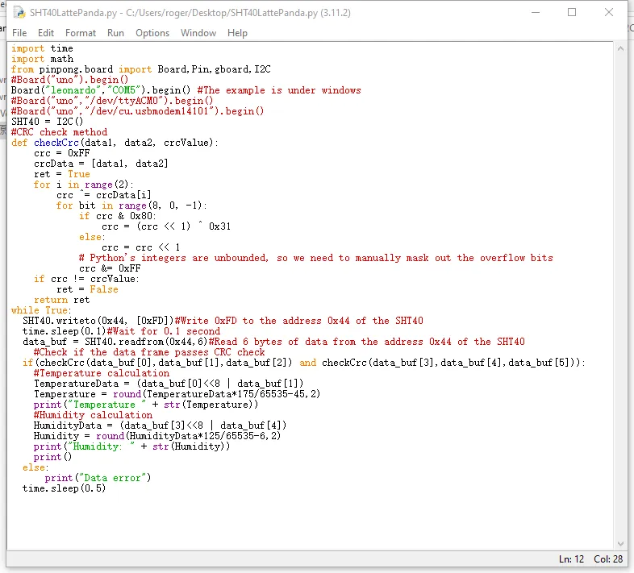
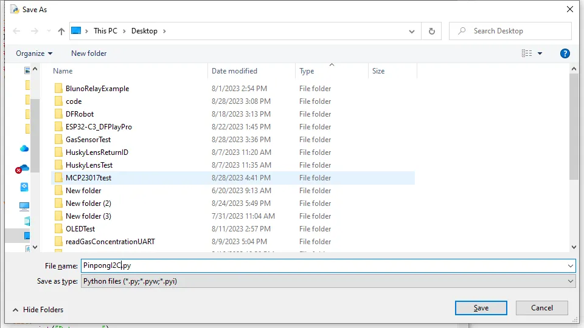
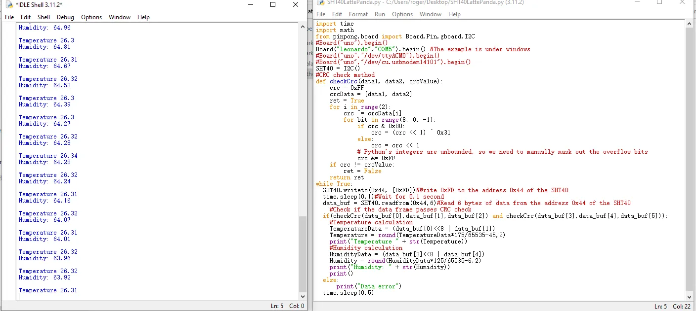
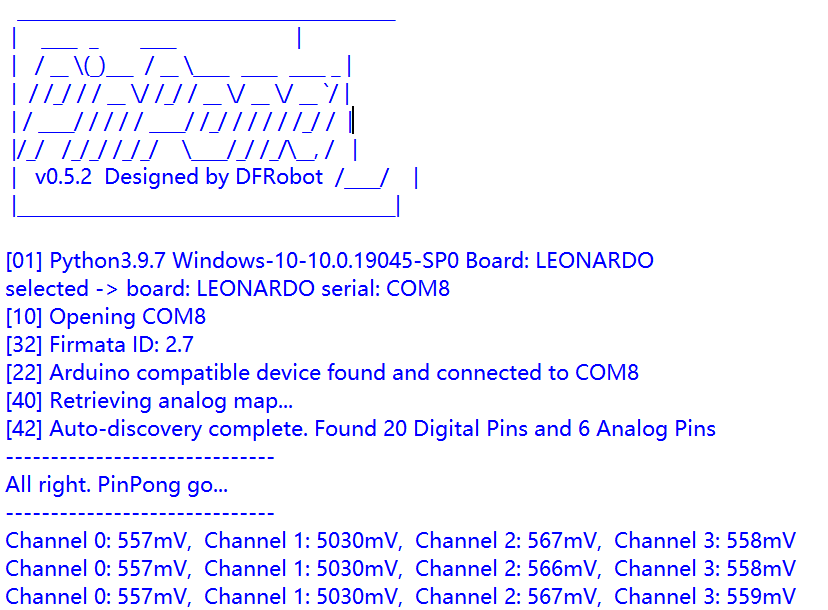

## Purpose of the Example Code

In the previous tutorials, we have covered all the functionalities of individual IOs. In practical development, sensors often transmit data using communication protocols. Common communication protocols include I2C, UART, SPI, etc.

Among them, the I2C communication protocol (Inter-Intergrated Circuit) is a type of serial communication used for communication between multiple devices.

The I2C communication protocol uses two signal lines for communication:

1. **Serial Clock line (SCL)**: Controlled by the master device, it provides the clock signal for synchronizing data transmission.
2. **Serial Data line (SDA)**: Used for data transmission between devices.

It has the following characteristics:

- Supports multiple master devices: Multiple master devices can share the same I2C bus and select the slave device to communicate with through address selection.
- 7-bit or 10-bit device addresses: I2C uses 7-bit or 10-bit addresses to identify devices.
- Low speed: I2C communication has a relatively low speed, typically within the range of a few hundred Kbps.
- Simple hardware: I2C communication only requires two signal lines, making hardware implementation relatively simple.

At the same time, the I2C communication protocol is widely used in DFRobot's open-source hardware sensors, covering various aspects such as environment, gas, and geomagnetism.

## Hardware Preparation

LattePanda 3 delta 					*1

Fermion: SHT40 Temperature & Humidity Sensor (Breakout)			*1

Dupond wires(M/F)					*3

## Hardware Connection

By referring to the [wiki](https://wiki.dfrobot.com/SHT40_Humidity_and_Temperature_Sensor_SKU_SEN0428 "wiki") of the SHT40 temperature and humidity sensor, we can learn that the sensor can be powered by a voltage of 3.3-5V and outputs data through I2C.

The LattePanda 3 delta board's built-in Arduino Leonardo supports 1 I2C communication interface, with the corresponding pins as follows: D2=SDA, D3=SCL.

In this tutorial, we will use the SHT40 temperature and humidity sensor as an example, connecting it to a 5V power supply.



## Programming

In this example, we will use the built-in text editor IDLE in Python for code editing.

If you are familiar with the editing and compilation process of Python code, you can also use your preferred code editor.

- Search for IDLE in the search box and open it.




- Click on File -> New File to create a new Python file.



- By referring to the SHT40 datasheet, we can learn that:

we need to write 0xFD to the I2C address (0x44) of the SHT40 and wait for at least 0.01 seconds. Then we read 6 bytes of data from the address 0x44.

In 6 bytes:：

The first and second bytes are temperature-related parameters, and the third byte is the CRC checksum.

The fourth and fifth bytes are humidity-related parameters, and the sixth byte is the CRC checksum.

- Input the following Python code:

    	import time
    	import math
    	from pinpong.board import Board,Pin,gboard,I2C
    	
    	#Board("uno").begin()               
    	Board("leonardo","COM5").begin() #The example is under windows
    	#Board("uno","/dev/ttyACM0").begin() 
    	#Board("uno","/dev/cu.usbmodem14101").begin()   
    	
    	SHT40 = I2C()
    	
    	#CRC check method
    	def checkCrc(data1, data2, crcValue):
    	    crc = 0xFF
    	    crcData = [data1, data2]
    	    ret = True
    	
    	    for i in range(2):
    	        crc ^= crcData[i]
    	        for bit in range(8, 0, -1):
    	            if crc & 0x80:
    	                crc = (crc << 1) ^ 0x31
    	            else:
    	                crc = crc << 1
    	            # Python's integers are unbounded, so we need to manually mask out the overflow bits
    	            crc &= 0xFF
    	
    	    if crc != crcValue:
    	        ret = False
    	        
    	    return ret
    	
    	while True:
    	  SHT40.writeto(0x44, [0xFD])#Write 0xFD to the address 0x44 of the SHT40
    	  time.sleep(0.1)#Wait for 0.1 second
    	  data_buf = SHT40.readfrom(0x44,6)#Read 6 bytes of data from the address 0x44 of the SHT40
    	  
    		#Check if the data frame passes CRC check
    	  if(checkCrc(data_buf[0],data_buf[1],data_buf[2]) and checkCrc(data_buf[3],data_buf[4],data_buf[5])):
    	    #Temperature calculation
    	    TemperatureData = (data_buf[0]<<8 | data_buf[1])
    	    Temperature = round(TemperatureData*175/65535-45,2)
    	    print("Temperature " + str(Temperature))
    	    #Humidity calculation
    	    HumidityData = (data_buf[3]<<8 | data_buf[4])
    	    Humidity = round(HumidityData*125/65535-6,2)
    	    print("Humidity: " + str(Humidity))
    	    print()
    	  else:
    	      print("Data error")
    	
    	  time.sleep(0.5)

   

- Click on Run -> Run Module to execute the Python code.



-  You will be prompted to save the Python file. You can choose to save it in your preferred folder. Here, we will assume the default save location.



- After saving, the Python code will be automatically executed. The command line will print the temperature and humidity values of the SHT40.




## ADS1115 ADC Module Example

This sample was provided by members of our disocrod group.

### Function

Read the voltage value of each channel of the ADS1115 module in sequence and print it at regular intervals.

### Hardware Preparation

LattePanda 3 delta 					*1

[Gravity: I2C ADS1115 16-Bit ADC Module](https://www.dfrobot.com/product-1730.html)			*1

Dupond wires(M/F)					*4

### Hardware Connection

| LattePanda 3 Delta Pin Header | ADS1115 Module Pin |
| ----------------------------- | ------------------ |
| 5V                            | VCC                |
| GND                           | GND                |
| D3                            | SCL                |
| D2                            | SDA                |

### Sample Code

```python
import time
from pinpong.board import Board, I2C

# Initialize the board (assuming Arduino Leonardo and COM port COM5)
Board("leonardo", "COM5").begin()

# ADS1115 settings
ADS1115_ADDR = 0x48  # I2C address of ADS1115
ADS1115_CONV_REG = 0x00  # Conversion register
ADS1115_CONFIG_REG = 0x01  # Config register

# Initialize I2C
ads1115 = I2C()

def config_ads1115_channel(channel):
    """
    Configure the ADS1115 to read from the specified channel with Gain = 2/3.
    """
    config = 0x4000  # Start single-conversion
    config |= (channel << 12)  # AINx single-ended input
    config &= ~0x0E00  # Clear gain bits
    config |= 0x0000  # 2/3 Gain for 6.144V voltage range
    config |= 0x0080  # 128 SPS
    config |= 0x0100  # Power-down single-shot mode
    config |= 0x8000  # Ensure MSB is set to '1' for operational status

    # Split the config into two bytes and write it to the config register
    high_byte = (config >> 8) & 0xFF
    low_byte = config & 0xFF
    ads1115.writeto(ADS1115_ADDR, [ADS1115_CONFIG_REG, high_byte, low_byte])

def read_voltage_from_channel(channel):
    """
    Read and convert the voltage from the specified channel of the ADS1115.
    """
    config_ads1115_channel(channel)
    time.sleep(0.1)  # Wait for conversion to complete

    # Read the conversion result
    ads1115.writeto(ADS1115_ADDR, [ADS1115_CONV_REG])
    data = ads1115.readfrom(ADS1115_ADDR, 2)
    adc_value = (data[0] << 8) | data[1]

    # If the ADC value is negative, adjust it
    if adc_value > 0x7FFF:
        adc_value -= 0x10000

    # Convert ADC value to voltage in mV with 2/3 Gain
    voltage_mV = int(adc_value * 6144 / 32767)
    return voltage_mV


# Main loop
while True:
    output = ""
    for channel in range(4):
        voltage_mV = read_voltage_from_channel(channel)
        if channel < 3:
            output += f"Channel {channel}: {voltage_mV}mV,  "
        else:
            output += f"Channel {channel}: {voltage_mV}mV"
    print(output)
    time.sleep(0.5)

```

### Result

{ width="500" } 