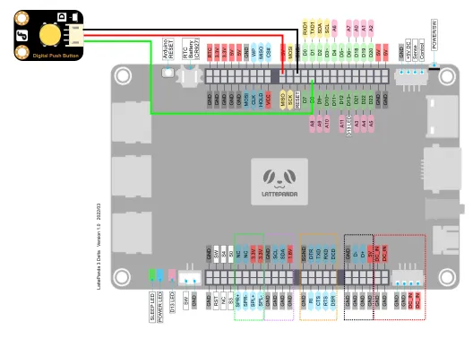
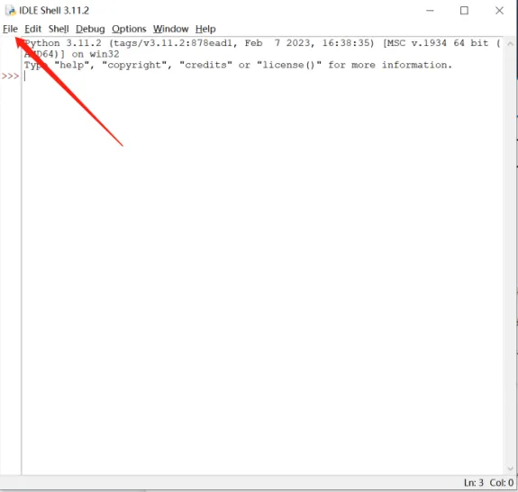

## Purpose of the Example code

IRQ (Interrupt Request) is used by microcontrollers (such as Arduino) to handle interrupt requests from external devices. When an external device needs to notify the microcontroller to perform certain operations, it sends an interrupt signal through the IRQ pin. This signal triggers an interrupt in the microcontroller, interrupting the currently executing task and executing a predefined Interrupt Service Routine (ISR) associated with that interrupt signal.

The main purpose of IRQ pin interrupts is to improve responsiveness and real-time capabilities. By using IRQ interrupts, the microcontroller can immediately respond to changes in the state of external devices or events, without continuously polling these devices in the main program. This interrupt-driven programming approach allows the system to run more efficiently while reducing resource consumption.

Next, we will learn an example to understand the application of pin interrupts. The following code is a Python-based Arduino example program used to test the pin interrupt functionality. It connects a button module to the D8 pin of the Arduino board and detects button press events using an interrupt handler function. This tutorial requires the use of the time library and the pinpong library in Python. You can modify the last section of the program based on the comments to choose the mode of button-triggered interrupts.

## Hardware Preparation

LattePanda 3 delta 					*1

Gravity: Digital Push Button			*1

Dupond wire(M/F)					*3

## Hardware Connection

By referring to the [wiki](https://www.dfrobot.com/wiki/index.php/DFRobot_Digital_Push_Button_SKU:DFR0029#Sample_Code "wiki") of the Numeric Keypad module, we can learn that the sensor can be powered by a voltage range of 3.3-5V. It outputs corresponding high or low levels based on whether the buttons are pressed.

The Arduino Leonardo onboard the LattePanda 3 Delta supports 20 digital inputs, corresponding to the following pins: D0~D13 / D18~D23

In this tutorial, we will use the D8 pin as an example. We will connect the Numeric Keypad module to the 5V power supply and detect the level changes of the button module input using IRQ for both rising and falling edges.

 

## Programming

In this example, we use the built-in text editor IDLE in Python for code editing.

If you are familiar with the process of editing and compiling Python code, you can also use your preferred code editor.

- Search for IDLE in the search box and open it.

- Click on File -> New File to create a new Python file.

- Input following Python code

		import time
		from pinpong.board import Board,Pin
		
		# Board("uno").begin()               # Initialize and select the board type (uno, leonardo, xugu) and port. If no port is specified, it will be automatically detected.
		Board("leonardo","COM5").begin() # Initialize with specified port on Windows
		# Board("uno", "/dev/ttyACM0").begin() # Initialize with specified port on Linux
		# Board("uno", "/dev/cu.usbmodem14101").begin()   # Initialize with specified port on Mac
		
		btn = Pin(Pin.D8, Pin.IN)
		
		def btn_rising_handler(pin): # Interrupt event callback function
		     print("\n--rising---")
		     print("pin = ", pin)
		
		def btn_falling_handler(pin):# Interrupt event callback function
		     print("\n--falling---")
		     print("pin = ", pin)
		
		def btn_both_handler(pin): # Interrupt event callback function
		     print("\n--both---")
		     print("pin = ", pin)
		
		btn.irq(trigger=Pin.IRQ_FALLING, handler=btn_falling_handler) # Set interrupt mode to falling edge trigger
		#btn.irq(trigger=Pin.IRQ_RISING, handler=btn_rising_handler)  # Set interrupt mode to rising edge trigger and specify the callback function
		#btn.irq(trigger=Pin.IRQ_RISING+Pin.IRQ_FALLING, handler=btn_both_handler)  # Set interrupt mode to level change trigger
		
		while True:
		     time.sleep(1)  # Keep the program running continuously

-  Click on Run -> Run Module to execute the Python code.

-  You will be prompted to save the Python file. You can choose to save it in a folder of your choice. Here, we will assume the default save location.

- Once the file is saved, the Python code will be automatically executed.
- The example code consists of three different modes. Users can set the mode by opening or closing the corresponding btn.irq() statements.

- Mode 1: Whenever the button is pressed, the value of pin 8 will be printed in the command line.

- Mode 2: Whenever the button is released, the value of pin 8 will be printed in the command line.

- Mode 3: Both when the button is pressed and released, the value of pin 8 will be printed in the command line.

