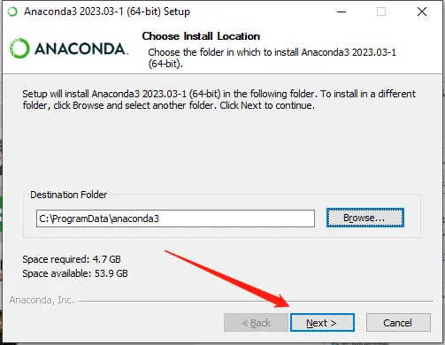
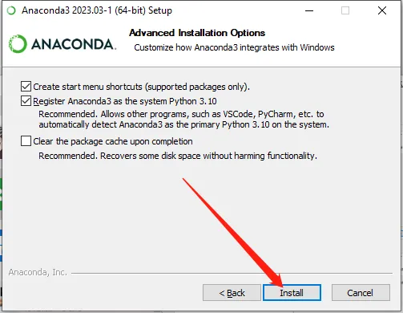

## Introduction to pinpong Library

The Pinpong Library is an open-source Python library that is based on the Firmata protocol and utilizes MicroPython syntax. Its primary objective is to provide developers with a tool that allows them to directly control various open-source hardware control boards through Python code. The library works by burning specific firmware to the open-source hardware, thereby enabling it to communicate with the computer via a serial port and execute multiple commands. The name "Pinpong" is a combination of "Pin" and "Pong," with "Pin" referring to pins, and "PinPong" being a homophone for "ping-pong," which reflects the library's ability to send and receive signals back and forth.

The primary aim behind the design of the library is to enable developers to focus on software implementation without being restricted by hardware limitations during the development phase. If developers initially developed their program using Arduino but required a different control board such as Controllino for deployment, only minor hardware parameter modifications would be necessary to achieve the "write once, run everywhere" goal.

## Course Objectives

This tutorial series is dedicated to introducing the utilization of the Pinpong Python library, developed by DFRobot, to operate the onboard Arduino Leonardo hardware resources of the LattePanda 3 Delta in a Windows environment. This tutorial serves as a beginner's guide, providing you with a swift and comprehensive grasp of the Pinpong library and its application in Python development. Implementation of the Pinpong library enables the alignment of software and hardware, thereby significantly decreasing your development cycle in areas such as robot creation, robotic arm production, and AGV (Automated Guided Vehicle) system development.

## Python3 installation introduction

- Install Python3. pinpong library depends on Python, so please make sure that Python3 is installed on your computer. If it is already installed, this step can be skipped.
- If Python3 is not installed, it needs to be installed. Python download website link:
https://www.python.org/

- Follow the prompts to install Python and select to add Python to the system path during installation, then click InstallNow

- Installation successful, click Close in the lower right corner.

## Pinpong library installation introduction

- Press Win+R on the keyboard to open the command line, enter pip install pinpong to install the pinpong library file

!!! Note
    Pip is a standard library manager for Python. Users can manage Python library files in the environment through command line instructions

- After the installation is complete, enter pinpong in the terminal to view detailed information

## Jupyter installation introduction

Jupyter Notebook is opened in the form of a web page. You can directly write and run code on the web page, and the running result of the code will also be displayed directly under the code block. If you need to write an instruction document during the programming process, you can write it directly on the same page, which is convenient for timely explanation and explanation.

If you are a beginner in python, we strongly recommend that you configure and install Jupyter Notebook by installing Anaconda.

Anaconda download address: https://www.anaconda.com/download/

- Click the Download button  
  

- After the installtion tool was downloaded, run the installation tool and click Next  
  

- Click I Agree  
  

- Install for all users, and click Next  
  

- Install on the Default location  
  

- Set up on some Advanced Installation Options  
  

- Once the Installation was done, click on Next  
  

- Then click on Next  
  

- Finish the Installation on the Anaconda  
  

- You will find the Jupyter Notebook Anaconda3 in the Anaconda folder  
  
