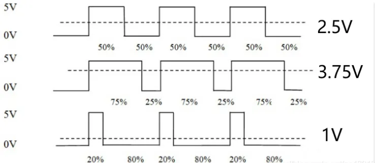
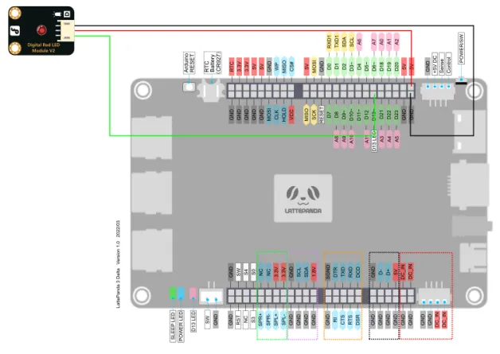
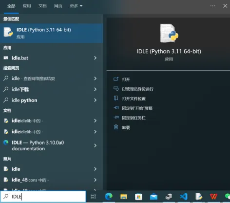
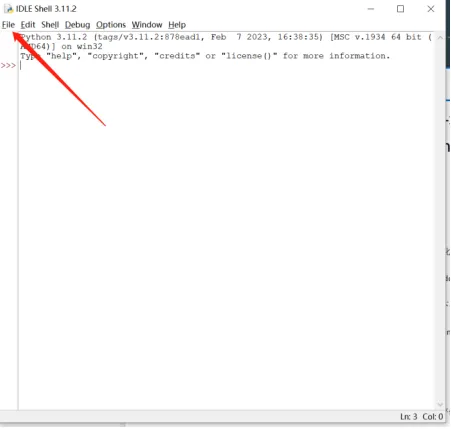
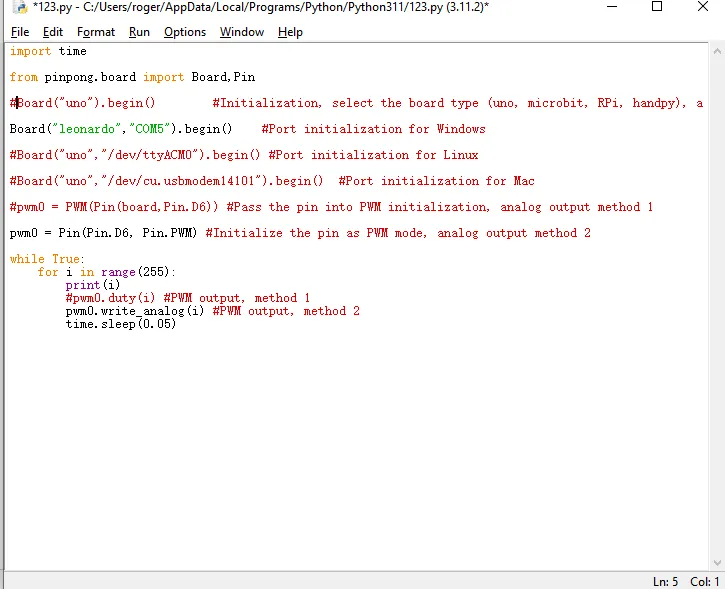
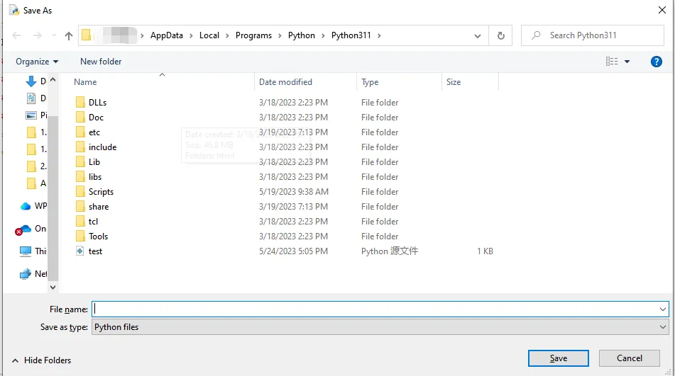
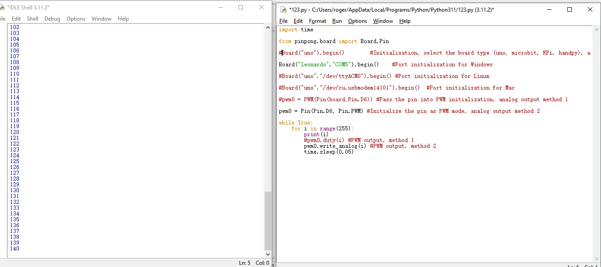

## Purpose of sample code

In the previous tutorial, we learned about the use of simulating input and understood that 0 and 1 can be further divided. 

In the actual development process, we sometimes need more precise and subdivided numerical values. This is where we often utilize the PWM interface of the microcontroller. 

PWM stands for Pulse Width Modulation, which is a technology that uses the digital output of the MCU to control the analog circuit. By adjusting the duty cycle of the high and low levels, voltage changes can be simulated.


## Hardware preparation

LattePanda 3 delta 					*1

Gravity:Digital red LED			*1

Male-to-male DuPont wire					*3

## Hardware connection

hrough the tutorial on digital IO, we can learn that the LED light can be turned on and off by simply using high and low digital IO signals. Similarly, we can connect it to a PWM interface and control the brightness of the LED light by adjusting the duty cycle.

On the onboard Arduino Leonardo of the LattePanda 3 Delta, we have marked a tilde symbol ~ next to the pins that support PWM output. There are a total of seven PWM output ports, which are D3, D5, D6, D9, D10, D11, and D13.

In this tutorial, we choose the D13 pin and connect it to a 5V power supply to drive this LED.




## Programming

In this example, we use the built-in text editor IDLE in Python for code editing. If you are familiar with the process of editing and compiling Python code, you can also use your preferred code editor.

- Search for IDLE in the search box and open it.




-  Click on File, then click on New File to create a new Python file.



- Enter the following Python code

```Python
  	import time
  	
  	from pinpong.board import Board,Pin
  	
  	#Board("uno").begin()        #Initialization, select the board type (uno, microbit, RPi, handpy), and port number. If no port number is entered, automatic recognition will be performed.
  	
  	Board("leonardo","COM5").begin()    #Port initialization for Windows
  	
  	#Board("uno","/dev/ttyACM0").begin() #Port initialization for Linux
  	
  	#Board("uno","/dev/cu.usbmodem14101").begin()  #Port initialization for Mac
  	
  	#pwm0 = PWM(Pin(board,Pin.D6)) #Pass the pin into PWM initialization, analog output method 1
  	
  	pwm0 = Pin(Pin.D6, Pin.PWM) #Initialize the pin as PWM mode, analog output method 2
  	
  	while True:
  	
  		for i in range(255):
  	
  			print(i)
  	
  			#pwm0.duty(i) #PWM output, method 1
  	
  			pwm0.write_analog(i) #PWM output, method 2
  	
  			time.sleep(0.05)

```


-  Click on Run, then click on Run Module to execute the Python code.



 

- You will be prompted to save the Python file, and you can choose to save it in a folder of your choice. Here, we will assume that you save it in the default location




- "After saving, the Python code will automatically execute. The command line will print out the PWM values (0-255).


