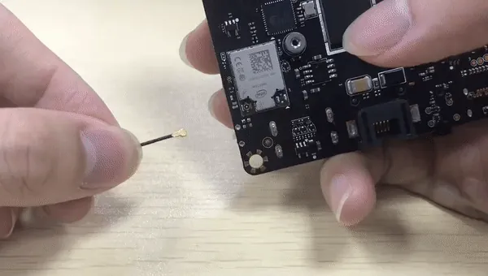

# Internet Connection 

## Wi-Fi

Install the Wi-Fi antenna by plugging the round-shaped end into the socket.

## Ethernet

There's an Ethernet socket on the board. Plug in the cable to surf the internet!

## Advanced Feature

### Wake-on-LAN

!!! info
    This is contributed by community member ccs_hello. Check out the [forum post link](https://www.lattepanda.com/topic-f23t18628.html) for further discussion here.

The settings to get WoL working are:

1. in BIOS menu, enable WoL.
2. Navigate to Control Panel > Device Manager > Gigabit Ethernet (Realtek RT8111E) Properties:
3. In Power Management tab, check all three boxes.
4. In Advanced tab, DISABLE the "Turn off Wake on LAN" option and any similar settings that may affect the computer's ability to turn on WoL.
5. Use a 3rd party solution to test it out, like our "RemoteBoot WOL" for iOS.

Enjoy tinkering and sharing!
