# Operating System

This document will go over the operating systems that are compatible with the LattePanda Alpha. It will also cover acceptable boot media as well as instructions and resources for installing the operating system and other special considerations.

## Overview

The LattePanda Alpha is, in fact, globally recognized as the **FIRST development device supporting 4 different operating systems.**

1. Windows 10 and other versions
2. Linux and other versions
3. Android for x86 (Phoenix OS)
4. Hackintosh (MacOS) - Contributed by the LP Community

!!! tips
    Please feel free to contribute or request new content via the [Official Docs Repository](https://github.com/LattePandaTeam/Docs)

## Windows

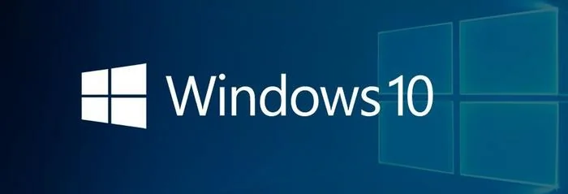

### Bootable Drive

* eMMC
* M.2 M-key NVMe or SATA SSD

### What You Will Need

* 1 x Blank USB flash drive (8 GB or larger)
* [LattePanda Alpha Windows 10 Image](https://www.dropbox.com/sh/d2d4xoe2nk7n0je/AACdzPN-bdwkwyHxe9KlSsiIa?dl=0).

### Installation Steps

* Download the Windows 10 disc image file for the LattePanda Alpha.
* Configure your USB drive to be a bootable device. Instructions can be found [here](https://technet.microsoft.com/en-us/library/jj200124%28v=ws.11%29.aspx).
* Copy and paste the Windows 10 disc image file contents to the USB drive.
* If you are using the LattePanda to create the USB installation media, restart the LattePanda. Otherwise, insert your USB drive into the LattePanda and turn it on. 
* Press 'Esc' continuously to enter BIOS. 
* Navigate to the "Boot" tab and change the "Boot Option Priorities" so that the USB drive is "Boot Option #1".

* Navigate to the "Save & Exit" tab and select "Save Changes & Reboot".

You will enter the installation GUI.

## Ubuntu

### Bootable Drive

* eMMC
* M.2 M-key NVMe or SATA SSD 

!!! tips 
    This tutorial is for the LattePanda Delta and Alpha. If you are using the 1st edition LattePanda, please refer to the 1st edition documents.

### What You Need

* 1 x Blank USB Flash Drive (8 GB or larger)
* [Ubuntu 16.04 LTS image](http://releases.ubuntu.com/releases/16.04/) (64 bit Desktop disc image file is recommended)

### Installation Steps

* Download the Ubuntu 16.04 LTS image.
* Create a USB installation media for Ubuntu. We recommend Rufus for creating installation media. You can download it [here](https://rufus.akeo.ie/).
* Restart the LattePanda. Press 'Esc' continuously to enter BIOS. 
* Navigate to the "Boot" tab and change the "Boot Option Priorities" so that the USB drive is "Boot Option #1".

* Navigate to the "Save & Exit" tab and select "Save Changes & Reboot".

You will enter the installation GUI.

Once your USB is inserted into your LP, turn on your LP. Hold the Esc button on your connected keyboard, and the following screen should show.

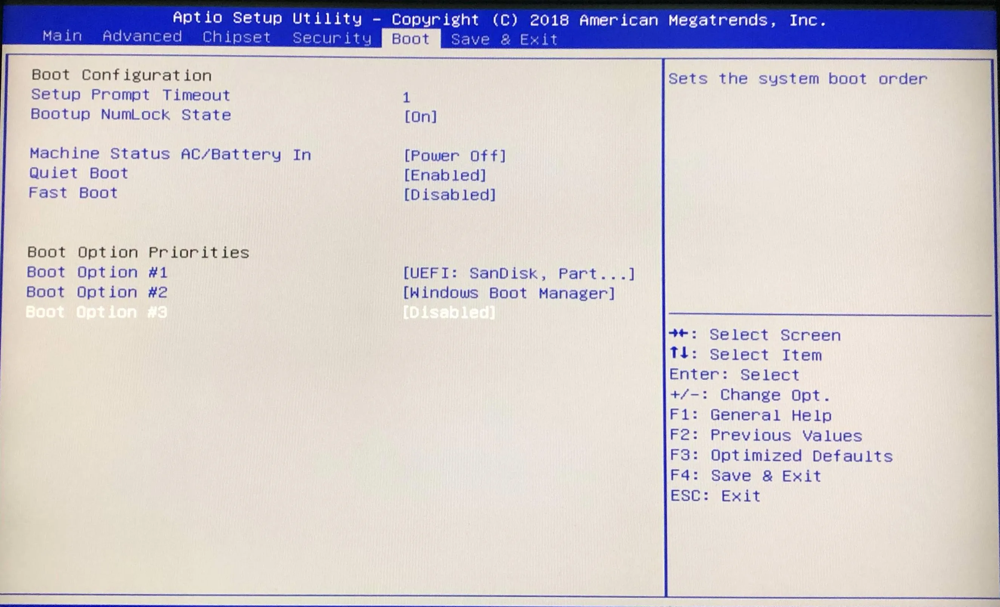

The BIOS menu should appear. Select the appropriate Boot option using the arrow buttons. Choose your USB drive to become your first Boot Option #1. You can do so like this:

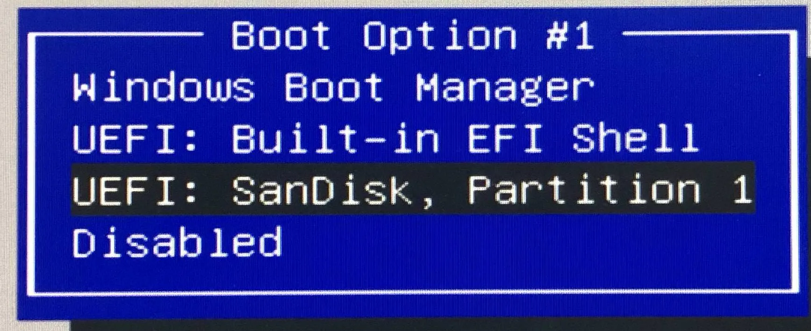

Make sure to select your USB. Then go to the 'Save and Exit' tab on the top right. Choose the 'Save Changes and Exit' option. Your LP should restart, and it should boot directly from your USB.

5. Install and set up Ubuntu 16.04 LTS on your LP. 

Once your LP restarts, the following page should appear.

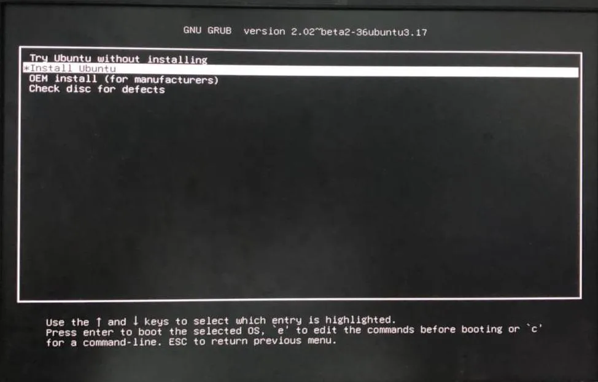

There will be two options:

- Try Ubuntu without installing
- Install Ubuntu

Both options should work, but in this tutorial we will install Ubuntu. We recommend proceeding with this option. 

After this option is selected, the installation will begin. A screen like the picture below will appear. This process may take a while. Please be patient while leaving your LP on for the installation to take place.

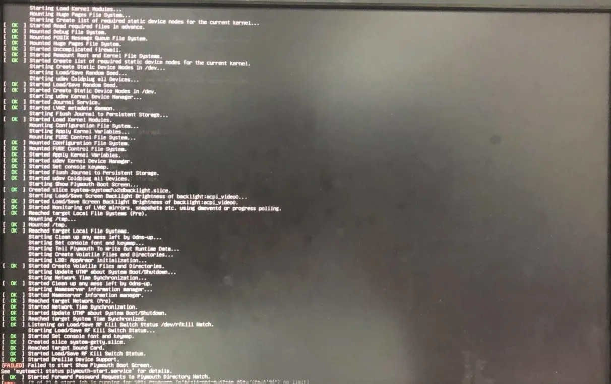

Once the installation is finished, a few more setup options for your Ubuntu OS will appear, and then it will be ready to use.

!!!note
    During this process, the screen may turn black. Please be patient as you wait for the screen to start displaying again. Do not do anything until your laptop displays the following screen:

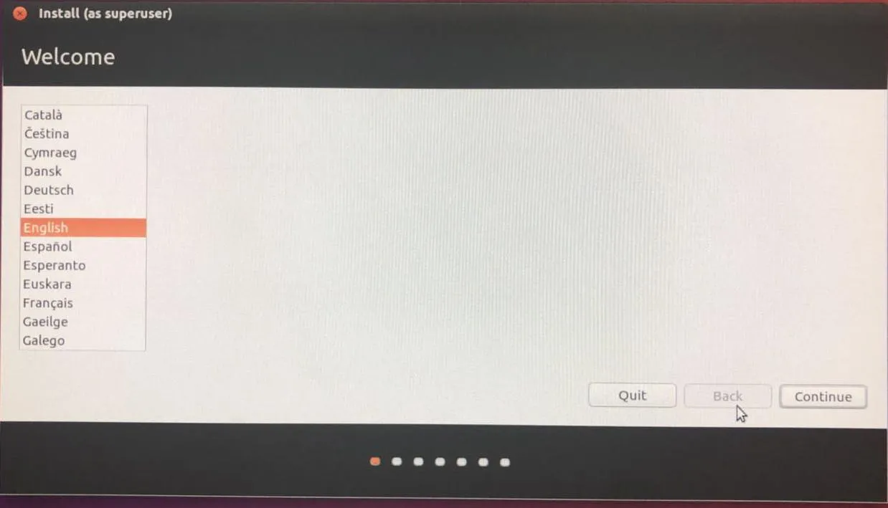

Choose your default language and continue. 

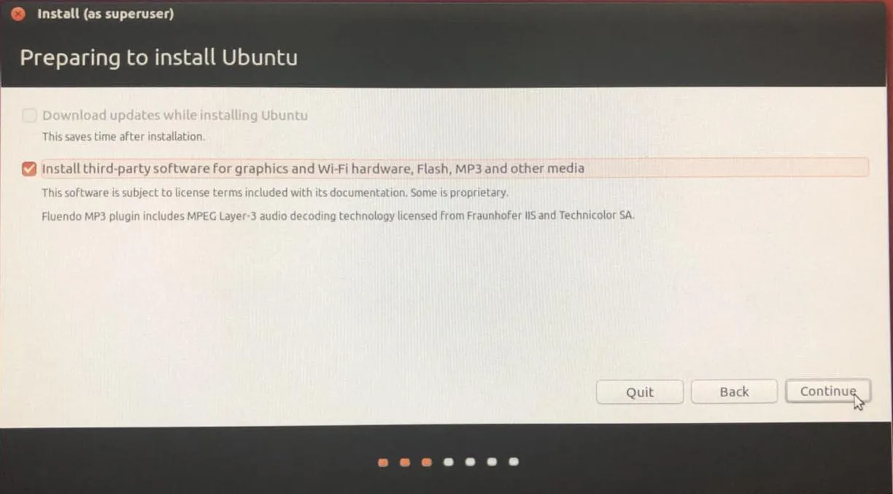

Check the box to install third-party software, and then continue. This will ensure that the common plugins are installed so everything can run smoothly. 

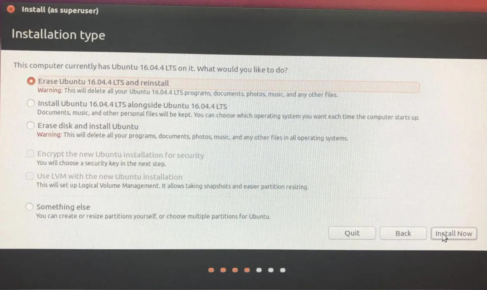

Choose the best option for you. These options may look slightly different on your screen, but normally the third option (Erase disk and install Ubuntu) would be the most appropriate. There will be a small window to confirm that changes can be made to your disk. Please click continue.

Choose your time zone and click continue to proceed.

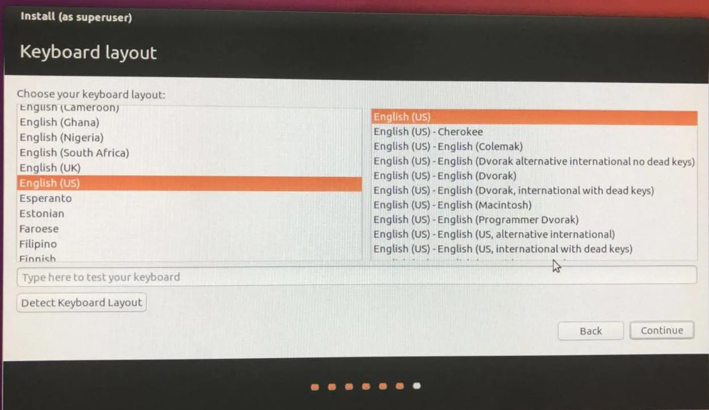

Select your keyboard layout. If you're unsure of what this is, you can use the "detect keyboard layout" option. Follow the instructions on screen and it should be relatively simple. Click continue.

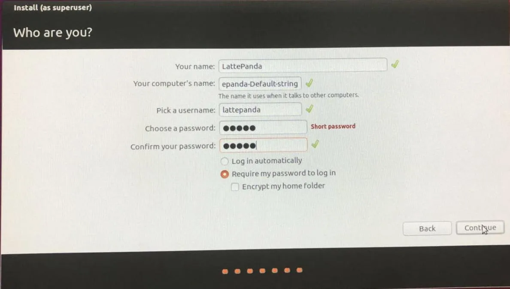

Fill out your details to continue. You will be asked to restart your LP in order to complete installation.

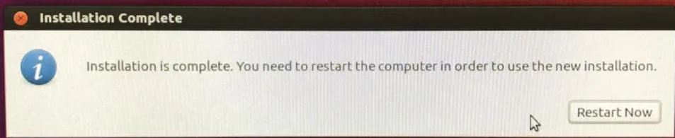

Wait for your LP to restart and then enter your password to log in. Your Ubuntu 16.04 LTS should be fully functional on your LattePanda. Enjoy!

## Android (Phoenix OS)

The LattePanda Alpha is also capable of using x86 versions of Android. One such version, is Phoenix OS. This version provides a desktop like Windows for an android system while also allowing access to the Google Play store.

### Bootable Drive

* eMMC
* M.2 M-key NVMe or SATA SSD 
* USB Drive (We recommend using the USB 3.0 slot for optimal results)

### What You Will Need

* [Phoenix OS Installer](http://www.phoenixos.com/download_x86)
* Bootable Partition (with drive letter assigned) and at least 4 GB of free space

### Installation Steps

1. Download the Phoenix OS Installer.
2. Launch the installation exe.
3. There are two options: Install and U Install. Select U Install for installing from the USB drive. Select "Install" for installing on eMMC or SSD partition.

## Hackintosh (macOS)

Since the LattePanda Alpha shares similar hardware as some Macbooks, it is possible to install macOS Mojave on the LattePanda Alpha. In fact, some community members have already done this and posted installation tutorials. One such member, Novaspirit, created a very detailed tutorial video along with some installation files. 

!!! note
    MacOS is not an officially supported operating system. Some functionality may not work, or may require additional hardware to work. For example, the provided LattePanda Wi-Fi card is not supported. A USB or M.2 E-key Wi-Fi card is required to receive Wi-Fi on macOS.**

### What You Will Need

* 1 x Blank USB Flash Drive (8GB or larger)
* macOS Mojave Image
* [NovaSpirit support installation files](https://github.com/novaspirit/macpanda/releases)

### Installation Steps

The NovaSpirit video tutorial can be found below.

[Community discussions regarding this topic!](https://www.lattepanda.com/topic-f11t16979p25805.html?hilit=hackintosh#p25805)

## Related Links

* [Drivers and Software](drivers_and_software.md)
