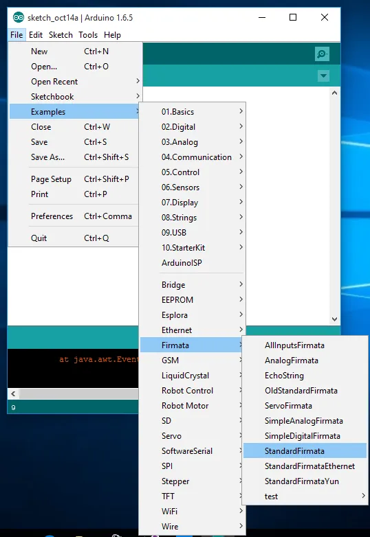
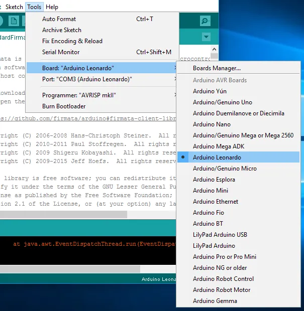

# How to Use Python to Make Your Arduino Blink

##Introduction

In this tutorial, we will show you how to control your Arduino with Python code. We will use the LattePanda with the built in Arduino chip and show you the basics of how to make the LED light blink. Once you understand this technique, you can play around with the code to control your Arduino with Python code..


##What You Will Need

**Hardware**

- LattePanda
- 7-inch 1024 x 600 IPS Display for LattePanda
- Mouse and Keyboard

**Software**

1.**Arduino IDE**

The latest software is available on the [Arduino website](https://www.arduino.cc/en/Main/Software?). IDE (integrated development environment) allows programmers to develop software. Make sure to download the most updated Arduino IDE. We are using Arduino 1.6.5 in this example.

2.**Python IDE**

This software is available on Python's official website. We are using Python 2.7.15 in this example, which can be found [here](https://www.python.org/downloads/release/python-2715/). You can use the following installer to install the Python IDE:


**Please make sure to select "add python.exe to Path" when installing** by clicking on the "Will be installed on local hard drive" option. This is shown below.


Once everything is ready we can start the process.


## Step 1

Similar to the C# tutorial, we will need to upload the StandardFirmata code into your local Arduino device. You can access the code by clicking File --> Examples --> Firmata --> StandardFirmata, as shown below.



After the code appears, select the correct Arduino type and port, as shown below.

<u>Find the correct Arduino type</u>



<u>With its corresponding port</u>


Once they have been selected, upload the code to your Arduino by clicking the arrow shown below.


Wait for the code to be uploaded.


## Step 2

The next step is to install the firmata package via the command prompt window. Make sure to right-click and run the command prompt as administrator.

<u>After clicking this</u>


<u>It should appear like this</u>


Type the following command in your command prompt window: 

`pip install pyFirmata` 

The following message will be shown if the installation is successful.


## Step 3

Open IDLE Python to check whether or not the pyfirmata package has been installed correctly.

Enter the following command:

`import pyfirmata`

If no error message appears, then firmata has been successfully installed. Please refer to the picture below.


 

Create a new python file (File -> New FIle) in the IDLE program, then enter the following code. Change 'COM3' into the port that was shown on your device previously on Arduino. Pin 13 is selected in this example, as it is the default pin with the built-in light. 

<u>Code:</u>

```
from pyfirmata import Arduino, util
import time
board = Arduino('COM3')
while True:
    board.digital[13].write(0)
    time.sleep(1)
    print("on")
    board.digital[13].write(1)
    time.sleep(1)
    print("off")
```

The IDLE window should display on/off messages corresponding to the on/off status of the light. Feel free to play around with other pins to explore the different options available to you. Here is the GIF again showing you how your Arduino should blink. Enjoy!


