# Operating Systems

This document will go over the operating systems that are compatible with the LattePanda Delta. It will also cover the acceptable bootup media, as well as instructions and resources for installing the operating systems and other special considerations.

## Overview

Incredibly, the LattePanda Delta is a **development device which supports 2 different operating systems.**

1. Windows 10 and other verions
2. Linux and other versions

!!! tips
    Please feel free to contribute or request new content via our [Official Docs Repository](https://github.com/LattePandaTeam/Docs)

!!! warning
    Before the OS installation, please finish backing up any important data.

## Windows

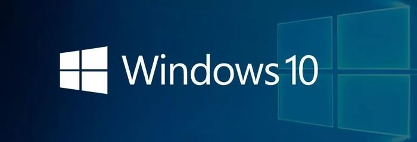
### Bootable Drive

* eMMC
* M.2 M-key NVMe SSD

### What You Will Need

* 1 x Blank USB flash drive (8 GB or larger)
* [Windows 10 Disc Image File for the LattePanda Delta](https://www.dropbox.com/scl/fo/4t8nqj0z89ygsugzes3ks/AMemhBNYwJkEcwyJGJdUmmM?rlkey=2qm0ho4pehpqjtqo837c2l8p8&st=lmbm2ray&dl=0)

### Installation Steps

* Download the Windows 10 disc image file for the LattePanda Delta.

* Configure your USB drive to be a bootable drive. Instructions can be found [here](https://technet.microsoft.com/en-us/library/jj200124%28v=ws.11%29.aspx).

* Copy and paste the Windows 10 disc image file contents to the USB drive. Then, the files in the USB flash driver should look like the picture below.

* If you are using the LattePanda to create the USB installation media, restart the LattePanda. Otherwise, insert your USB drive into the LattePanda and turn it on. 

* Press 'Esc' continously to enter into the computer's BIOS. 

* Navigate to the "Boot" tab and change the "Boot Option Priorities" so that the USB drive is "Boot Option #1".
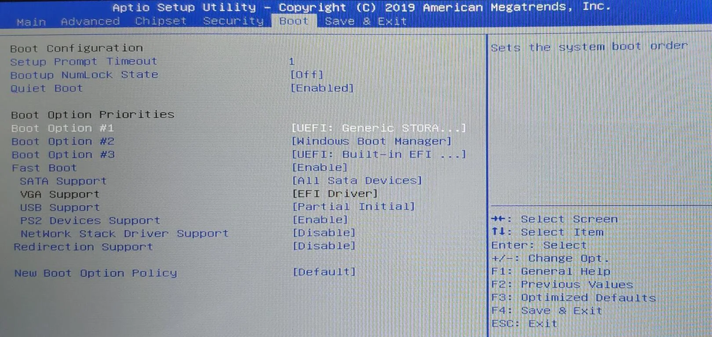
* Navigate to the "Save & Exit" tab and select "Save Changes & Exit".

The LattePanda will restart. Afterwards, you will enter the installation GUI.

The green progress bar on the left will slowly increase. This process will take some time, so please wait patiently. This process is fully automatic. You do not need to do anything at this time.

When the progress bar is full, please unplug the USB flash drive immediately. The LattePanda will restart automatically.  

After restarting, Windows 10 will install automatically. You do not need to do anything at this time. After a few minutes,  the installation will finish. 

Then, enjoy!

## Ubuntu

### Bootable Drive

* eMMC
* M.2 M-key NVMe SSD 

!!! tips 
    This tutorial is for the LattePanda Delta and Alpha. If you are using the 1st edition LattePanda, please refer to the 1st edition documents.

### What You Will Need

* 1 x Blank USB Flash Drive (8 GB or larger)
* [Ubuntu 16.04 LTS disc image file](http://releases.ubuntu.com/releases/16.04/) (64 bit Desktop disc image file is recommended)

### Installation Steps

* Download the Ubuntu 16.04 LTS image.
* Create a USB installation media for Ubuntu. We recommend using 'Rufus' to create the installation media. You can download this [here](https://rufus.akeo.ie/).  
* Choose your USB flash drive, and load the ISO file. The GUI of Rufus will looked like the picture below. Click the start button to burn the ISO file onto the USB flash drive.
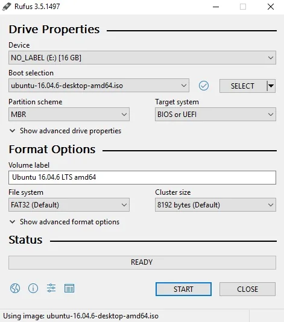
* If you are using the LattePanda to create the USB installation media, restart the LattePanda. Otherwise, insert your USB drive into the LattePanda and turn it on. 
* Press 'Esc' continously to enter the BIOS. 
* Navigate to the "Boot" tab and change the "Boot Option Priorities" so that the USB drive is "Boot Option #1".

* Navigate to the "Save & Exit" tab and select "Save Changes & Exit".

The LattePanda will restart. Afterwards, you will enter the installation GUI. The following picture should appear.

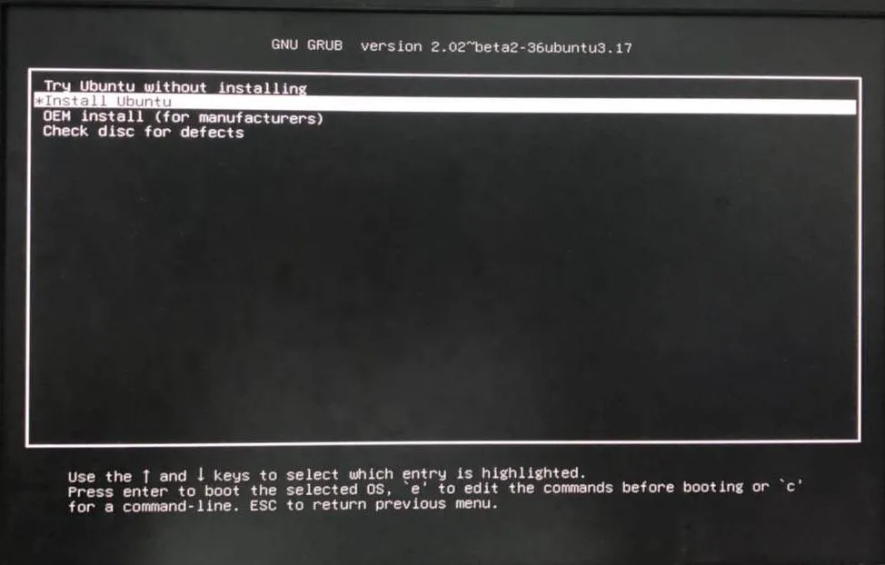
There will be two options:

- Try Ubuntu without installing
- Install Ubuntu

Both options should work, but in this tutorial, we will use the 'Try Ubuntu without installing' option. Then, the files will load. After a while, the following picture should appear. 

!!!note
    During this process the screen may go black. However, please be patient and do not do anything until your LattePanda displays the following screen.

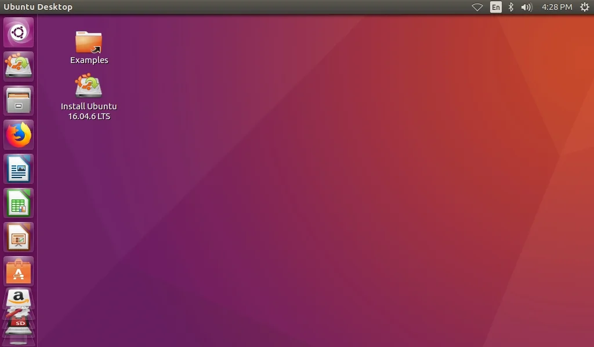
This is the Ubuntu Desktop. Next, please double-click the icon on the desktop whose name is 'Install Ubuntu 16.04.6 LTS'. After double-clicking, the installation will begin. A screen like the picture below will appear.

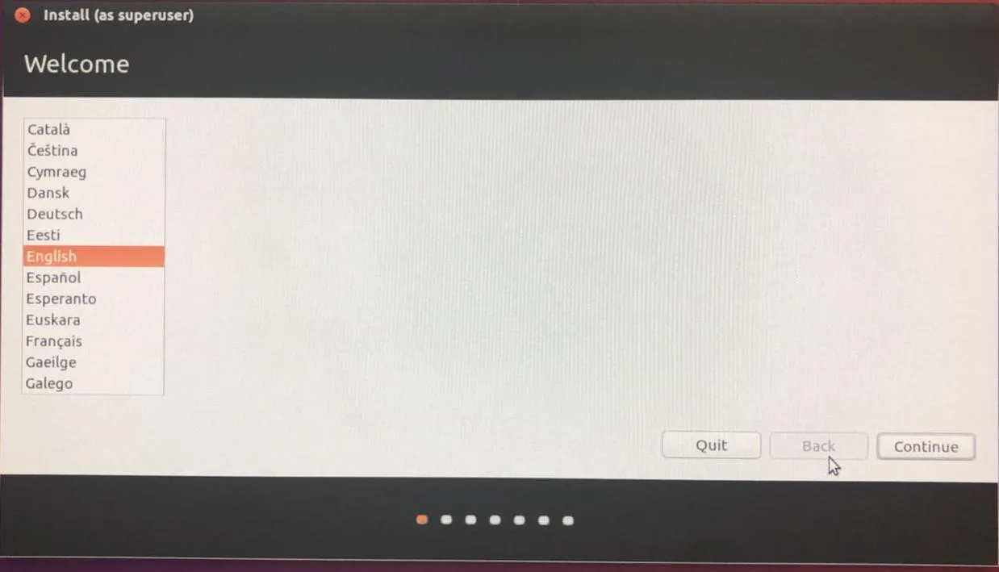
Choose your default language and continue. 

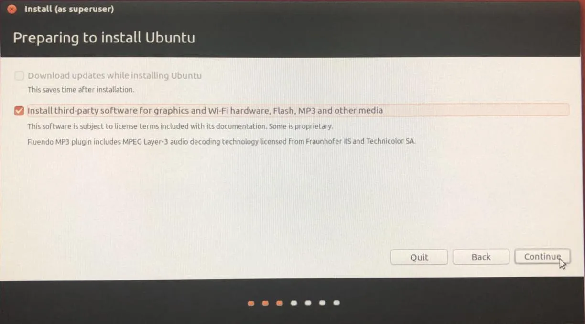
Check the box to install third-party software, and then continue. This will ensure that the common plugins are installed so everything can run smoothly. 

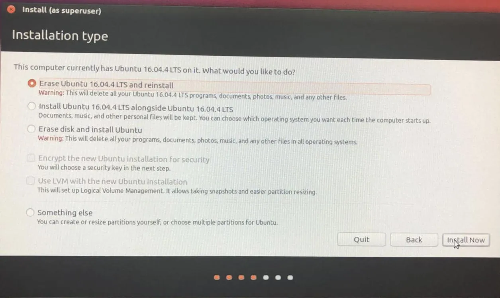
Choose the best option for you. The options may look slightly different on your screen, but normally the third option (Erase disk and install Ubuntu) will be the most appropriate. There will be a small window to confirm that changes will be made to your hard disk. Please click continue.

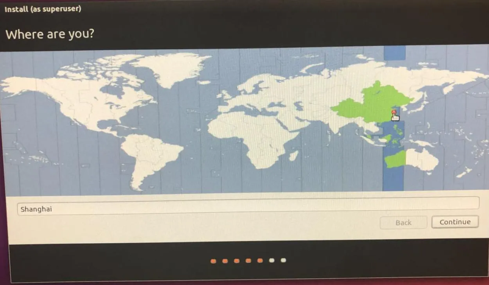
Choose your time zone and click continue to proceed.

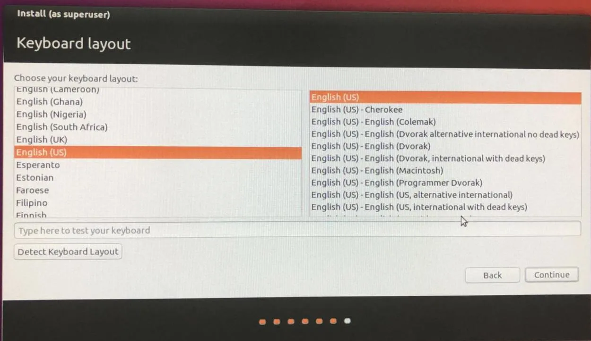
Select your keyboard layout. If you're unsure of which one you need, you can use the detect keyboard layout option. Follow the instructions on your screen and then click continue.

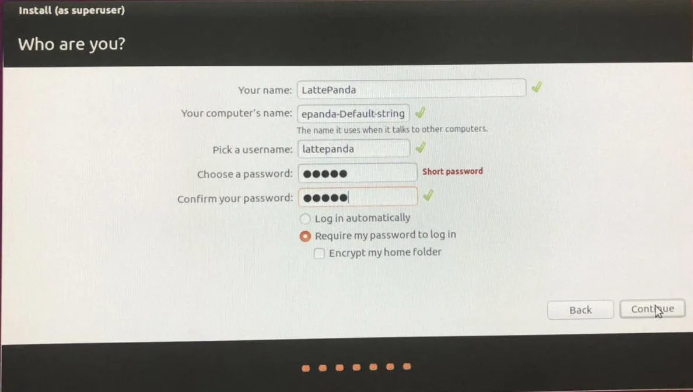
Fill out all input fields to continue. 

Please be patient and wait for the installation to complete. Then, you will be asked to restart in order to complete installation.

Wait for your LattePanda to restart and boot up the Ubuntu, then enter your password to log in. Your Ubuntu 16.04 LTS should be fully functional on your LattePanda. Enjoy!
