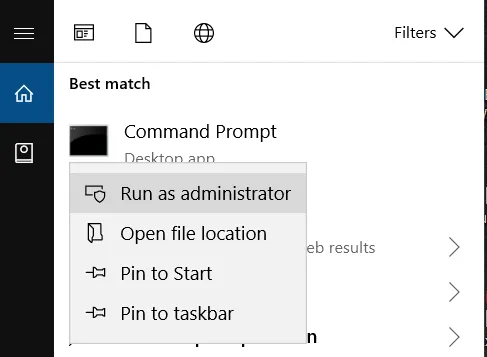
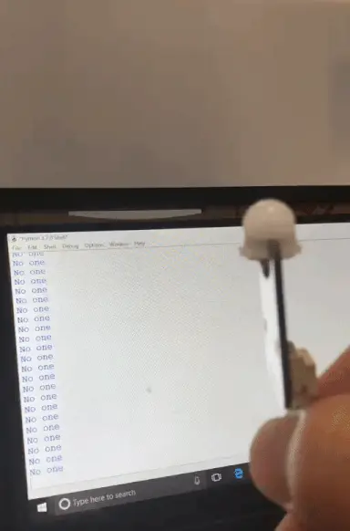

## How to Use Python to Read Data from Sensors

## Introduction

In this tutorial, we will show you how to read information from an analog and digital sensor connected to the Arduino using Python. We will be using the built-in Arduino Leonardo on the LattePanda, and read off of a digital PIR sensor as well as an analog rotation sensor. Once you understand these techniques, you can play around with the code to read different signals from different pins.

##What You Will Need

**Hardware**

- LattePanda
- 7-inch 1024 x 600 IPS Display for LattePanda
- Mouse and Keyboard
- Analog Rotation Sensor, which can be found [here](https://www.dfrobot.com/product-86.html).
- Digital PIR Motion Sensor, which can be found [here.](https://www.dfrobot.com/product-1140.html)

**Software**

1.**Arduino IDE**

The latest software is available on the [Arduino website](https://www.arduino.cc/en/Main/Software?). IDE (integrated development environment) allows programmers to develop software. Make sure to download the most updated Arduino IDE. This example uses Arduino 1.6.5.

2.**Python IDE**

This software is available on Python's official website. This example uses python 2.7.15, which can be found [here](https://www.python.org/downloads/release/python-2715/). We used the following installer to install the Python IDE:


**Please make sure to select "add python.exe to Path" when installing** by clicking on the "Will be installed on local hard drive" option. This is shown below.


Once everything is ready we can start the process.


## Step 1

Similar to the C# tutorial, we will need to upload the StandardFirmata code onto your local Arduino device. You can access the code by clicking File --> Examples --> Firmata --> StandardFirmata, as shown below.


After the code appears, select the correct Arduino type and port as shown below.

<u>Find the correct Arduino type</u>


<u>With the corresponding port</u>


Once they have been selected, upload the code to your Arduino by clicking the arrow shown below.


Wait for the code to be uploaded.


## Step 2

The next step is to install the firmata package via the command prompt window. Make sure to right-click and run the command prompt as administrator.

<u>After clicking this</u>



<u>It should appear like this</u>


Type the following command into your command prompt window: 

`pip install pyFirmata` 

The following message will be shown if the installation is successful.


## Step 3

Open Python IDLE to check whether or not the pyfirmata package has been installed correctly.

Enter the following command:

`import pyfirmata`

If no error message appears, it means that the firmata has been successfully installed. Please refer to the picture below.


Everything is now ready for you to connect your sensor. The section below talks about reading information from an analog sensor. If you want to learn about the digital sensor, please refer to the next section.

### Analog Rotation sensor

The Rotation Sensor is an Arduino-compatible multi-ring analog rotation sensor. It is based on the multi-turn precision potentiometer and is capable of ten full rotations. If the sensor input is 5V, then 5000mV will be divided into 3600 portions (10 rotations). When you adjust the rotation by 3 degrees, the resulting voltage will have 2mV change, therefore, you can accurately achieve small changes in voltage. This sensor can be easily connected to a LattePanda using a Gravity connector. 

#### Connecting the Analog Rotation Sensor

Once the LattePanda has been set up, connect the rotation sensor to pin A0 (4th pinhole on the left). Please refer to the LattePanda guide below.


Make sure the black cable is facing toward the outside of the LattePanda like this: 


#### Analog Rotation Sensor Code

Create a new python file using the IDLE program and enter the following code. Change 'COM5' into the port that was shown on your device previously on Arduino. An iterator is required to make sure the loop continues and doesn't overflow when reading many values. In order to print the value of the pinhole, it must be allowed to send values by enabling reporting. Pin(0) is chosen in this example, since we had inserted the rotation sensor into pin A0 in the steps above.

<u>Code:</u>

```
from pyfirmata import Arduino, util
from pyfirmata.util import Iterator
import time
board = Arduino('COM5') #Select the correct port
it = util.Iterator(board)
it.start()
while True:
   board.analog[0].enable_reporting()
    print(board.analog[0].read())
   time.sleep(0.5)
```


The IDLE window should show the different values corresponding to the rotation sensor. The values should go up and down, between 0 and 1, as you turn the sensor. Feel free to play around with other analog sensors to read and write information from your built in Arduino. Here is a GIF on how the rotation sensor works. Enjoy!


### Digital PIR Motion Sensor

The PIR sensor is designed to sense the motion of an animal. This sensor is small, inexpensive, energy-efficient, and easy-to-use and will not wear out. The PIR Sensor can detect infrared signals from the human body or other animals and is triggered by their movement. So, this device can be applied to a variety of scenarios which require motion detection of humans or animals. This new PIR sensor is smaller than conventional ones, which makes it perfect for your Arduino projects! It can also be easily connected to your LattePanda using a Gravity connector.

#### Connecting the Digital PIR Sensor

Once the LattePanda has been set up, connect the PIR Motion to pin D9 (1st pinhole on the left). Please refer to the LattePanda guide below.


Once again, make sure the black cable is facing towards the outside of the LattePanda like this:


#### Digital PIR Sensor Code

Create a new python file through the IDLE program and enter in the following code. Change 'COM5' into the port that was shown on your device previously on Arduino. An iterator is required to make sure the loop continues and doesn't overflow when reading many values. Pin(9) is chosen, as before we had inserted the rotation sensor into pin D9.

<u>Code:</u>

```
from pyfirmata import Arduino, util

import time
board = Arduino('COM5') #Select the correct port
board.get_pin('d:9:i')
thread = util.Iterator(board)
thread.start()

time.sleep(1) 

while True:
    if board.digital[9].read()== True:
        print('!!!')
   else:
        print('No one')
   time.sleep(0.5)
```

The IDLE window should show a Boolean data type with either one of two values. This will either be true or false depending on whether or not motion has been detected.  In the code, if motion is detected, the sensor will read 'True' and print out '!!!' as a warning, whereas if no motion is detected, the sensor will continuously print 'No one'. Feel free to play around with other digital sensors to read and write information from your built-in Arduino. Here is a GIF on how the PIR Motion sensor works. Enjoy!



## Additional Information

Attached is a PDF with some PyFirmata functions to use in Python that we have based some of this code on. [Here](https://media.readthedocs.org/pdf/pyfirmata/latest/pyfirmata.pdf) is the PDF. Enjoy tinkering with your Arduino using Python!
