# Operating Systems

## Ubuntu


In this chapter, we will guide you through installing **Ubuntu 22.04 LTS** on the **LattePanda Iota** powered by the Intel Processor N150.

---

### ✅ Preparations

* :material-usb-flash-drive-outline: **Empty USB Flash Drive** (8 GB or larger)
* 💿 [**Ubuntu 22.04 LTS Desktop ISO**](http://releases.ubuntu.com/jammy/) (64-bit recommended)

---

### ⚙️ Installation Steps

1. **Download Ubuntu 22.04 LTS ISO**  
   Visit [Ubuntu Releases](http://releases.ubuntu.com/jammy/) and download the 64-bit Desktop image.

2. **Create Bootable USB Drive**  
   We recommend using **[Rufus](https://rufus.ie/)** (Windows) or **BalenaEtcher** (cross-platform) to flash the ISO.  
    - Insert your USB drive.
    - Select the downloaded Ubuntu ISO.
    - Click **Start** to create the bootable media.

    

3. **Boot from USB on LattePanda Iota**  
    - Insert the USB drive into your Iota.
    - Power on the board.
    - Immediately and repeatedly press **++f7++** to enter the **Boot Device Selection Menu**.

    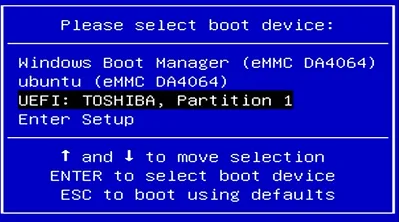

4. **Select USB Boot Device**  
    Use **++arrow-up++** / **++arrow-down++** to highlight your USB drive, then press **++enter++**.

5. **Start Ubuntu Installer**  
    - You’ll see the GRUB boot menu. Select **`Try or Install Ubuntu`** → then double-click **`Install Ubuntu`**.

    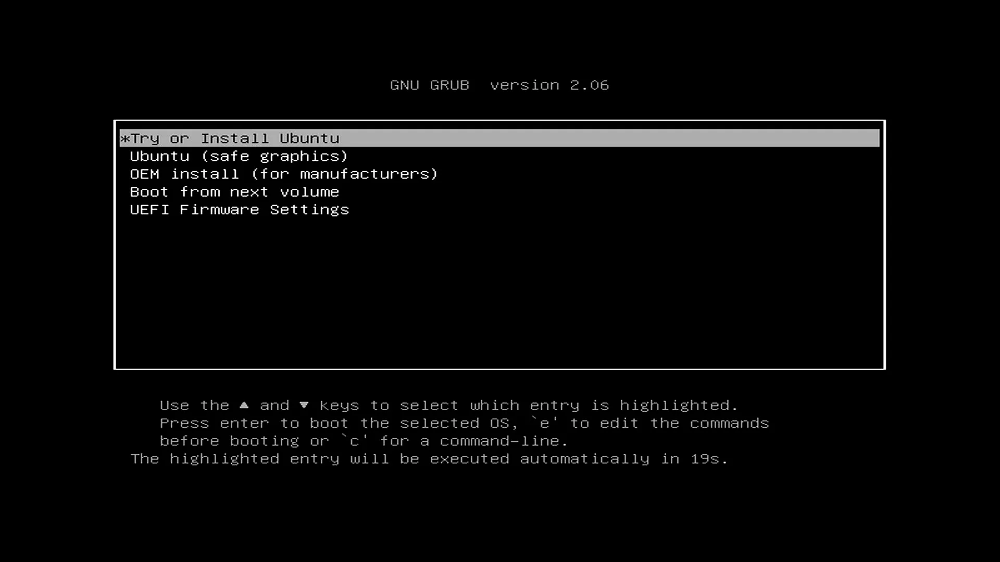{ width="500" }
    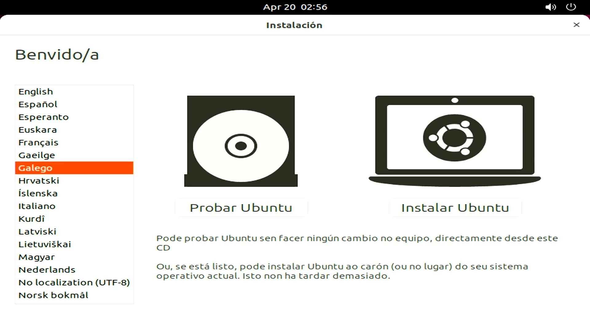{ width="500" }

6. **Configure Installation Settings**
    - Choose your **language** → Continue.
    - Select **keyboard layout** → Continue.
    - Choose whether to install **third-party software & updates** (optional).
    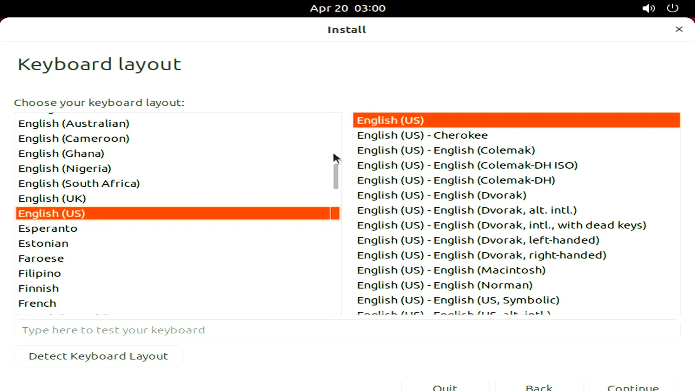{ width="500" }  
    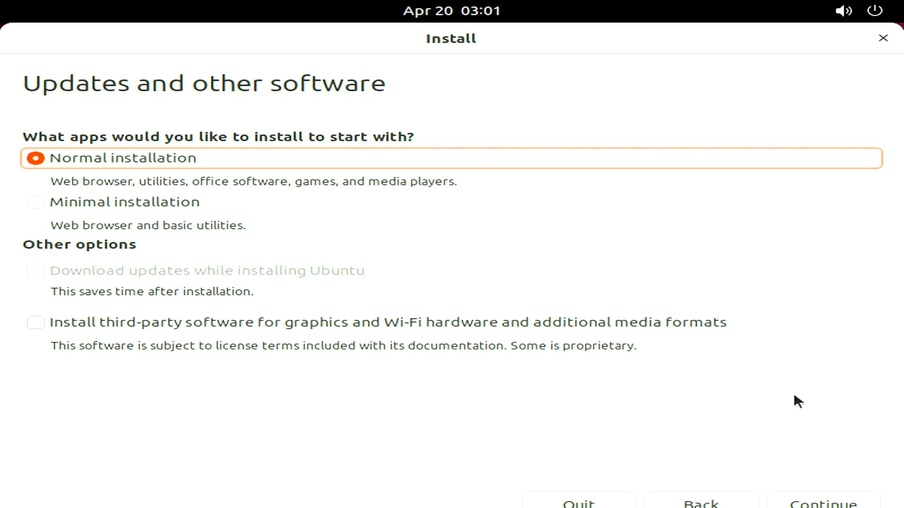{ width="500" }

7. **Installation Type**  
    - If installing **alongside another OS** (e.g., Windows), select *Install Ubuntu alongside...*  
    - For **full disk install**, choose *Erase disk and install Ubuntu*.  
    - Confirm partition changes when prompted.

    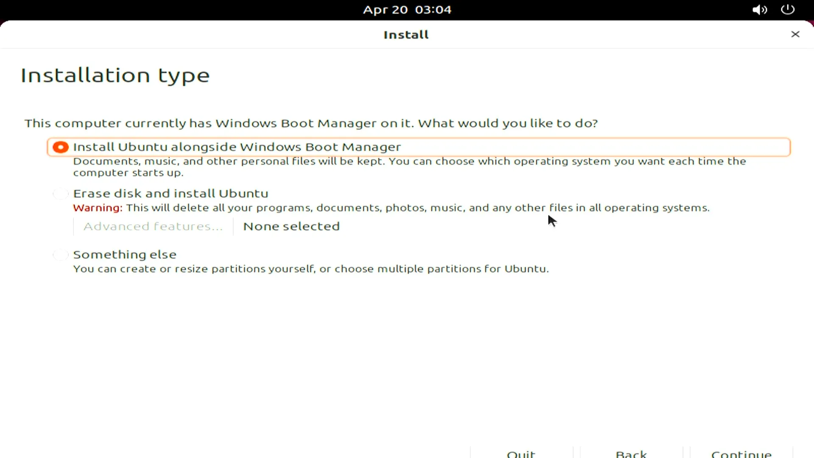{ width="500" }  
    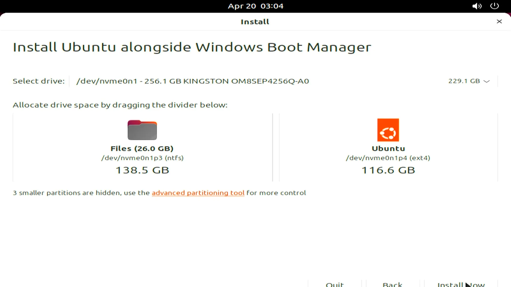{ width="500" }  
    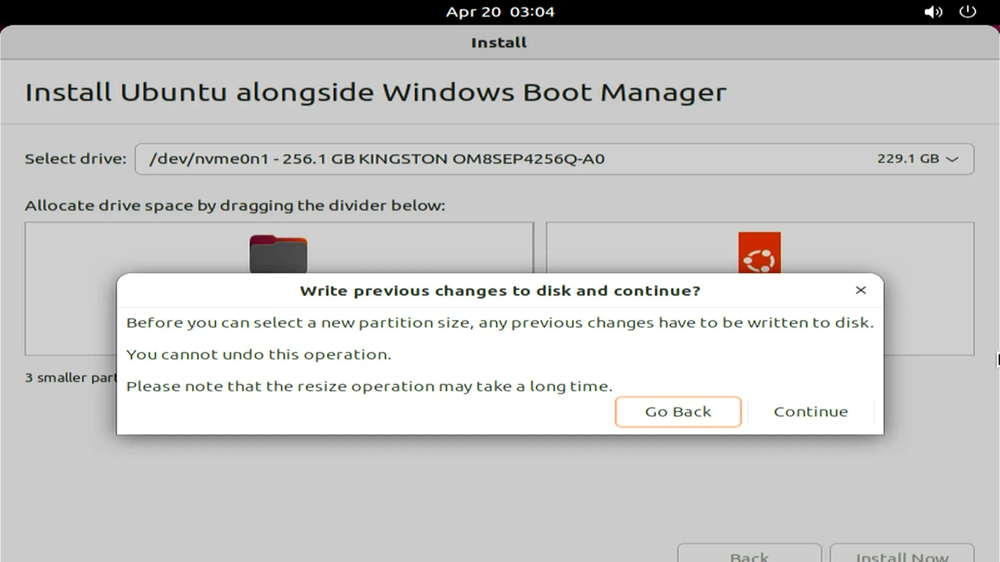{ width="500" }
    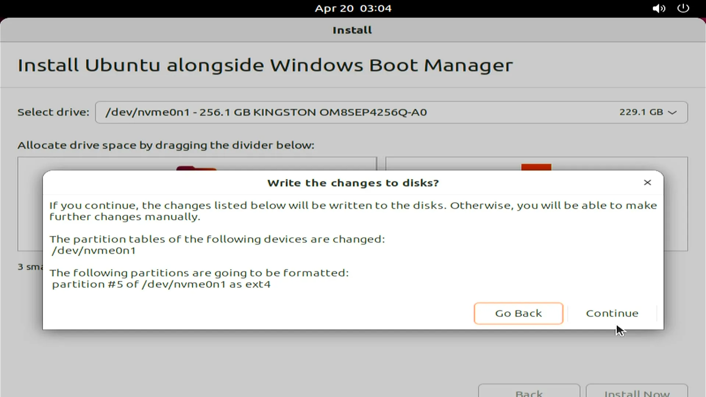{ width="500" }

8. **Set Location & User Account**  
    - Select your **time zone** → Continue.  
    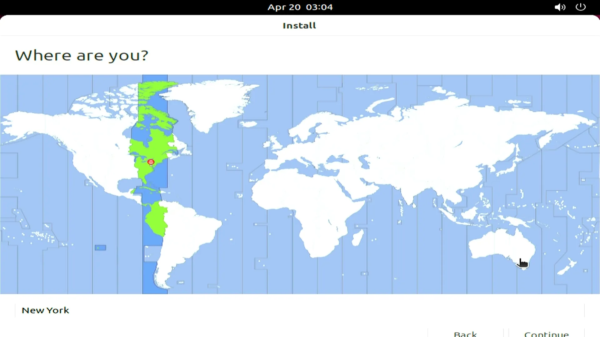{ width="500" }
    - Enter your **name, computer name, username, and password**.  
    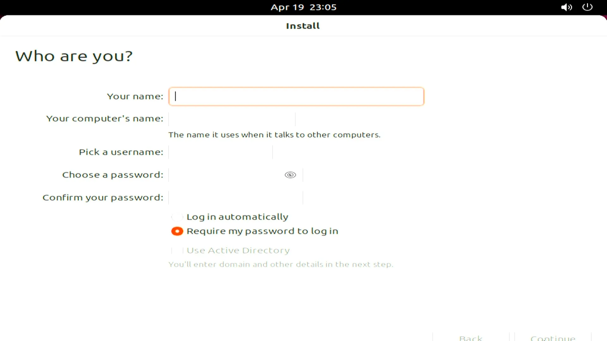{ width="500" }

9. **Complete Installation**  
     Wait for the installer to finish copying files and configuring the system.  
    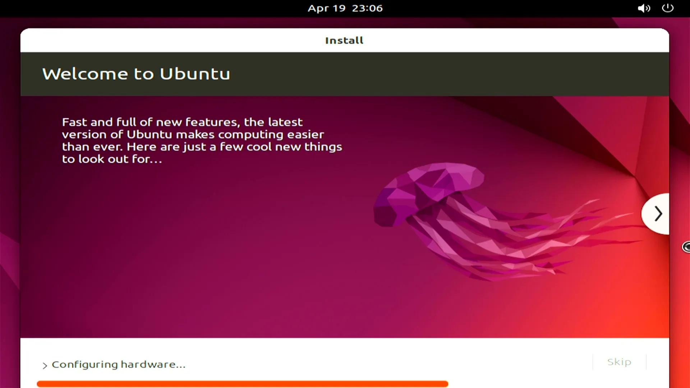{ width="500" }

10. **Restart & Enjoy!**  
        When prompted, click **Restart Now**. Remove the USB drive after shutdown.  
        After reboot, log in with your credentials — welcome to Ubuntu on LattePanda Iota!

---
###  Install HWE Kernel

- Update package lists and install the HWE kernel meta-package for Ubuntu 22.04 LTS:
```bash
sudo apt update
sudo apt install --install-recommends linux-generic-hwe-22.04
```
   > What these commands do:<br>
   >  `sudo apt update`: Refreshes the package index.<br>
   > `sudo apt install --install-recommends linux-generic-hwe-22.04`: Installs the Hardware Enablement (HWE) kernel and its recommended dependencies for Ubuntu 22.04.


---

[**:simple-discord: Join our Discord**](https://discord.gg/k6YPYQgmHt){ .md-button .md-button--primary }