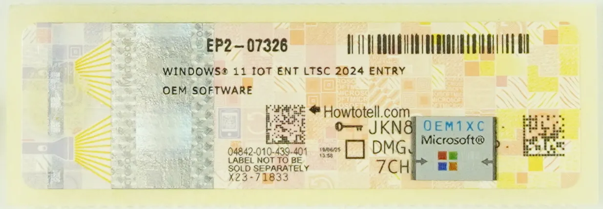

# Operating Systems

## Windows

The following guide demonstrates how to install Windows on your **LattePanda Iota**. By default, the operating system will be installed on the onboard eMMC storage.

---

### 🧰 Preparations

* :material-usb-flash-drive-outline: USB flash drive (8GB or larger, formatted as NTFS)
* 💿 Official Windows 10/11 System Image for LattePanda Iota:  
  Download from [:material-google-drive: Google Drive]()

!!! Note

    - Installation steps are identical for **Windows 10** and **Windows 11**.
    - The official system image provided by the LattePanda team includes **all necessary drivers pre-installed**, ensuring optimal performance and plug-and-play experience out of the box.

---

### ⚙️ Installation Steps

1. **Download** the Windows 10/11 system image file for LattePanda Iota.
2. **Format** your USB drive to **NTFS** file system.
3. **Extract** the downloaded `.zip` file and **copy all contents** directly to the root of your USB drive.  
   → The file structure should match the example below:  
   
4. **Insert** the prepared USB drive into your LattePanda Iota and power it on.  
   > 💡 *If you prepared the USB on the Iota itself, please restart the board before proceeding.*
5. Immediately and repeatedly press the **++f7++** key to enter the **Boot Device Selection Menu**.
6. Use **++arrow-up++** / **++arrow-down++** to highlight your USB drive, then press **++enter++**.  
   
7. The automated installer will launch — no input required. Please wait **5–8 minutes** for completion.  
   
8. When you see the “Installation Completed” message, **shut down** the board and **remove the USB drive**.  
  
9. **Power on** the LattePanda Iota. The system will initialize for approximately **3 minutes**, then boot into the Windows desktop.  
   → **Enjoy your new LattePanda Iota!**

---

### 🔑 Windows Activation

If you purchased an **activated model**, a Windows license sticker is included in the box:  

**Follow these 6 steps to activate Windows:**

1. Gently scrape off the silver coating to reveal your full **25-character Product Key**.
2. Ensure your Iota is connected to the internet (via Wi-Fi or Ethernet).
3. Right-click the **Start** button → Select **System**.
4. Click **Activate Windows**.
5. Click **Change Product Key**.
6. Enter the key → Click **Next** → Activation will complete automatically.

---

[**:simple-discord: Join our Discord**](https://discord.gg/k6YPYQgmHt){ .md-button .md-button--primary }