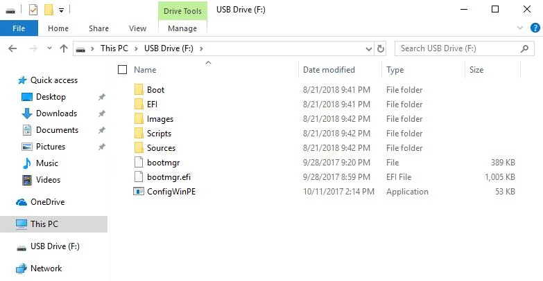

# Operating Systems

## Windows Recovery Image

The following guide demonstrates how to use the Windows 11 recovery image file, which is the Windows 11 image pre-installed on the LattePanda Iota from the factory. This image comes with all hardware drivers and is ready to use, providing you with a fast and ultimate experience.

This image does not update in real-time. Therefore, if you need to install the latest version of the Windows OS, you will need to download it yourself and install the drivers.

The Operating system will be installed on the eMMC by default.

??? tip "How to install the official system image to the SSD?"
    - Insert your SSD into LattePanda Iota via [M.2 M-Key Expansion Board(DFR1250)](https://www.dfrobot.com/product-2985.html), then remove all other storage.
    - Enter into the BIOS setup(**Chipset -> Device Configuration ->eMMC 5.1 Controller**) to disable the onboard eMMC. Then save the change.
            
    - Restart the LattePanda. Use the following installation steps to install the system image.

### 🧰 Preparations

* :material-usb-flash-drive-outline: USB flash drive (8GB or larger, formatted as NTFS)
* 💿 Official Windows 11 System Image for LattePanda Iota:
  
    Download from [:material-dropbox: **Dropbox**](https://www.dropbox.com/scl/fo/vrixaulo9d8m4yirj2hve/AJ6sthTkhp0a3l51_3r8BVA?rlkey=2qfyd0gyukr9tag3x87vixmiu&st=gt4d54q3&dl=0) or [:material-google-drive:**Google Drive**](https://drive.google.com/drive/folders/1hYB2sx3qW3o2guAHZ-LShZc6exy8XJSf?usp=sharing)

!!! Note

    - Installation steps are identical for **Windows 10** and **Windows 11**.
    - The official system image provided by the LattePanda team includes **all necessary drivers pre-installed**, ensuring optimal performance and plug-and-play experience out of the box.

---

### ⚙️ Installation Steps

1. **Download** the Windows 11 system image file for LattePanda Iota.
2. **Format** your USB drive to **NTFS** file system.
3. **Extract** the downloaded `.zip` file and **copy all contents** directly to the root of your USB drive.  
   → The file structure should match the example below:  
   
4. **Insert** the prepared USB drive into your LattePanda Iota and power it on.  
   > 💡 *If you prepared the USB on the Iota itself, please restart the board before proceeding.*
5. Immediately and repeatedly press the **++f7++** key to enter the **Boot Device Selection Menu**.
6. Use **++arrow-up++** / **++arrow-down++** to highlight your USB drive, then press **++enter++**.  
   
7. The automated installer will launch — no input required. Please wait **5–8 minutes** for completion.  
   
8. When you see the “Installation Completed” message, **shut down** the board and **remove the USB drive**.  
  
9. **Power on** the LattePanda Iota. The system will initialize for approximately **3 minutes**, then boot into the Windows desktop.  
   → **Enjoy your new LattePanda Iota!**

---

### 🔑 Windows Activation

If you purchased an **activated model**, a Windows license sticker is included in the box:  

**Follow these 6 steps to activate Windows:**

1. Gently scrape off the silver coating to reveal your full **25-character Product Key**.
2. Ensure your Iota is connected to the internet (via Wi-Fi or Ethernet).
3. Right-click the **Start** button → Select **System**.
4. Click **Activate Windows**.
5. Click **Change Product Key**.
6. Enter the key → Click **Next** → Activation will complete automatically.

---
## Standard Windows Installation

Lattepanda Iota runs a full version of the Windows OS, which means that the installation process is the same as on a regular laptop or desktop computer. The general steps are as follows:

- Search for and download the version of Windows you need.  

    > You can download from [Microsoft Software Download Center](https://www.microsoft.com/en-us/software-download/windows11).

- Burn the Windows image into a USB drive. You can use the [Rufus](https://rufus.ie/) for this purpose.

- Plug the USB drive into the LattePanda, and continuously press ++del++ after turning it on to enter the BIOS settings. Configure the LattePanda to boot from the USB drive.

- Follow the on-screen instructions to complete the operating system installation.

- Refer to the [drivers section](download_resources.md#windows-1011-driver) and complete the installation of all necessary drivers.

[**:simple-discord: Join our Discord**](https://discord.gg/k6YPYQgmHt){ .md-button .md-button--primary }