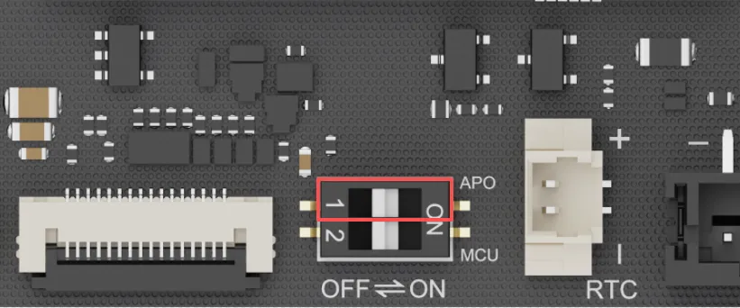

# Auto Power-On
The Auto Power-On feature allows the LattePanda to start up automatically without pressing the physical power button. 

The LattePanda Iota's auto-power-on configuration differs from previous LattePanda boards: it is set directly via DIP switches and requires no BIOS adjustments, making it simple and convenient.

## Configure Auto Power-On
- Locate the DIP switch. It is positioned to the left of the RTC battery connector.

- The actuator controlling auto power-on is in the upper half of the DIP switch, as highlighted by the red frame in the figure. The "APO" label in the upper-right corner of the DIP switch indicates auto power-on.

    { width="400" }

- Set the actuator:
> Move the actuator to the **left** (OFF) to **disable** the auto power-on function. 
> Move the actuator to the **right** (ON) to **enable** the auto power-on function. 
> These settings take effect immediately, and is unaffected by the RTC battery. 
> Only this actuator of the DIP switch needs to be set; no modifications are required in the BIOS settings!

  

[**:simple-discord: Join our Discord**](https://discord.gg/k6YPYQgmHt){ .md-button .md-button--primary }