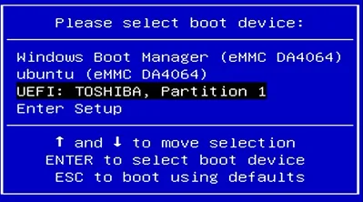
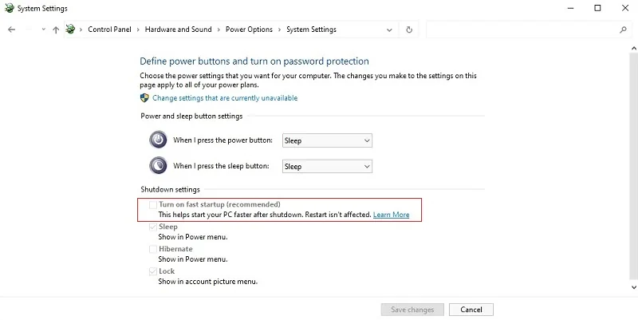

# BIOS Setup

## Entering BIOS Setting

* Power on or reboot LattePanda.

* Press **++del++** key continuously to enter into BIOS menu before you see the LattePanda logo on the splash screen. 

    

## Select Bootable Device

* Power on or reboot LattePanda.
* Press the **++f7++** key repeatedly before the bootable devices appear on the screen during the boot process.

* Press ++arrow-up++ or ++arrow-up++ key to select the bootable device, and press ++enter++ key to boot from it.

    

!!! Note
    The **`Turn on Fast Startup`** option is initially **disabled** in our system image file, ensuring that the LattePanda device shuts down completely when turned off. Alternatively, if this option is enabled, the device will enter a hibernate state upon shutdown. This behavior is a result of the power management functionality within the Windows operating system. Kindly be mindful to verify this setting as it may have an impact on the system status.

  

[**:simple-discord: Join our Discord**](https://discord.gg/k6YPYQgmHt){ .md-button .md-button--primary }