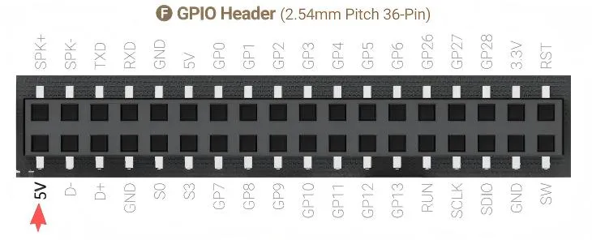

# BIOS Setup

## USB-A Port Power Control

Three USB Type-A ports on LattePanda Iota support power control.

**Path: Advanced --> Power Configuration --> Always On Double/Single  Deck USB Port**

{width="600" }

The default setting is **disabled**.

| Always On USB Port | Power Supply of the USB Port                                 |
| ------------------ | ------------------------------------------------------------ |
| Enabled            | Running Mode: :fontawesome-solid-check:   Sleep Mode: :fontawesome-solid-check:   Hibernate Mode: :fontawesome-solid-check:   Shut Down Mode: :fontawesome-solid-check: |
| Disabled           | Running Mode: :fontawesome-solid-check:   Sleep Mode: :fontawesome-solid-check:   Hibernate Mode: :x:   Shut Down Mode: :x: |
|                    | :fontawesome-solid-check: means **Enabled**, the USB port can output 5V power supply;  :x: means **Disabled** , the USB port can't output 5V power supply. |

!!! note

    - The USB-A double-deck connector contains two USB ports, and the power supply to both ports can only be controlled together, not individually.
    - If the LattePanda Iota is disconnected from the power supply, all USB-A ports are powered off by default when the LattePanda Iota is reconnected power supply and not turned on.

## 5V Pin Header Power Control

The 5V pin of the USB 2.0 pin header (marked with a red arrow in the picture below) on the LattePanda Iota also supports power control.

{width="600" }

**Path: Advanced --> Power Configuration --> Always On USB Pin Header**

The default setting is **disabled**.

| Always On USB Pin Header | Power Supply of the 5V Pin                                   |
| ------------------------ | ------------------------------------------------------------ |
| Enabled                  | Running Mode: :fontawesome-solid-check:   Sleep Mode: :fontawesome-solid-check:   Hibernate Mode: :fontawesome-solid-check:   Shut Down Mode: :fontawesome-solid-check: |
| Disabled                 | Running Mode: :fontawesome-solid-check:   Sleep Mode: :fontawesome-solid-check:   Hibernate Mode: :x:   Shut Down Mode: :x: |
|                          | :fontawesome-solid-check: means **Enabled**, the 5V pin can output power;  :x: means **Disabled** , the 5V pin can't output 5V power supply. |

!!! note

    - If the LattePanda Iota is disconnected from the power supply, this 5V pin is powered off by default when the LattePanda Iota is reconnected power supply and not turned on.

[**:simple-discord: Join our Discord**](https://discord.gg/k6YPYQgmHt){ .md-button .md-button--primary }