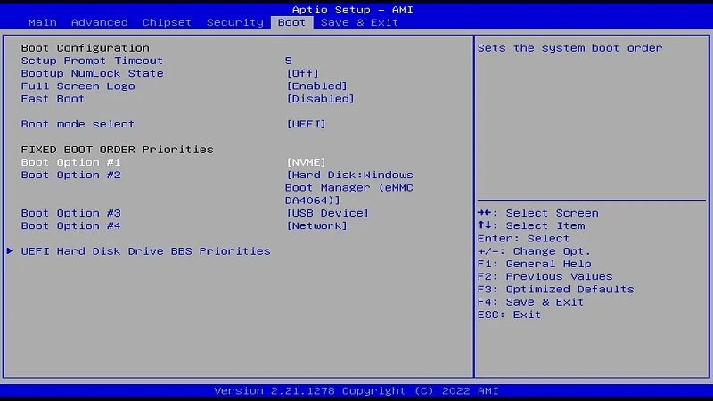
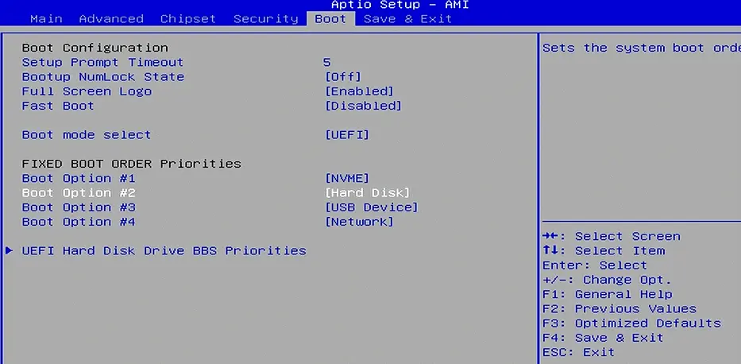

# BIOS Setup

## Bootable Device Order

The default boot order priorities are as follows: 

  - Boot Option #1: NVME
  - Boot Option #2: HardDisk
  - Boot Option #3: USB Device
  - Boot Option #4: Network

If default boot order priorities don't meet your requirement, you can change them manually.

**Path: BIOS Setup --> Boot --> Boot Option**

Press **++arrow-up++** or **++arrow-down++** key to select the bootable device, and press **++enter++** key to confirm it. 

  {width="600" }

!!! info "**Attention** "
    In older BIOS versions(LP-BS-7-S70JR120-CN51G-D and earlier), the M.2 SATA SSD and built-in eMMC all belong to HardDisk in the BIOS. If you want to change the order priorities of the hard disk, or eMMC doesn't show in the  boot order priorities, please take the following steps:

    - Select **`UEFI Hard Disk Drive BBS Priorities`**；
    - Change the device in **`Boot Option #1/2`**.
    {width="600" }

[**:simple-discord: Join our Discord**](https://discord.gg/k6YPYQgmHt){ .md-button .md-button--primary }
