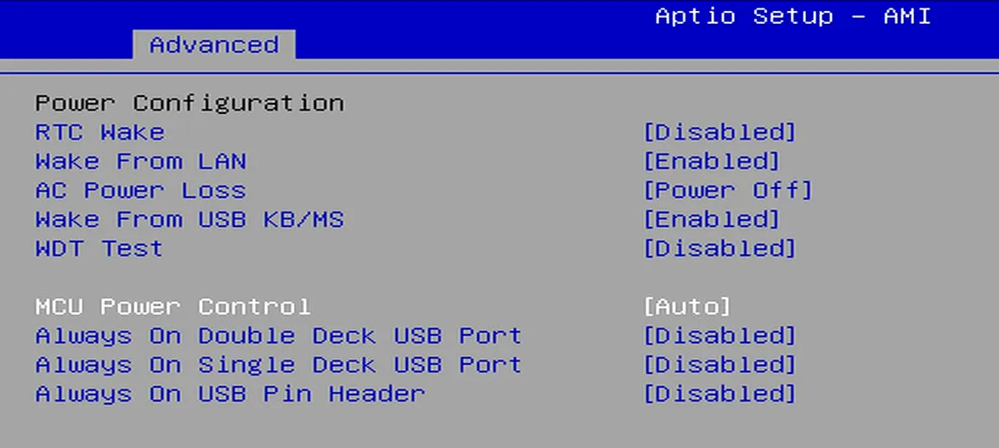
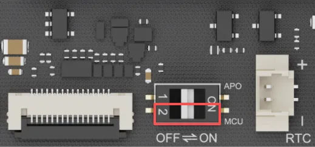

# BIOS Setup

## MCU Power Control

The LattePanda Iota integrates an RP2040 MCU, which supports power control via BIOS settings and a DIP switch.

When the LattePanda Iota is running, sleeping, in shutdown, or in hibernation mode, the power supply to the RP2040 MCU is controlled by the BIOS settings.

**Path: Advanced --> Power Configuration --> MCU Power Control**

{width="600" }

The default setting is **Auto**.

| MCU Power Control | Power Supply to the RP2040 MCU                               |
| ----------------- | ------------------------------------------------------------ |
| Enabled           | Running Mode: :fontawesome-solid-check:   Sleep Mode: :fontawesome-solid-check:   Hibernate Mode: :fontawesome-solid-check:   Shut Down Mode: :fontawesome-solid-check: |
| Auto              | Running Mode: :fontawesome-solid-check:   Sleep Mode: :fontawesome-solid-check:   Hibernate Mode: :x:   Shut Down Mode: :x: |
| Disabled          | Running Mode: :x:   Sleep Mode: :x:   Hibernate Mode: :x:   Shut Down Mode: :x: |
|                   | :fontawesome-solid-check: means **Enabled**, the RP2040 MCU is powered on and run.  :x: means **Disabled** , the RP2040 MCU is powered off. |

When the LattePanda Iota is connected to power but not turned on, the RP2040 MCU's power supply is controlled by the DIP switch.

- The actuator controlling the MCU's power is in the lower half of the DIP switch, as highlighted by the red frame in the figure. The "MCU" label in the lower-right corner of the DIP switch indicates the MCU's power control.

    {width="300" }

- Set the actuator:

| Actuator Position | Power Supply of the RP2040 MCU                               |
| ----------------- | ------------------------------------------------------------ |
| OFF (Left Side)   | :fontawesome-solid-check: Enabled |
| ON (Right Side)   | :x:Disabled                                                  |
  This setting take effect immediately, and is unaffected by the RTC battery.

[**:simple-discord: Join our Discord**](https://discord.gg/k6YPYQgmHt){ .md-button .md-button--primary }
