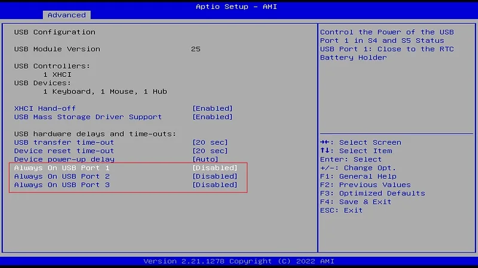
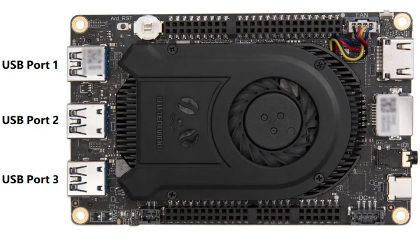

# BIOS Setup

## USB-A Port Power Control Settings

Three USB Type-A ports on LattePanda 3 Delta support power control. Every port can be configured independently.

**Path: BIOS Setup --> Advanced --> USB Configuration --> Always On USB Port**

  {width="600" }

The default setting is **disabled**.

| Always On USB Port | Power Control of the USB Port                                |
| ------------------ | ------------------------------------------------------------ |
| Enabled            | Running Mode: :fontawesome-solid-check:   Sleep Mode: :fontawesome-solid-check:   Hibernate Mode: :fontawesome-solid-check:   Shut Down Mode: :fontawesome-solid-check:  |
| Disabled           | Running Mode: :fontawesome-solid-check:   Sleep Mode: :fontawesome-solid-check:   Hibernate Mode: :x:   Shut Down Mode: :x: |
|                    | :fontawesome-solid-check: means **Enabled**, the USB port can output power;  :x: means **Disabled** the USB port can't output power. |

  {width="600" }

!!! info "**Attention:** "

    - If LattePanda is disconnected from the power supply, all USB A ports are powered off by default when the lattePanda connects power supply again and is not turned on. The MCU power control is also the same.
    - The USB2.0 pin in the female header doesn't support power control.

[**:simple-discord: Join our Discord**](https://discord.gg/k6YPYQgmHt){ .md-button .md-button--primary }