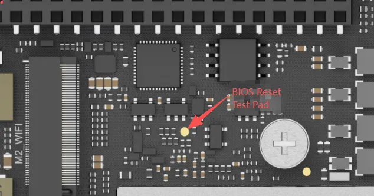

# BIOS Setup

The BIOS settings of the LattePanda Iota support power-off retention. This means that even if the RTC battery is depleted or lost, the BIOS settings will not be lost and will not revert to defaults. In unattended scenarios, this feature avoids the inconvenience of manual reconfiguration when the BIOS reset.

## Restore via BIOS Setup

- After entering the BIOS setup, navigate to the following path:

    **Save & Exit --> Load Optimized Defaults**

- Press ++enter++ to select it, then in the pop-up dialog box, press ++enter++ again to select `Yes`.

- Select `Save Changes and Reset`, then in the pop-up dialog box, select `Yes`.

- After these settings, the BIOS will be restored to its factory default values.

{width="600" }

## Hardware Forced Restore

If your LattePanda Iota is unable to enter the BIOS setup interface, you may attempt to force a BIOS reset using a jumper.

- Remove the power supply to the LattePanda Iota. The RTC battery can remain connected.

- Locate the BIOS reset test pad.  It is positioned 12 mm to the left of the M.2 E-key mounting column, as shown in the picture below.

   { width="400" }
   
- Using a jumper wire, short-circuit this test pad to any GND pin in the GPIO header. Keep the jumper wire connected, do not disconnect it.

- Connect the LattePanda Iota to the  power supply and press the power button to turn it on.

- Wait for at least 10 seconds. Then, remove the jumper wire. The BIOS restore will be complete when the LattePanda Logo appears during boot.

 
:pencil: [Related Posts:How to Properly Reset BIOS on LattePanda IOTA (Hard Reset)](https://www.lattepanda.com/forum/topic/399095)

 
[**:simple-discord: Join our Discord**](https://discord.gg/k6YPYQgmHt){ .md-button .md-button--primary }
