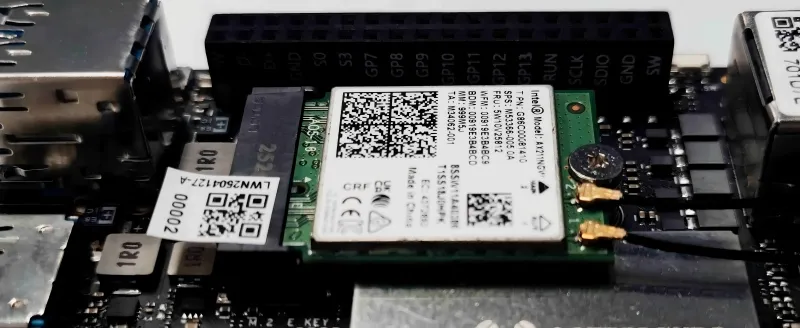
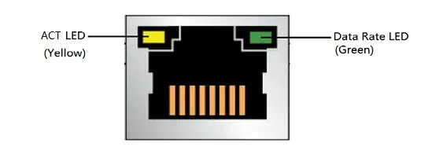

# Network Connections

## :material-wifi: WIFI

The LattePanda Iota board features an M.2 E key slot, designed for installing compatible M.2 Wi-Fi/Bluetooth modules.

### Installation Steps

- Connect the antennas to the M.2 2230 Wi-Fi/Bluetooth module. (Typically, two dual-band antennas with IPEX4 connectors.)

- Insert a compatible M.2 2230 Wi-Fi/Bluetooth module into the M.2 E-key slot.

- Secure the module using the provided mounting screw.

  {: style="width:500px; height:auto;"}

### Compatible Modules

The M.2 E key supports M.2 Type 2230 PCIe and CNVio wireless network card. The following are some compatible devices that we have tested:

- [Intel BE200](https://www.dfrobot.com/product-2877.html)
- [Intel AX210](https://www.dfrobot.com/product-2325.html)
- Intel AX211
- Intel AX200
- Intel AX201
- [Intel AC8265](https://www.dfrobot.com/product-1998.html)

## :material-lan-connect: Ethernet

The LattePanda Iota board comes equipped with a built-in 1GbE Ethernet port. Simply plug in an Ethernet cable to establish a wired internet connection.

It is also compatible with **Wake-On-LAN (WOL)** for remote device management.

### Compatible Speed

Supports 10/100/1000 Mbps Ethernet speeds

### LED Function

| LED           | LED Color | LED State | Meaning                                       |
| :------------ | :-------- | :-------- | :-------------------------------------------- |
| ACT LED       | Yellow    | Blinking  | LAN activity is occurring                     |
| Data Rate LED | Green     | OFF       | 10 Mb/s data rate is selected, or no LAN Link |
|               |           | Green     | 100/1000 Mb/s data rate is selected           |

### PoE & Dual Ethernet Ports

For applications requiring POE support, or dual network interfaces, you can add our optional [**:material-cart: 51W POE Expansion Board**](https://www.dfrobot.com/product-2984.html) to enable PoE and dual-port Ethernet configuration.
{: style="width:500px; height:auto;"}

## :material-signal-cellular-3: Cellular (4G)

The LattePanda Iota does not include a built-in M.2 B key slot. However, you can easily expand cellular connectivity by using our dedicated [**:material-cart: 4G LTE Expansion Board**](https://www.dfrobot.com/product-2982.html), which adds an M.2 B key interface for installing 4G modules.

### Installation Steps

- Mount the 4G LTE Expansion Board onto your Iota board.
  {: style="width:500px; height:auto;"}
- Install a compatible 4G module (e.g., SIM7600G-H-M2) onto the expansion board’s M.2 B key slot.
- Attach the required cellular and GNSS antennas to the module.
- Insert a micro-SIM card into the module’s SIM slot.
  {: style="width:500px; height:auto;"}

- After booting into the operating system, install the appropriate drivers for your 4G module. Ensure no unknown devices appear in Device Manager.

!!! note
    For detailed step-by-step assembly and configuration instructions, please refer to the [**4G LTE Expansion Board User Guide**](https://wiki.dfrobot.com/SKU_DFR1049_LattePanda_Iota_4G_LTE_Expansion_Board).

### Compatible Modules

We have conducted thorough testing on the following modules, all of which have demonstrated excellent functionality within the Windows 10/11 operating system:

* [SIMCom SIM7600G-H-M2 (4G)](https://www.dfrobot.com/product-2643.html)
* [Quectel EM05-CE (4G)](https://www.quectel.com/product/lte-em05-series/)

[**:simple-discord: Join our Discord**](https://discord.gg/k6YPYQgmHt){ .md-button .md-button--primary }