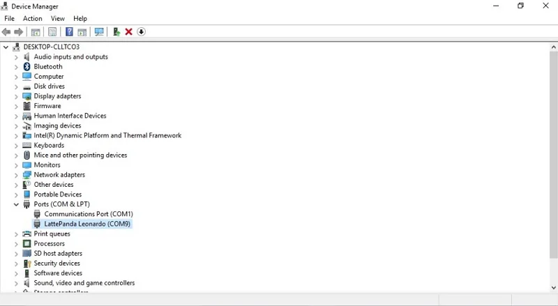
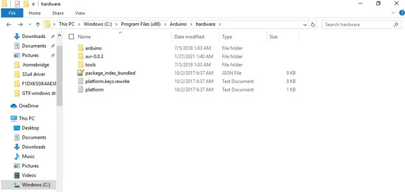
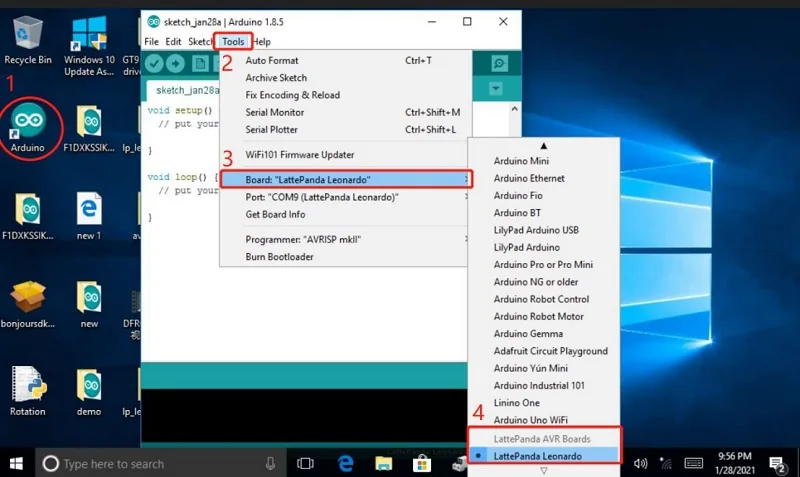
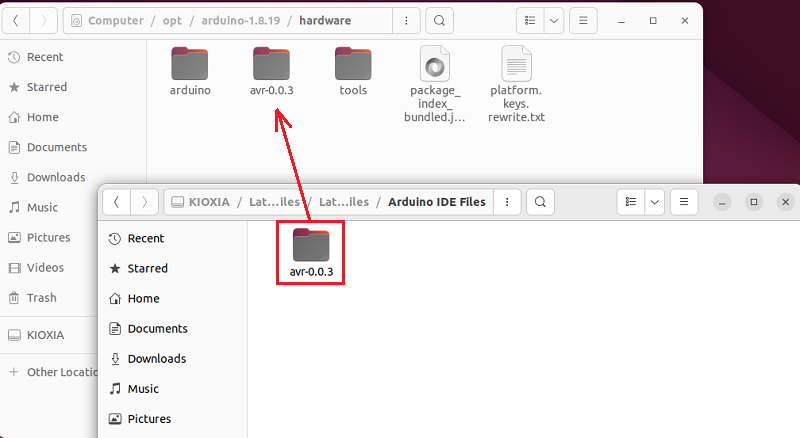
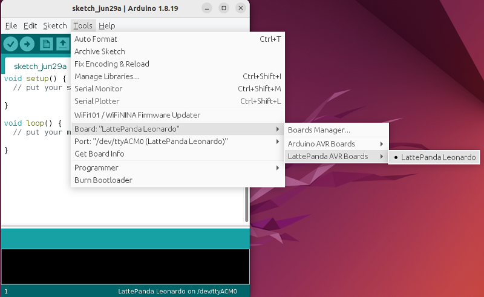
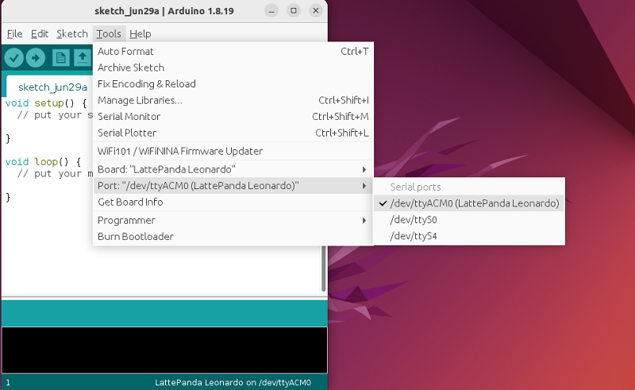

# Driver


## Windows 10/11 Driver

The Windows system will automatically connect to the internet to fetch driver updates after installation. If you cannot connect to the Windows update service, or if some drivers are still missing after the automatic update, you can download the offline driver package here.

| Name                                     | Version        | Size    | Download                                                                                      |
|------------------------------------------|----------------|---------|-----------------------------------------------------------------------------------------------|
| Intel Chipset Driver                     | 10.1.32.3      | 9.08 KB | [:material-download:](../../assets/drivers/3rd_delta_edition/Chipset_10.1.32.3.zip)           |
| Intel Network Adapter Driver             | Latest         | N/A     | [:material-download:](https://www.intel.com/content/www/us/en/download/18293/)[^1]            |
| Intel Wireless Adapter Driver            | Latest         | N/A     | [:material-download:](https://www.intel.com/content/www/us/en/download/19351/)[^1]            |
| Intel Wireless Bluetooth Driver          | Latest         | N/A     | [:material-download:](https://www.intel.com/content/www/us/en/download/18649/)[^1]            |
| Intel Processor Graphics Driver          | Latest         | N/A     | [:material-download:](https://www.intel.com/content/www/us/en/download/776137/)[^1]           |
| Realtek Audio Driver                     | 6.0.9191.1     | 81.1 MB | [:material-download:](../../assets/drivers/3rd_delta_edition/RealtekAudio_6.0.9191.1.7z)[^2]  |
| Type-C Controler Driver                  | 1.8.1.0        | 59.7 KB | [:material-download:](../../assets/drivers/3rd_delta_edition/TypeC_1.8.1.0.zip)               |
| TouchPanel Driver                        | 1.3.2.0        | 63.4 KB | [:material-download:](../../assets/drivers/3rd_delta_edition/TouchPanel_1.3.2.0.zip)          |
| LattePanda Leonardo Driver               | 1.2.3.0        | 8.82 KB | [:material-download:](../../assets/drivers/3rd_delta_edition/LattePanda_Leonardo_1.2.3.0.zip) |
| intel Serial IO Driver                   | 30.100.2026.14 | 315 KB  | [:material-download:](../../assets/drivers/3rd_delta_edition/SerialIO_30.100.2026.14.zip)     |
| Intel Management Engine Interface Driver | 2131.1.4.0     | 16.3 MB | [:material-download:](../../assets/drivers/3rd_delta_edition/MEI_2131.1.4.0.zip)              |
| Intel Watchdog Timer Driver              | 11.7.0.1000    | 29.5 KB | [:material-download:](../../assets/drivers/3rd_delta_edition/Watchdog_11.7.0.1000.zip)        |

[^1]: Download from intel.com

[^2]: 7z compressed format, please install 7-Zip to unzip

## Linux Driver

Linux drivers are usually provided by the distribution with kernel and kernel module updates, please use the new kernel for full driver support.

- Minimum kernel: 5.15
- Recommended kernel: 6.1 or newer


## Touch Panel Driver

- [Windows Touch Panel Drivers (V1.1) - 64Bit for Windows 10](https://github.com/LattePandaTeam/LattePanda-Win10-Software/raw/master/Drivers/4G64GB_Drivers/Touch/64%20bit%20GoodixTouchDriver%20v1.1.rar)

- [Windows Touch Panel Drivers(V1.3.2)-64bit for Windows 11](https://raw.githubusercontent.com/LattePandaTeam/LattePanda-Win10-Software/master/Drivers/4G64GB_Drivers/Touch/Goodix%20Touch%20HID(Win11).zip)

!!! Note 

    “install.bat” must be run as administrator to update the driver correctly.

## LattePanda Leonardo Driver and IDE Configuration

The LattePanda Leonardo is different from the standard Arduino Leonardo. The IDE configuration files and drivers are not the same. 

### In Windows OS

The official windows 10/11 system image provided by LattePanda team has integrated drivers and configuration files. So if you installed the Windows system by yourself, please configure the driver and IDE files according to the following steps.

* Download the [Arduino IDE](https://www.arduino.cc/en/software/OldSoftwareReleases). Then install it on your windows 10/11 system. We use the Arduino IDE 1.8.16.

* Download the LattePanda Leonardo configuration files from [Dropbox Link](https://www.dropbox.com/s/2s60p70v6ewmkbh/LattePanda%20Leonardo%20Configuration%20Files.zip?dl=0) or [Google Drive Link](https://drive.google.com/file/d/1rfrUShz9Y8ZYq2rywhecdoYYGGes5IEM/view?usp=sharing). Then unzip it.

* Enter into "Windows Driver" folder, and run "dpinst-amd64.exe" to install the driver. After that, you will see the LattePanda Leonardo port in the device manager.

    

* Enter into "Arduino IDE Files" folder, copy "avr-0.0.3" folder to "C:\Program Files(x86)\Arduino\hardware". 

  

* Run  Arduino IDE，Open “Tool” menu，Choose “Board：xxx” -> “LattePanda AVR Boards”->“LattePanda Leonardo”. If you see  “LattePanda Leonardo” board, the Arduino IDE files are correct.



### In Ubuntu OS

We take the ubuntu OS as an example to demonstrate how to install Arduino IDE and configure Lattepanda Leonardo. 

* Download the [Arduino IDE](https://www.arduino.cc/en/software/OldSoftwareReleases). We choose the Linux 64 bits version of Arduino IDE 1.8.16.

* Unzip the downloaded arduino-1.8.16-linux64.tar.xz file. You can do this in terminal with the following command:

```bash
tar -xvf arduino-1.8.16-linux64.tar.xz
```
This will unzip the Arduino IDE into the current directory.

* Move the Arduino IDE to the /opt directory. This is where third-party software is typically stored in Linux systems. Run the following command:

```bash
sudo mv arduino-1.8.16 /opt
```

* Navigate to the Arduino IDE directory:

```bash
cd /opt/arduino-1.8.16
```

* Run the installation script:

```bash
sudo ./install.sh
```
This will create a desktop shortcut and register the Arduino IDE in the system's application menu.

* To be able to upload code to the Arduino board without root permissions, add the current user to the dialout group. Run the following command:

```bash
sudo usermod -a -G dialout $USER
```

* You will then need to log out and log back in for the changes to take effect. This completes the installation of the Arduino IDE on your Ubuntu system. 

* Download the LattePanda Leonardo configuration files from [Dropbox Link](https://www.dropbox.com/s/2s60p70v6ewmkbh/LattePanda%20Leonardo%20Configuration%20Files.zip?dl=0) or [Google Drive Link](https://drive.google.com/file/d/1rfrUShz9Y8ZYq2rywhecdoYYGGes5IEM/view?usp=sharing). Then unzip it.

* Enter into "Arduino IDE Files" folder, copy "avr-0.0.3" folder to "/opt/arduino-1.8.16/hardware". 

  

* Run  Arduino IDE，Open “Tool” menu，Choose “Board：xxx” -> “LattePanda AVR Boards”->“LattePanda Leonardo”. 



* Then choose the serial port: “Port: /dev/ttyACM0 xxx” -> “/dev/ttyACM0(LattePanda Leonardo)”.




[**:simple-discord: Join our Discord**](https://discord.gg/k6YPYQgmHt){ .md-button .md-button--primary }
