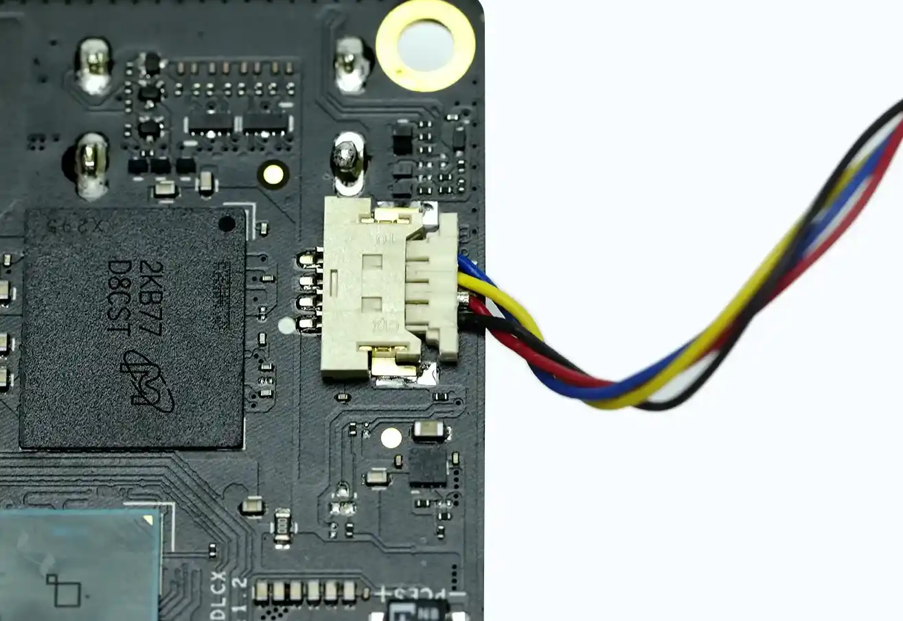
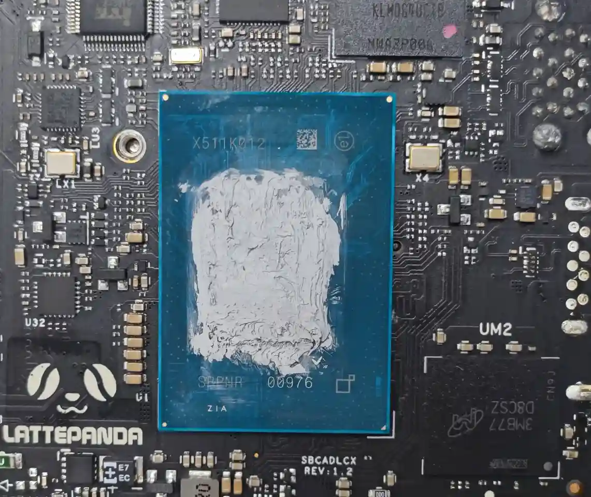
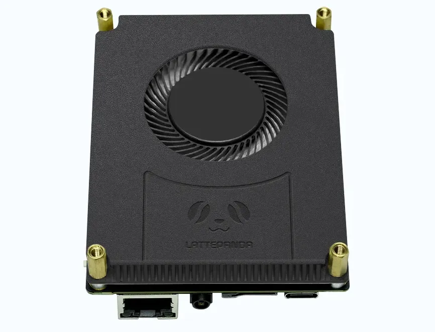
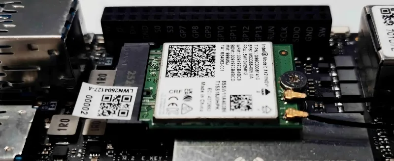
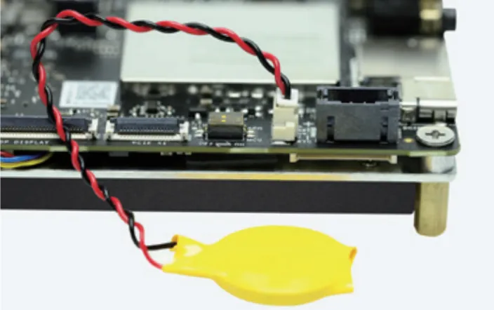

# Initial Setup

This chapter will guide you through setting up your LattePanda Iota for the first time. It covers essential preparations and step-by-step instructions to safely boot your device.

## Booting the LattePanda Iota

### Preparations

Before powering on your LattePanda Iota, ensure you have the following accessories:

- :material-fan:     Cooling Fan or Heatsink (Required)
- :material-cable-data:     HDMI Cable
- :material-monitor:    External HDMI Monitor
- :material-keyboard:    Keyboard and Mouse
- :material-power-plug-battery:    Power Adapter (PD 15V or 10–15V DC)
- :material-antenna:     M.2 Wi-Fi/Bluetooth Module (Optional)
- :material-battery:   CR2032 3V RTC Battery(Comes with Board)

!!! Danger "Critical Cooling Warning"

    - The LattePanda Iota **must** be equipped with a cooling fan or heatsink before power is applied.  
    - Operating the device without adequate cooling will cause immediate thermal protection and may permanently destroy the SoC.  
    - Do not power on the board until the cooling solution is properly installed.

### Instructions

#### Step 1: Install the Cooling Fan

- Connect the fan to the MX1.25-4Pin Fan Connector on the board.
> Note the wire order. As shown in the figure, from top to bottom, the colors are: blue, yellow, red, black.

{: style="width:400px; height:auto;"}
    
- Apply an even layer of thermal paste directly onto the processor surface.
{: style="width:300px; height:auto;"}
- Remove the transparent protective film from the thermal pad on the back of the fan assembly.
- Mount the fan onto the back of the board and secure it using the provided screws and standoffs.
> The fan comes with two lengths of standoffs. 
> 10mm short standoffs are for when the fan faces down and the board faces up. 
> 18mm long standoffs are for when the fan faces up and the board faces down.

    {: style="width:400px; height:auto;"}
    
    !!!Tip
        For optimal thermal performance, we recommend using high-quality thermal paste and ensuring full contact between the fan and processor.

#### Step 2: Install an M.2 Wi-Fi Module(Optional)

- Connect the antennas to the M.2 2230 Wi-Fi/Bluetooth module. (Typically, two dual-band antennas with IPEX4 connectors.)

- Insert a compatible M.2 2230 Wi-Fi/Bluetooth module into the M.2 E-key slot.

- Secure the module with the mounting screw.

    {: style="width:400px; height:auto;"}

    !!! Caution
        If wireless connectivity is not required, this step can be skipped.  
        Refer to the [**Connectivity Options**](connectivity.md) section for more network connections.

#### Step 3: Connect an HDMI Display

- Use an HDMI cable to connect your monitor to the HDMI port on the LattePanda Iota.

    !!! Caution
        See the [**Display Connections**](touch_and_display.md) section for details on display compatibility and resolution settings.

#### Step 4: Connect Peripherals and Power

- Connect your keyboard and mouse via USB ports.
- Connect the CR2032 RTC battery via the RTC battery connector.

    {: style="width:400px; height:auto;"}

- **Connect the power adapter** using either:

    - ✅ USB Type-C: PD 15V
    - ✅ PH2.0-4Pin Header: 10–15V DC

    !!! Caution
        See the [**Power Options**](powering.md) section for details on power supply requirements.
    
- Once all connections are secure, press the power button to start the device.

The power LED will illuminate, and the system will begin booting. Allow approximately 30 seconds for the operating system to load. 

When powering on for the first time after connecting the RTC battery, the startup time will be longer, please be patient.

[**:simple-discord: Join our Discord**](https://discord.gg/k6YPYQgmHt){ .md-button .md-button--primary }