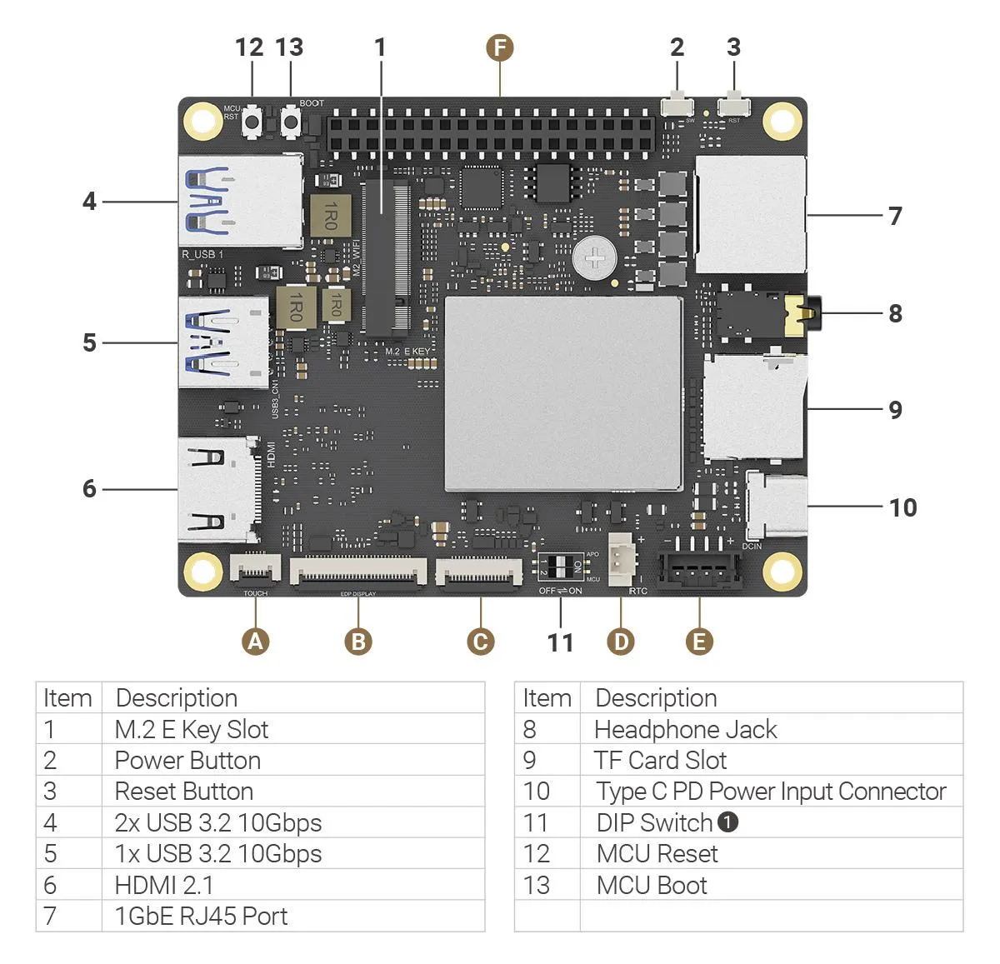
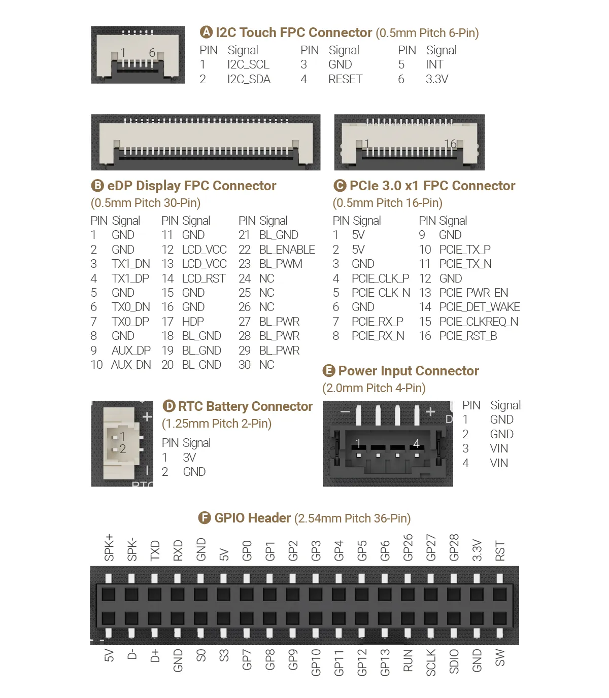
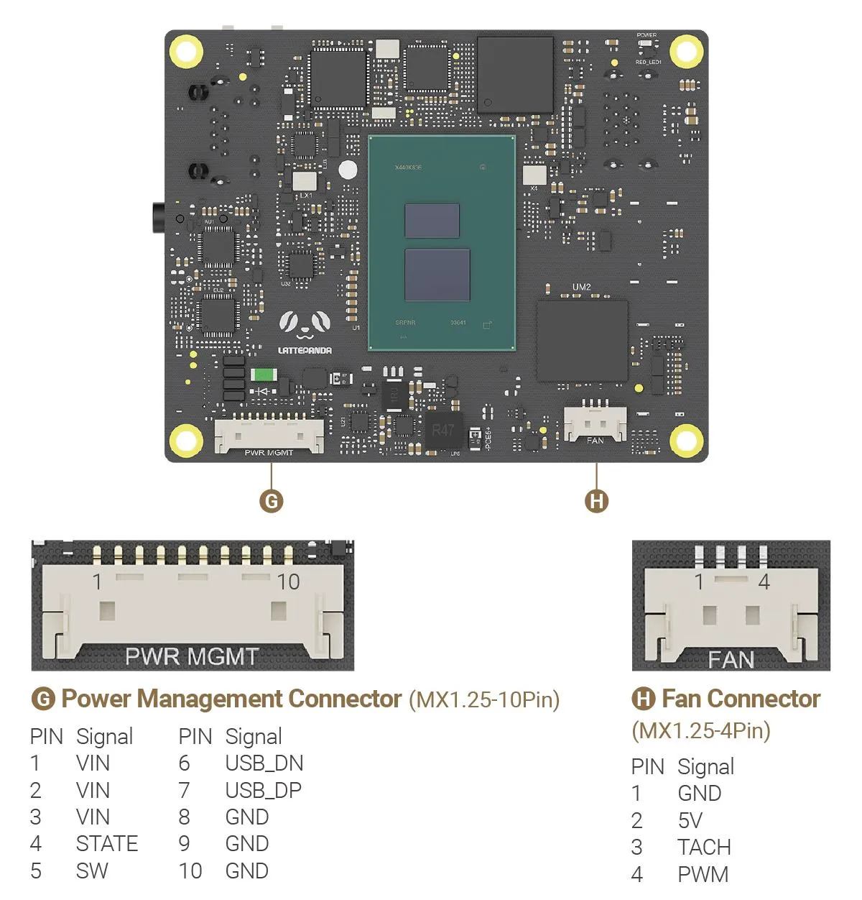

# Hardware Interface

## Pinout and Hardware Diagram
### Top Layout

### Bottom Layout

!!! note ""

    **1️⃣ DIP Switch Configuration:**

    The DIP switch on the LattePanda Iota allows you to customize system behavior for **Auto Power-On** and **MCU Control**. Below is a detailed breakdown of each setting:

    | Function          | Position | Behavior                                                                                     |
    |-------------------|----------|----------------------------------------------------------------------------------------------|
    | **Auto Power-On** | OFF *(Default)* | System requires manual press of the power button to boot after power is connected.           |
    |                   | ON           | System automatically powers on as soon as external power is applied — ideal for headless or embedded deployments. |
    | **MCU Control**   | OFF *(Default)* | Onboard MCU remains **inactive** until the system is powered on via the power button.        |
    |                   | ON           | Onboard MCU stays **active immediately** upon power connection — even before OS boot. Useful for pre-boot sensor control or automation. |

    ⚠️ **Note:** To completely disable the MCU regardless of DIP switch setting, you must disable it via the **BIOS Setup Menu**.

[**:simple-discord: Join our Discord**](https://discord.gg/k6YPYQgmHt){ .md-button .md-button--primary }