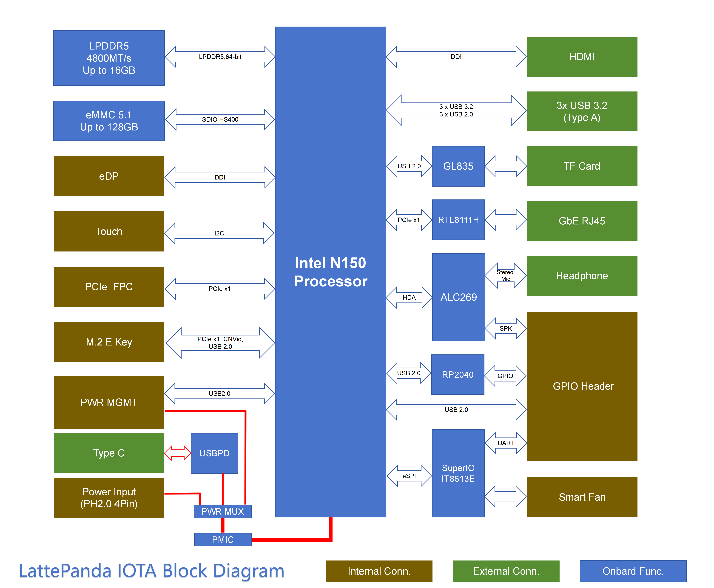

# Hardware Interface

## Block Diagram

## Pinout Diagram

### Top Layout

### Bottom Layout

!!! note ""

    **1️⃣ DIP Switch Configuration:**
    
    The DIP switch on the LattePanda Iota allows you to customize system behavior for **Auto Power-On** and **MCU Control**. Below is a detailed breakdown of each setting:
    
    | Function          | Position | Behavior                                                                                     |
    |-------------------|----------|----------------------------------------------------------------------------------------------|
    | **Auto Power-On** | OFF *(Default)* | System requires manual press of the power button to boot after power is connected.           |
    |                   | ON           | System automatically powers on as soon as external power is applied — ideal for headless or embedded deployments. |
    | **MCU Control**   | OFF *(Default)* | Onboard MCU remains **inactive** until the system is powered on via the power button.        |
    |                   | ON           | Onboard MCU stays **active immediately** upon power connection(before OS boot). Useful for pre-boot sensor control or automation. |
    
    ⚠️ **Note:** Once Auto Power-On is set to ON, the Iota Board will automatically power on as soon as it receives power, regardless of the RTC battery.

[**:simple-discord: Join our Discord**](https://discord.gg/k6YPYQgmHt){ .md-button .md-button--primary }