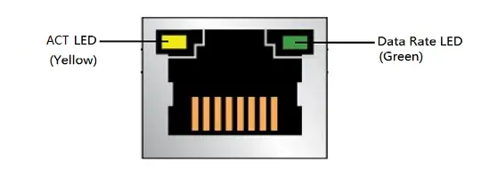

# External Interface

## :material-power: Power Button

This button functions almost the same as the power button on your laptop, as shown below:

=== "Power On"

    When the board is in a **shutdown or hibernation** state, a **short press** of the power button will turn it on.

=== "Wake Up"

    When the board is in **sleep** mode, a **short press** of the power button will wake it up.

=== "Sleep / Shut Down"

    When the board is **running normally**, a **short press** of the power button will trigger a preset action, which is typically **Sleep** by default. :material-note:You can customize this behavior in your operating system's power settings. For example, in Windows, you can navigate to `Control Panel` > `Hardware and Sound` > `Power Options` > `Choose what the power buttons do` to change the action to "Shut down," "Do nothing," etc.

=== "Force Shut Down"

    If the OS becomes unresponsive or freezes, **press and hold the power button for about 6 seconds** until all indicator lights turn off. This will force the power off. :warning:**Please note that this is an emergency procedure, and any unsaved work will be lost**.

## :material-restart: Reset Button

- System Reboot

	When the OS is running, a short press of the reset button will immediately restart the OS.

!!! warning

    This action is similar to a "hard reset" and will not save any open files or work. Use it only when the system is unresponsive and cannot be restarted through the operating system.

## :material-usb-port: USB 3.2 Type-A Port

The LattePanda Iota features a total of three USB Type-A ports.

- Each port offers an impressive throughput of up to 10Gb/s — ideal for high-speed data transfer, external SSDs, and bandwidth-intensive peripherals.

- All ports are native to the processor's PCH and do not pass through any USB hub chips.

- The default BIOS setting is that the USB Type-A ports lose power after shutdown. If you want them to continue supplying power after the system is shut down, please refer to the [BIOS USB Power Control](bios_usb_port_power_control.md) section.

!!! note "Maximum Current"

    - Dual-layer USB Connector: Features 2 USB ports, sharing a maximum current of 2.2A.  
    - Single-layer USB Connector: Features only 1 USB port, with a maximum current of 1.2A.

## :material-hdmi-port: HDMI Port

- HDMI 2.1: Up to 4096x2160 @ 60Hz HDR

!!! note

    The LattePanda Iota supports HDMI 2.1, enabling 4K@60Hz HDR output. For optimal performance, use a certified HDMI 2.1 or higher cable.

## :material-lan-connect: RJ45 Ethernet Port(1Gbps)

The LattePanda Iota includes one Gigabit Ethernet port, powered by the **RTL8111H 1.0 GbE** Ethernet Controller. 

- Supports standard 10/100/1000 Mbps speeds.
- Compatible with **Wake-On-LAN (WOL)** for remote device management — perfect for headless setups or networked applications.

| LED           | LED Color | LED State | Meaning                                       |
| :------------ | :-------- | :-------- | :-------------------------------------------- |
| ACT LED       | Yellow    | Blinking  | LAN activity is occurring                     |
| Data Rate LED | Green     | OFF       | 10 Mb/s data rate is selected, or no LAN Link |
|               |           | Green     | 100/1000 Mb/s data rate is selected           |

## :material-headphones: Headphone Jack

- 3.5mm
- CTIA Standard
- Supports stereo and microphone, can work simultaneously
- Audio Out Priority:

    - When headphones are not plugged in, audio is output by default from the SPK+ and SPK– pins in the GPIO Header. 
    - When headphones are plugged in, audio is output by default from the headphones.

## :fontawesome-solid-sd-card: TF(MciroSD) Card Slot

- The card reader chip connects to the processor’s PCH via USB 2.0.
- It supports booting from a TF card and installing the OS.

## :material-usb: USB Type-C Port

The LattePanda Iota is equipped with a USB Type-C port **dedicated solely to power delivery**.  It supports **USB PD 15V input** for stable and efficient system power.

!!! warning "Power Iput Only"

    This port **does not support data transfer or video output** — it is power-only.

:material-details: **Required Specifications of Power Adapter**

- Supports **USB Power Delivery (PD)**
- Must negotiate **15V output** from the power source
- Minimum power: **15V @ 1.8A**

Most standard USB Type-C PD power adapters or power bank on the market can meet the aforementioned requirements.

:material-details: **Power Supply Priority**

- see [Power Option](powering.md#power-supply-priority) section.

[**:simple-discord: Join our Discord**](https://discord.gg/k6YPYQgmHt){ .md-button .md-button--primary }
