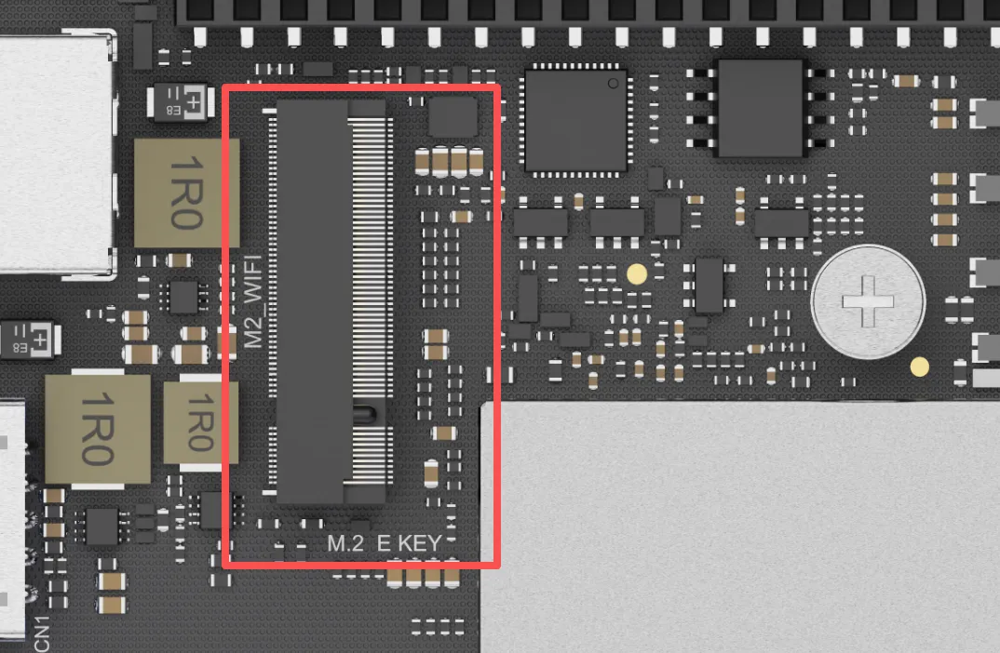
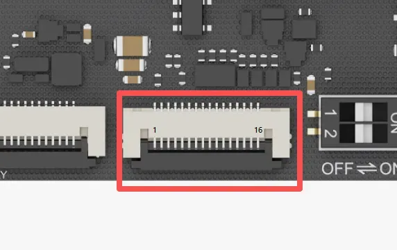
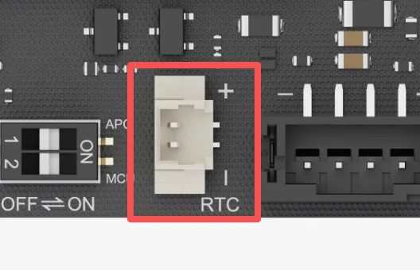
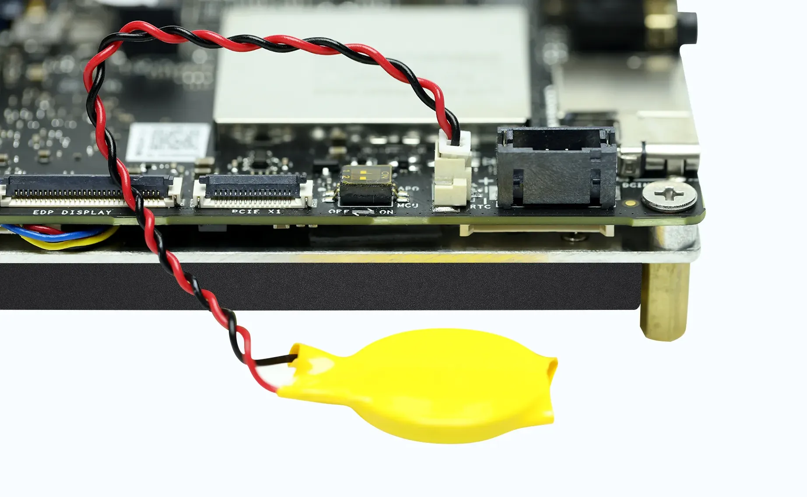
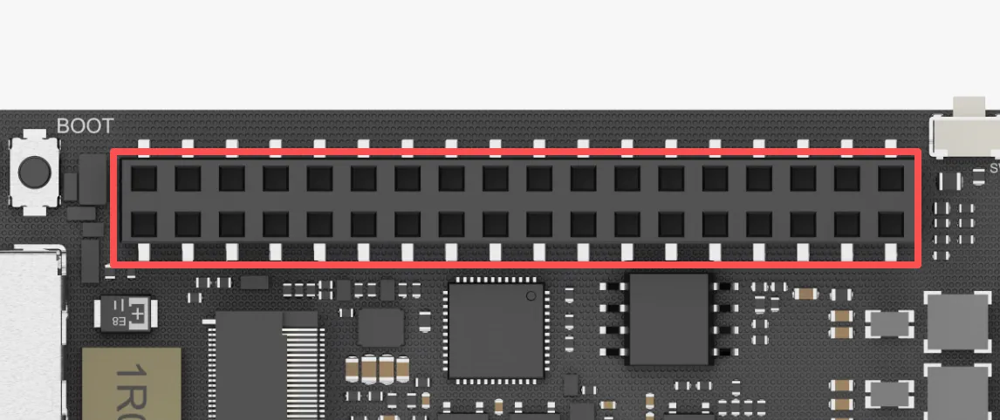
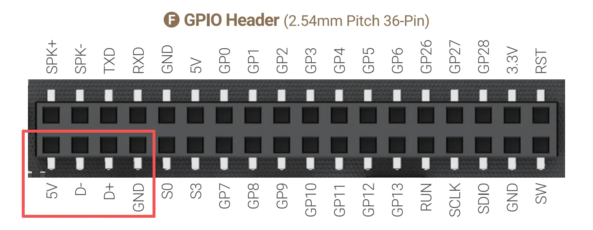

# Internal Interface

## M.2 E Key Socket

LattePanda Iota features a dedicated M.2 E Key socket for wireless connectivity modules. It supports M.2 Type 2230 PCIe and CNVio wireless network card.

{: style="width:400px; height:auto;"}

!!! note ""
    
    #### :material-check-circle: **Compatible Device**
      - **Wireless Modules:** M.2 2230 form factor, PCIe or CNVio lanes
      - **Other E Key Devices:** M.2 to SATA, etc.
    
    Tested Modules
    
    - [**:material-cart: Intel AC8265 WiFi 5**](https://www.dfrobot.com/product-1998.html)
    - [**:material-cart: Intel AX210 WiFi 6E**](https://www.dfrobot.com/product-2325.html)
    - [**:material-cart: Intel BE200 WiFi 7**](https://www.dfrobot.com/product-2877.html)

## PCIe x1 FPC Expansion Interface

LattePanda Iota provides a flexible PCIe x1 expansion interface using the same FPC (Flexible Printed Circuit) pinout as the Raspberry Pi 5.

{width="400"}

This interface exposes a native **PCIe 3.0 x1 lane** for high-speed expansion.
    
#### :material-check-circle: **Compatible Device**
- [**M.2 M-Key Expansion Board**](https://www.dfrobot.com/product-2985.html) (for NVMe SSDs or other M.2 devices)
- [**PoE Expansion Board**](https://www.dfrobot.com/product-2984.html) (Power over Ethernet for network connectivity)
- Most PCIe expansion boards or HATs for Raspberry Pi 4 or 5

## RTC Battery Connector

LattePanda Iota features a dedicated 3V RTC battery connector designed to accept the included CR2032 coin cell battery.

{width="400"}

- **Voltage:** 3.0V
- **Included Battery:** CR2032
- **Purpose:** Maintains real-time clock and BIOS settings during power-off

{width="400"}

!!! warning
    Do not connect batteries exceeding 3.3V. Ensure correct polarity when inserting the battery.

## GPIO Header

The GPIO header on LattePanda Iota integrates both USB 2.0 signals and RP2040 microcontroller pins for flexible I/O control and peripheral expansion.

{width="400"}

#### USB 2.0 Pins
- D+ / D- lines exposed for custom USB device integration
- Can be used to interface with USB-to-serial converters, custom HID devices, or debug probes

{width="400"}

You can also connect our dedicated [**:material-cart: 4G LTE Expansion Board**](https://www.dfrobot.com/product-2982.html) to expand cellular connectivity.

#### RP2040 Microcontroller Pins

- Built-in RP2040 chip (same as Raspberry Pi Pico) for real-time I/O control
- Programmable via Arduino C/C++ or MicroPython
- Direct access to multiple GPIOs, I2C, SPI, UART, and ADC pins
- Communicates with Intel N150 Processor via USB 2.0 CDC (appears as a serial device)
- 3.3V I/O Level

[**:simple-discord: Join our Discord**](https://discord.gg/k6YPYQgmHt){ .md-button .md-button--primary }

