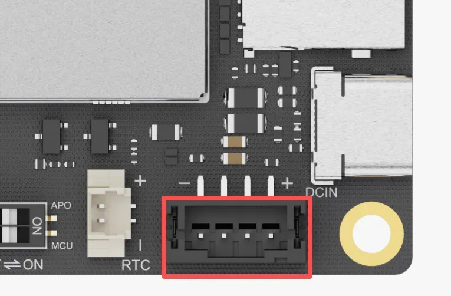

# Internal Interface

## M.2 E Key Slot

LattePanda Iota features one M.2 E Key slot for modern wireless modules, enabling high-speed Wi-Fi and Bluetooth connectivity. 

{: style="width:400px; height:auto;"}

### Key Specifications
  - Slot Type: M.2 E Key
  - Available Lanes: PCIe 3.0 x1, USB 2.0, CNVio2
- Compatible Module Size: 2230

### Compatible Devices

This slot is primarily intended for Wi-Fi and Bluetooth combo cards. However, it can also accommodate other M.2 E Key devices that utilize the available PCIe interface, such as M.2 to SATA adapters.

- **Wireless Modules:** M.2 2230 form factor with either PCIe or CNVio2 lane.
- **Other Devices:** M.2 E Key peripherals compatible with the 2230 size and PCIe lane.
### Tested Modules

To ensure stability and performance, we have tested and confirmed compatibility with the following popular wireless modules:

- [**:material-cart: Intel AC8265 WiFi 5**](https://www.dfrobot.com/product-1998.html)
- [**:material-cart: Intel AX210 WiFi 6E**](https://www.dfrobot.com/product-2325.html)
- [**:material-cart: Intel BE200 WiFi 7**](https://www.dfrobot.com/product-2877.html)
- Intel AX211
- Intel AX200
- Intel AX201

!!! note

    - Antenna Connection: M.2 wireless modules require external antennas to function correctly. Remember to connect two antennas to the IPEX4 connectors on the module before use.
    - Driver Installation: After installing the hardware, you will need to install the appropriate drivers for your operating system. These can typically be downloaded directly from the module manufacturer's website (e.g., Intel's official support page).

## PCIe 3.0 x1 FPC Connector

The LattePanda Iota is equipped with a versatile PCIe 3.0 x1 FPC (Flexible Printed Circuit) expansion connector. By adopting the same pinout as the Raspberry Pi 5's PCIe connector, it allows you to tap into a growing ecosystem of expansion boards.

This connector exposes a native PCIe 3.0 x1 lane, delivering up to 8 GT/s of bandwidth, perfect for data-intensive applications.

{width="400"}

### Key Specifications

- Connector Type: 16-pin FPC, 0.5mm Pitch
- Available Lane: PCIe 3.0 x1

### Pinout Definition

| Pin | Signal Name | Description                  |
|:----|:------------|:-----------------------------|
| 1   | 5V         | 5V Power Output  |
| 2   | 5V         | 5V Power Output  |
| 3   | GND         | Ground                       |
| 4   | PCIE_CLK_P | Reference Clock, Positive |
| 5   | PCIE_CLK_N | Reference Clock, Negative |
| 6   | GND    | GND |
| 7   | PCIE_RX_P | PCIe Receive Lane 0, Positive |
| 8   | PCIE_RX_N | PCIe Receive Lane 0, Negative |
| 9   | GND | GND                                                          |
| 10  | PCIE_TX_P | PCIe Transmit Lane 0, Positive |
| 11  | PCIE_TX_N | PCIe Transmit Lane 0, Negative |
| 12  | GND | GND  |
| 13  | PCIE_PWR_EN | High Level(3.3V) Output to enable power on HAT or exp. board. When OS is running or sleeping, this pin will output 3.3V. |
| 14  | PCIE_DET_WAKE | Wake-up Signal, Active Low Pull this pin low to wake the LattePanda board from sleep states. |
| 15  | PCIE_CLKREQ_N | Reference Clock Request, Active Low |
| 16  | PCIE_RST | PCIe Device Reset, Active Low |

### Compatible Device

- [**M.2 M-Key Expansion Board**](https://www.dfrobot.com/product-2985.html) (for NVMe SSDs or AI  Accelerator Card)
- [**PoE Expansion Board**](https://www.dfrobot.com/product-2984.html) (Power over Ethernet for network connectivity)
- Most PCIe expansion boards or HATs for Raspberry Pi 4 or 5

!!! warning "5V Power Output"

    - The 5V power output has two pins and shares a maximum current of 2.2 A.
    - The BIOS default power control is: enable the 5V power output when the OS is running or sleeping; disable the 5V power output when the OS is not running, such as during shutdown or hibernation.

!!! note

    - FPC Cable Required: To connect an expansion board, you will need a compatible 16-pin FPC cable designed for PCIe signals. 
    - Check for Compatibility: While the electrical pinout is compatible, always verify that the specific expansion board or HAT is fully compatible with a generic PCIe host and doesn't rely on Raspberry Pi-specific software overlays.
    - Driver & OS Support: Ensure your operating system (Windows or Linux) has the necessary drivers to support the connected PCIe device. Most standard devices like NVMe drives are supported out-of-the-box by modern operating systems.

## RTC Battery Connector

LattePanda Iota features a 3V Real-Time Clock(RTC) battery connector. This allows the board to maintain its internal clock even when the main power supply is completely disconnected.

{width="400"}

### Key Specifications

- Connector Type: 2-Pin, 1.25mm Pitch
- Nominal Voltage: 3.0V
- Included Battery: CR2032 Coin Cell (with pre-soldered wire and connector)

{width="400"}

!!! warning

    - Do not connect batteries exceeding 3.3V. 
    - Ensure correct polarity when inserting the battery.

## Power Input Connector

In addition to the Type-C port, this connector can also be used to power the LattePanda board, making it ideal for integration into custom enclosures or systems with existing DC power.

{width="400"}

- Connector Type: 4-Pin, 2.0mm Pitch

- **Please refer to the [Power Option](powering.md#powered-by-ph20-4pin-power-input-connector) section for details.**

## GPIO Header

LattePanda Iota features a comprehensive 36-pin GPIO header, serving as a versatile interface for system control, peripheral expansion, and custom hardware integration. It provides direct access to a wide range of signals, including those from the onboard RP2040 MCU, USB 2.0 lanes, system status indicators, and audio outputs.

{width="500"}

### Key Specifications

- Header Type: 2x18 Female Header
- Pitch: 2.54mm (0.1 inch)
- Total Pins: 36

### Pinout Definition

{width="800"}

| Pin Name  | Direction      | I/O Level | Description                                                  |
| :-------- | :------------- | --------- | :----------------------------------------------------------- |
| SPK+      | Output         |           | Speaker Audio Output, Positive                               |
| SPK-      | Output         |           | Speaker Audio Output, Negative                               |
| TXD       | Output         | 3.3V      | Serial Port Transmit                                         |
| RXD       | Floating Input | 3.3V      | Serial Port Receive                                          |
| GND       | Output         |           | Ground                                                       |
| 5V        | Output         |           | 5V Power Output 1 Current Limit: 0.9A                     |
| GP0 ~ 6   | Input/Output   | 3.3V      | RP2040 GPIO 0~6                                              |
| GP26 ~ 28 | Input/Output   | 3.3V      | RP2040 GPIO 26~28                                            |
| 3.3V      | Output         |           | RP2040 3.3V Power Output Current Limit: 1.2A              |
| RST       | Pull-up Input  | 3.3V      | System Reset Pull this pin low is equivalent to press `RST` button. |

| Pin Name | Type          | I/O Level | Description                                                  |
| :------- | :------------ | --------- | :----------------------------------------------------------- |
| 5V       | Power         |           | 5V Power Output 2 Current Limit: 1.2A                    |
| D-       | Input/Output  |           | USB 2.0 Data-                                                |
| D+       | Input/Output  |           | USB2.0 Data+                                                 |
| GND      | Power         |           | Ground                                                       |
| S0       | Output        | 3.3V      | Running State Indicator Output HIGH only when OS is running |
| S3       | Output        | 3.3V      | Sleeping State Indicator Output HIGH only when OS is sleeping |
| GP7 ~ 13 | Input/Output  | 3.3V      | RP2040 GPIO 7~13                                             |
| RUN      | Input         | 3.3V      | RP2040 Reset, Activate Low                                   |
| SCLK     | Input/Output  | 3.3V      | RP2040 SWCLK                                                 |
| SDIO     | Input/Output  | 3.3V      | RP2040 SWDIO                                                 |
| GND      | Output        |           | Ground                                                       |
| SW       | Pull-up Input | 3.3V      | System Power Switch Pull this pin low is equivalent to press PWR button. |

### Speaker Audio Output Pins

The `SPK+` and `SPK-` pins form a speaker audio output channel. It  can deliver up to 2 Watt (RMS) / 4 Ω. You can connect a speaker directly to play sound.

When headphones are inserted, the audio output automatically switches to the headphone jack.

### Serial Port TXD RXD Pins

- This serial port is derived from the onboard SuperIO chip and is typically mapped as `COM1` in Windows systems and `/dev/ttyS0` in Linux systems.
-  It supports serial port redirection.
-  Baud Rate: up to 115200

### RP2040 GPIO Pins

- RP2040 communicates with Intel N150 Processor via USB 2.0 CDC (appears as a serial device)
- 3.3V I/O Level
- The GPIO pins of the RP2040 are directly exposed, without series resistors or parallel ESD components.
- **Please refer to the [rp2040_programming](rp2040_programming.md) section for programming guide.**

### USB 2.0 Pins
- D+ / D- lines and power pins exposed for custom USB device integration.
- Can be used to interface with USB-to-serial converters, custom HID devices, or debug probes.
- Directly routed from the processor's PCH and do not use any HUB chips.

- You can also connect our dedicated [**:material-cart: 4G LTE Expansion Board**](https://www.dfrobot.com/product-2982.html) to expand cellular connectivity.

### Status Indication Pins

The S0 and S3 pins can indicate the operating system's current state through different output voltages. 

Thus, the operating system status can be obtained by reading these voltages or by connecting LED indicators. 

The pins are already connected in series with 200Ω current-limiting resistors, so most LEDs can be attached directly without risk of burning out.

The voltage of these pins in different states are shown as follows:

|        | Run  | Sleep | Hibernate | Shut Down |
| :----- | :--- | :---- | :-------- | :-------- |
| S0 Pin | High | Low   | Low       | Low       |
| S3 Pin | Low  | High  | Low       | Low       |

[**:simple-discord: Join our Discord**](https://discord.gg/k6YPYQgmHt){ .md-button .md-button--primary }

