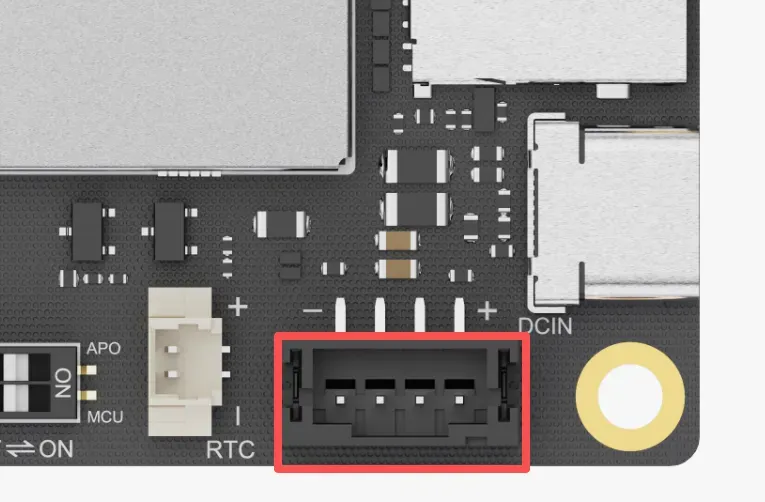
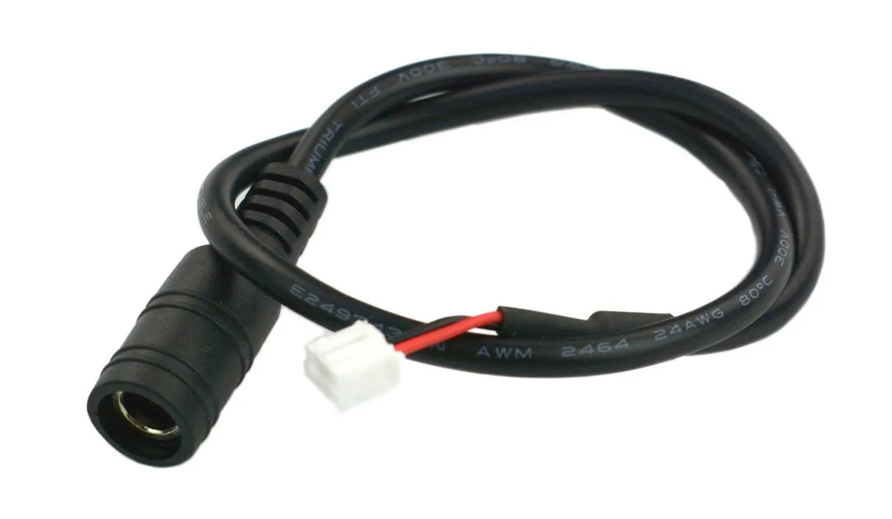
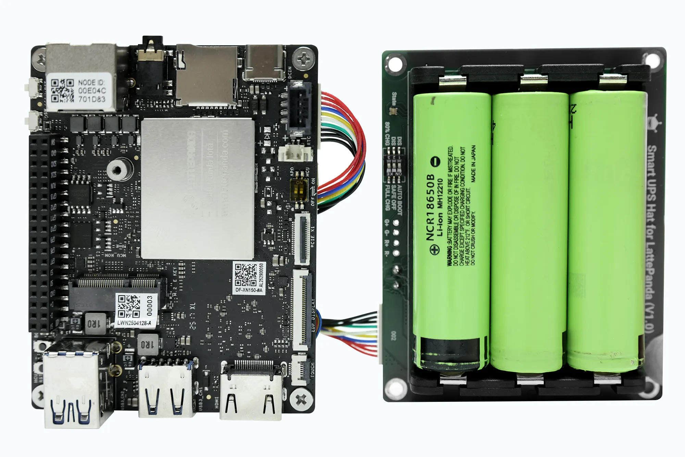

# Power Options

The LattePanda Iota is a compact yet powerful single-board computer designed for reliable performance in diverse environments. To ensure stable operation and protect the device from damage, proper power delivery is essential.

In this chapter, we will explore the available power input options for the LattePanda Iota, helping you choose the right solution based on your application needs—whether it's for portable projects, industrial setups, or long-term deployments.

## 3 Ways to Power LattePanda Iota

!!! Warning "Voltage and Power Requirements"

    - **USB Type-C Port**: Requires **15V PD (Power Delivery)** input only.
    - **PH2.0-4Pin Power Input Connector**: Accepts **10–15V DC**, with no more than 15V.
    - The power adapter must provide **at least 24W** for stable operation.
    - Using underpowered or out-of-spec adapters may result in boot failure, system instability, or even hardware damage.

You can power the LattePanda Iota via:

1. **USB Type-C Port** – *Recommended for most users*  
   Uses Power Delivery (PD) protocol at 15V.

2. **PH2.0-4Pin Power Input Connector**  
   Ideal for integration into custom enclosures or systems with existing DC power.

3. **Power Management Connector**  
   With [LattePanda UPS expansion board(DFR1247)](https://www.dfrobot.com/product-2983.html) and 18650 batteries, it is very suitable for seamless battery backup and intelligent power management of mission-critical applications.

## Power Supply Priority

LattePanda Iota intelligently selects its power source based on voltage level. If both inputs are active, the system prioritizes the port with the **higher voltage**. Power switching is seamless and hot-swappable.

!!! Example
    === "Scenario 1: USB-C (15V) + PH2.0 (12V)"
        LattePanda Iota will **prioritize power from the USB Type-C port**. 
        > 1. If USB-C power is disconnected, the system instantly and silently switches to the PH2.0 header. 
        > 2. When USB-C power is restored, it automatically switches back — no reboot or data loss. 
        > 3. This failover mechanism ensures uninterrupted operation during power transitions.

    === "Scenario 2: Both Inputs at 15V"
        LattePanda Iota will **draw power from both sources simultaneously**, sharing the load for enhanced stability and thermal performance.

---

## Powered by USB Type-C PD Adapter (🔌)

This is the **recommended method** for powering the LattePanda Iota due to its simplicity and compliance with modern standards.

### Required Specifications

- Supports  **USB Power Delivery (PD)**
- Must negotiate **15V output** from the power source
- Minimum power: **15V @ 1.8A**

**Most standard USB Type-C PD power adapters or power bank on the market can meet the aforementioned requirements.**

---

## Powered by PH2.0-4Pin Power Input Connector

Ideal for embedded applications where a dedicated DC power supply is already available.

{ width="400" }

### Required Specifications

- Voltage: **10–15V DC** (do not exceed 15V)
- Power: **At least 24W recommended**
- Current: ≥2.0A at 12V

!!! Warning "Power Input Only"
    This connector is for power INPUT ONLY. It does NOT support battery charging or power output to other devices.

### Pinout Definition

As shown in the figure above, from left to right:

| Pin  | Function |
| ---- | -------- |
| 1    | GND (-)  |
| 2    | GND (-)  |
| 3    | VIN (+)  |
| 4    | VIN (+)  |

> 🔋 The two positive and two ground pins are used in parallel to reduce resistance and improve current handling.

!!! Warning "Ensure Correct Polarity Connection"

    Double-check wiring before connecting power. Reversed polarity can permanently damage the board.

### Recommended Adapter Cable

[LattePanda DC 5.5x2.1mm Power Cable(FIT0903)](https://www.dfrobot.com/product-2624.html)  
This cable allows easy connection from a standard 5.5×2.1mm DC barrel jack power supply to the PH2.0-4Pin header.
Thus, with this adapter cable, you can use a standard DC 2.1 power adapter to power the Iota board.

{width="400" }

---

## Powered by UPS Exp. Board (Optional)

For mission-critical applications — such as data logging, remote monitoring, or edge servers — the **[LattePanda UPS Exp. Board (DFR1247)](https://www.dfrobot.com/product-2983.html)** delivers seamless battery backup and intelligent power management.

{ width="400" }

The LattePanda 18650 UPS Expansion Board is a plug-and-play uninterruptible power supply module designed for the LattePanda IOTA. Using the HID-UPS protocol, it is automatically recognized as a battery in Windows 10 and 11 without drivers or programming.  

Features include intelligent power management, ultra-low power standby (**~30μA**), and support for up to 8 hours of runtime with three 18650 cells. Ideal for mobile robotics, portable systems, and applications requiring reliable power-fail protection.

For detailed step-by-step assembly and configuration instructions, please refer to the [LattePanda UPS Exp. Board (DFR1247) Tutorial](https://wiki.dfrobot.com/SKU_DFR1247_UPS_Expansion_Board).

[**:simple-discord: Join our Discord**](https://discord.gg/k6YPYQgmHt){ .md-button .md-button--primary }