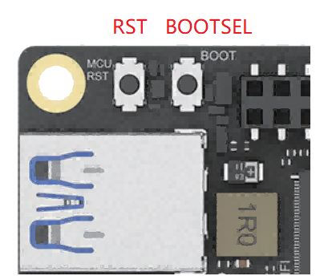

# RP2040 Programming

The LattePanda Iota integrates a RP2040 MCU, which communicate with Intel N150 processor via USB 2.0. 

- Dual ARM Cortex-M0+ @ 133MHz

- 264kB on-chip SRAM
- 8MB onboard Flash
- 3.3V I/O Level

!!! Danger "3.3V I/O Level Limit"

    The RP2040 operates at a 3.3V logic level. Its I/O pins are not 5V tolerant. Do not connect 5V devices directly to the GPIOs.

## RP2040 GPIO Mapping

Most of the RP2040's GPIOs are routed out through the header, as shown in the figure below.

| RP2040 Pin | Board Connection / Function | Notes |
| ------------- | ----------------- | ----------------- |
| GPIO0 ~ 13 | Header Pin `GP0` ~ `GP13` |  |
| GPIO14 ~ 17 | Not Connected | Internally Floating |
| GPIO18 | S0 | Internally Connected to S0 State Pin |
| GPIO19 | S3 | Internally Connected to S3 State Pin |
| GPIO20 | SW | Internally Connected to SW Button |
| GPIO21 | RST | Internally Connected to RST Button |
| GPIO22 ~ 24 | Not Connected | Internally Floating |
| GPIO25 | Onboard Blue LED | Internally Connected to Blue LED |
| GPIO26 ~ 28 | Header Pin `GP26` ~ `GP28` | Multiplexing Function: ADC |
| GPIO29 | Not Connected | Internally Floating |
| SWCLK | Header Pin `SCLK` |  |
| SWDIO | Header Pin `SDIO` |  |
| RUN | Header Pin `RUN` | RP2040 Reset Pin |
| IOVDD/DVDD | Header Pin `3.3V` | RP2040 Power Supply |

## Uploading new Firmware to RP2040

The RP2040 features a built-in USB bootloader, a small program stored in its Read-Only Memory (ROM). This bootloader allows you to upload new firmware to the microcontroller simply by connecting it to your computer via USB.

### Onboard Buttons

On the LattePanda Iota board, there are two buttons that control the operating status of the RP2040, which are:

- **RST**: The Reset button. A short press performs a hard reset on the RP2040, restarting its current program.
- **BOOTSEL**:  The Boot select button. This button is used to put the RP2040 into its special bootloader mode, preparing it to receive new firmware.

### Upload Instructions

Follow these steps to upload a .uf2 file to the RP2040:

- Press and hold the `BOOTSEL` button.
- While still holding `BOOTSEL` button, press and release the `RST` button.
- Release the `BOOTSEL` button.
- Your board's OS will now detect the RP2040 as a new USB Mass Storage Device (like a flash drive). It will typically appear with the name RPI-RP2.
   
- Drag and drop your firmware file (.uf2) onto this new drive.
- Once the file is copied, the bootloader will automatically verify the firmware, write it to the RP2040's flash memory, and then reboot the device. Your new program will start running immediately.

---

[**:simple-discord: Join our Discord**](https://discord.gg/k6YPYQgmHt){ .md-button .md-button--primary }