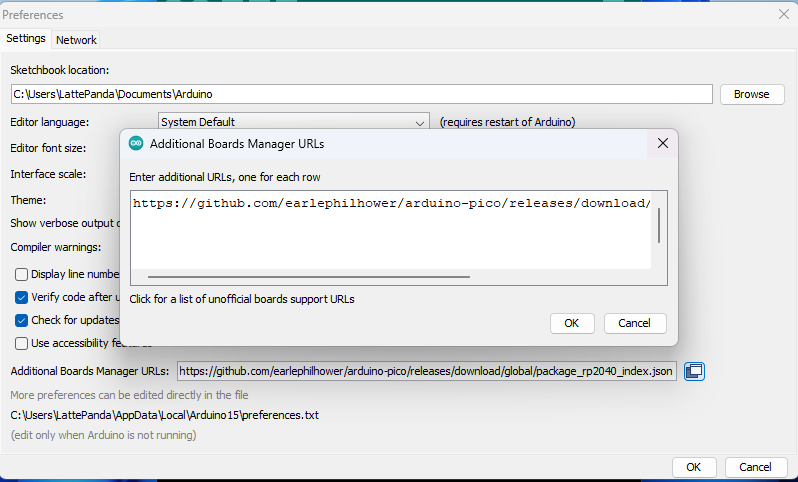
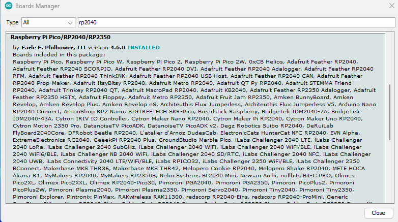
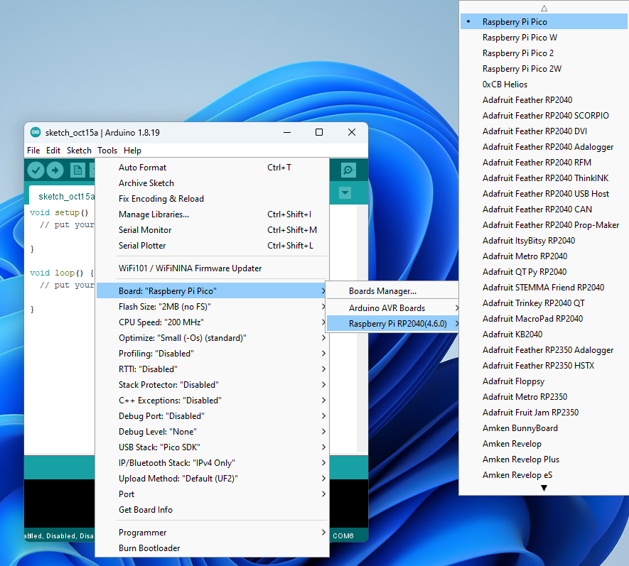
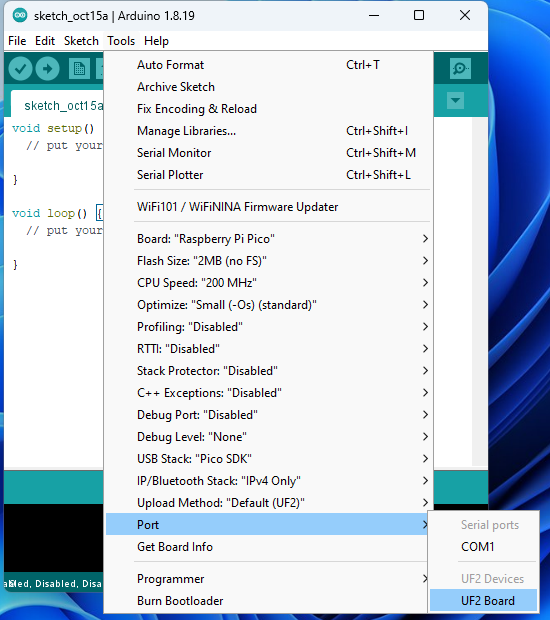
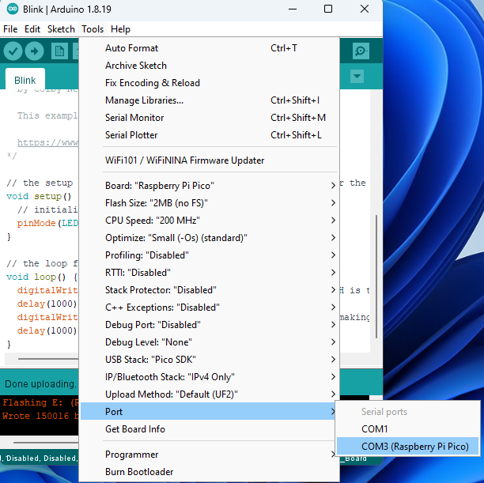

# RP2040 Programming - Arduino C++


## Preparation

Arduino C++ provides a simple and intuitive framework for programming microcontrollers. This section guides you through setting up the Arduino IDE to program the RP2040.

Follow these steps to set up your development environment:

- Install the Arduino IDE.

   > Download and install the Arduino IDE from the [official Arduino website](https://www.arduino.cc/en/software).
   
- Add RP2040 board support to Arduino IDE.

   > Open Arduino IDE, navigate to: **File → Preferences**.
   
   > In the "Additional Boards Manager URLs" field, add the following URL:
   ```
   https://github.com/earlephilhower/arduino-pico/releases/download/global/package_rp2040_index.json
   ```
   
   > Click **OK** to save the settings.

   
   


- Install the RP2040 package.

   > Navigate to: **Tools → Board → Boards Manager**.
   
   > Search for "pico" or "rp2040" in the search box.
   
   > Find "Raspberry Pi Pico/RP2040" by Earle F. Philhower, III , then click **Install**.
   
   > Wait for the installation to complete. The download process may take time, depending on your network speed.



- Select the board.

   > After installation, navigate to: **Tools → Board → Raspberry Pi RP2040 Boards** → Select **Raspberry Pi Pico**.



## Upload the First Sketch

For the first upload, you must manually put the RP2040 into bootloader mode. This section uses the built-in "Blink" example to demonstrate the process.

- Open the Arduino IDE.

- In the Arduino IDE, navigate to **File → Examples → Basics → Blink**.

- Verify that the `Raspberry Pi Pico` board is selected.
  
- Enter bootloader mode.
  
   > Press and hold the `BOOTSEL` button, then press and release the `RST` button. Finally release the `BOOTSEL` button.
   > The OS will now detect the RP2040 as a new USB Mass Storage Device (like a flash drive). It will typically appear with the name RPI-RP2.

- Select the upload port.

   > Navigate to: **Tools → Port** → Select `UF2 Board`.
   > After the first upload, this is not necessary as the arduino-pico core has auto-reset support. Select the appropriate serial port shown in the Arduino Tools->Port->Serial Port menu once.



- Click the **Upload** button to upload the code to the RP2040.
   > Wait for the upload process to complete. You should see "Done uploading" in the status bar.

- The blue LED on the top of the Iota board will begin flashing on and off at 1-second intervals.


## Upload Subsequent Sketches

After the first upload, the arduino-pico core enables an auto-reset feature, which simplifies future uploads. You no longer need to enter bootloader mode manually.

- **Select the Serial Port**

  > Connect your board. Navigate to **Tools → Port** and select the serial port corresponding to your RP2040 (e.g., `COM3` or `/dev/ttyACM0`).



- **Upload your code**

  > With your new sketch open, simply click the `Upload` button. The Arduino IDE will automatically handle the reset and upload process.


## Language Reference

[Arduino C++ Language Reference](https://www.arduino.cc/reference/en/)

[Arduino-Pico Core Documentation](https://arduino-pico.readthedocs.io/en/latest/)

[Arduino-Pico Core Library](https://github.com/earlephilhower/arduino-pico)

---

[**:simple-discord: Join our Discord**](https://discord.gg/k6YPYQgmHt){ .md-button .md-button--primary }