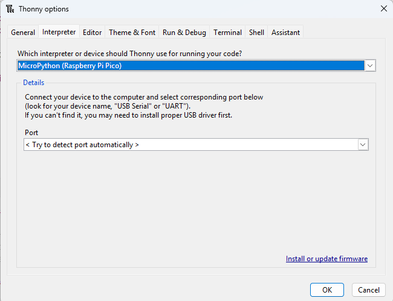
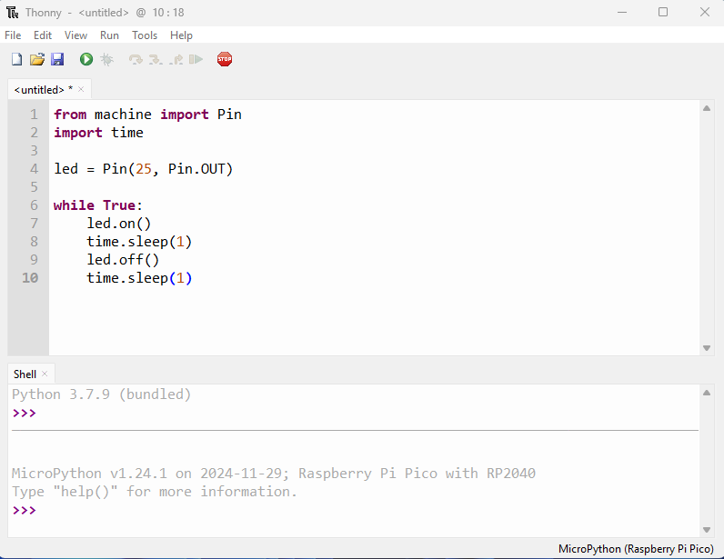
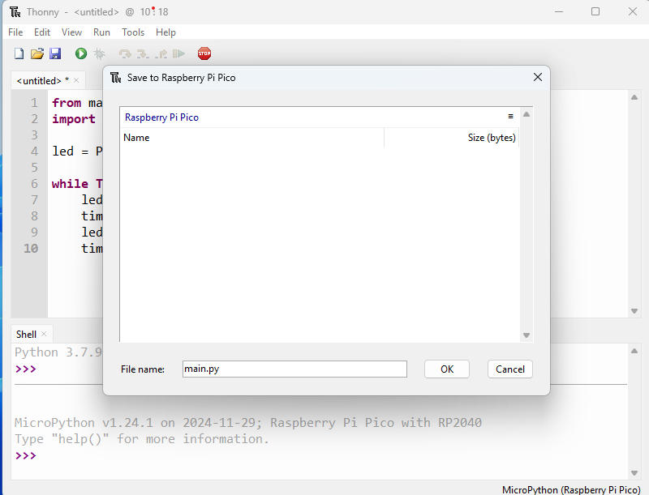

# RP2040 Programming - Micropython


## Preparation

If you are familiar with Python, MicroPython is the preferred choice for programming and controlling the RP2040 MCU, as it greatly simplifies the development process.

This section demonstrates how to use the RP2040 with MicroPython via the Thonny IDE. Follow these steps:

- Upload the MicroPython firmware to the RP2040.

   > The onboard RP2040 is pre-flashed with the RPi Pico MicroPython firmware. You can skip this step if the RP2040 has not been programmed with other software.

   > If the firmware was overwritten by another programming IDE, download the latest firmware from the [official MicroPython website](https://micropython.org/download/RPI_PICO/) and re-flash it. Refer to the [Uploading new Firmware to RP2040](rp2040_programming.md#upload-instructions) section, copy the downloaded .uf2 file to the RP2040's drive.

- Download and install an IDE that supports MicroPython.

   > For example: [Thonny](https://thonny.org/)

## Upload & Run Code

In this section, we will run a simple blink program to make LED25 continuously flash. LED25 is the blue indicator light located in the upper right corner of the front shield.

- Open the Thonny IDE.

- Navigate to: Tools -> Interpreter.  Select`MicroPython(Raspberry Pi Pico)` as the  interpreter.  

  

- Write the blink code in the IDE.

  

```python
from machine import Pin
import time

led = Pin(25, Pin.OUT)

while True:
    led.on()     
    time.sleep(1)     
    led.off()      
    time.sleep(1)     
```

- Click `Save` and choose `Raspberry Pi Pico` as the destination.  Name the File `main.py`. 
   > Using this filename allows the RP2040 to execute the code automatically upon power-on or after a hard reset.

  
  
- Click `Run` or press the **RST** button. The blue LED on the top of the Iota board will begin flashing on and off.


## Language Reference

[Quick reference for the RP2040](https://docs.micropython.org/en/latest/rp2/quickref.html)


---

[**:simple-discord: Join our Discord**](https://discord.gg/k6YPYQgmHt){ .md-button .md-button--primary }