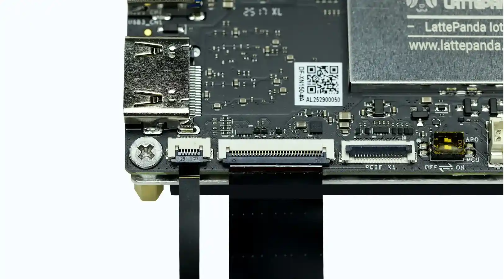

# Display Connections

This chapter will demonstrate multiple ways to connect display devices to your **LattePanda Iota**, and provide information on the necessary components and installation steps.

!!! Warning "Electrostatic Warning"
    Be sure to remove the static electricity from your body before touching the LattePanda Iota! Otherwise, it may cause potential static discharge and damage your device!

## 2 Ways to Extend Your Display on LattePanda Iota

=== "HDMI Monitor"

    * via HDMI port
    * HDMI 2.1: Up to 4096x2160 @ 60Hz HDR
    * for standard desktop usage 
    * hot-plug support

=== "eDP Screen"

    * via 30-pin eDP FPC connector
    * 2 Lanes, Up to 1920×1080 @ 60Hz
    * for embedded, compact, or portable applications
    * no hot-plug support

## HDMI

!!! Note "4K HDR Support"
    The LattePanda Iota supports HDMI 2.1, enabling 4K@60Hz HDR output. For optimal performance, use a certified HDMI 2.1 or higher cable.

### Preparations

- :material-cable-data:     HDMI Cable (2.1 recommended)
- :material-monitor:        External Monitor or TV with HDMI Input

### Installation Steps

1. Power off your LattePanda Iota.
2. Connect one end of the HDMI cable to the HDMI port on the LattePanda Iota.
3. Connect the other end to your external display.
4. Power on the LattePanda Iota — display should initialize automatically.

## eDP (Embedded DisplayPort)

### Compatibility

The LattePanda Iota’s eDP interface supports 30-pin, 2-lane eDP displays operating at **3.3V logic level**. We recommend starting with our official [**:material-cart: 7-inch eDP Touch Display**](https://www.dfrobot.com/product-2993.html) or [**:material-cart: 11.6-inch eDP Touch Display**](https://www.dfrobot.com/product-2794.html), tested and optimized for LattePanda boards.

### Preparations

- Compatible 30-pin eDP display
- eDP ribbon cable (usually included with display)

### Installation Steps

!!! Warning "Power Off Before Connecting"

    Always ensure the LattePanda Iota is **powered off and unplugged** before connecting or disconnecting the eDP display. Incorrect insertion may damage the board or panel.

- Locate the eDP connector on the LattePanda Iota.
- Gently lift the black latch on the eDP socket.
- Align the gold contacts of the eDP cable toward the board. The gold contacts face downwards as shown in the figure below.
- Insert the cable fully and press the latch down to lock it.
- In the same way, connect the touch cable. The gold contacts of the touch cable should also face downwards as shown in the figure below.

    { width="600" }

- Power on the device.

## Touch Panel Support

LattePanda Iota supports touchscreen input via **USB** or **I2C** interfaces.

#### USB Touch Connection

Enjoy true plug-and-play convenience — no drivers or configuration required. Perfect for interactive kiosks, desktop workstations, and rapid prototyping where simplicity and speed matter most.

#### I2C Touch Connection

Engineered for embedded systems: ultra-low power, minimal wiring, and seamless integration. Ideal for space-constrained or battery-powered projects demanding efficiency and reliability.

!!! Note "Driver Compatibility"

    - ✅ **Official LattePanda eDP Display**: Fully plug-and-play. Works instantly with the pre-installed Windows OS image,  or any standard Linux distributio — zero setup required.
    - ⚠️ **Third-party Touch Panels**: Require installation of vendor-specific drivers (e.g., Goodix, FT5x06, etc.) to enable full touch functionality. Always verify chipset compatibility before use.

## Official eDP Touch Display

* [**:material-cart: 7-inch eDP display with I2C touch panel**](https://www.dfrobot.com/product-2993.html)
* [**:material-cart: 11.6-inch eDP display with I2C touch panel**](https://www.dfrobot.com/product-2794.html)

---

[**:simple-discord: Join our Discord**](https://discord.gg/k6YPYQgmHt){ .md-button .md-button--primary }